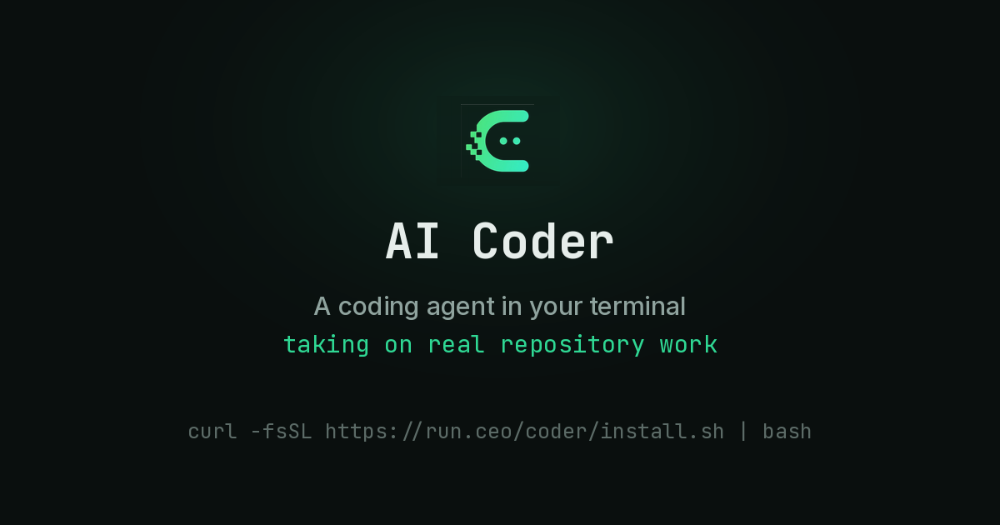

  

<h1 align="center">RunAI Coder · Showcase</h1>

  <em>One sentence in, one merged PR out.</em> 
  Write-ups, with receipts, from the team building <a href="https://run.ceo/coder/?utm_source=github_Official_Page">RunAI Coder</a> — an autonomous coding agent.

  

---

RunAI Coder is an autonomous coding agent: you hand it a goal in natural language, it plans, fans the work out to parallel workers, runs the tests, and files the result as a delivery for your sign-off — with the diff, the test run and the full step-by-step trace attached. The unit of work isn't a suggestion; it's a **merged PR**.

Everything in this repo follows the same rule as the product: **claims ship with receipts.** Posts link to measured data, real runs and reproducible methodology, and we state limitations ourselves rather than waiting for someone else to.

## A real run, unedited

A public SWE task on [pallets/flask](https://github.com/pallets/flask) (CLI feature + tests, all green), recorded from a production session — playback sped up 8×, content untouched. The money-bag indicator at the bottom left is the live compression savings multiple climbing as cached and compressed context accumulates:

  

## Measured, not projected

| Metric | Value | Scope |
|---|---|---|
| Merged squash PRs in 7 days | **968** | 2026-07-14 → 07-21 PDT, one developer, one machine |
| First-pass completion | **98.8%** (1,786 / 1,807 deliveries) | same window |
| Best single day | **98 merged PRs** | 2026-07-21 |
| Context compression | **2.83×** median (p10–p90 2.26–3.08×) | n = 7,222 production requests |
| Effective input price | **≈ $0.26 / M tokens** (≈ 2.6% of list) | measured account, caveats published |

Every number traces back to a machine-recorded ledger or a reproducible script — formulas, sample windows and known limitations are in the [performance report](https://run.ceo/coder/perf?lang=en).

## Posts

| # | Title | Date |
|---|---|---|
| 001 | [One sentence in, one merged PR out](posts/001-one-sentence-one-merged-pr/README.md) — what RunAI Coder is, a week of dogfooding numbers with the caveats attached, and why a merged PR costs $10 | 2026-07-30 |
| 002 | [Our house rules for letting an AI agent commit code](posts/002-house-rules-for-coding-agents/README.md) — five boring-on-purpose guardrails for giving an agent write access, and what they don't solve | 2026-07-31 |
| 005 | [The bill is 99% input tokens: cost engineering for a coding agent](posts/005-cost-engineering-for-coding-agents/README.md) — one ledger day, three levers from $10/M to an effective $0.26/M, and the SWE-bench A/B that keeps it honest | 2026-08-03 |
| 006 | [Why your coding agent forgets: a field guide to context rot](posts/006-why-coding-agents-forget/README.md) — the two-budget model of a context window, what compaction quietly costs, and what helps if you just use these tools | 2026-08-04 |
| 007 | [33k tokens before hello: the anatomy of your coding agent's preamble](posts/007-agent-preamble-anatomy/README.md) — what the viral token-overhead study really found: configuration swamps defaults, cache churn beats size, and a two-minute way to measure your own | 2026-08-05 |
| 008 | [Nobody reads your architecture overview. Including the agent.](posts/008-agent-friendly-codebases/README.md) — why an instruction file is rent, not documentation: three conflicting evals reconciled, a five-lane probe on Flask, and the harness that never read our AGENTS.md at all | 2026-08-06 |
| 009 | [The human in the loop approves one in three attacks](posts/009-approval-fatigue/README.md) — 409,000 approve/deny decisions say the approval prompt asks the wrong question: where the misses concentrate, why vigilance doesn't train, and where human attention actually buys safety | 2026-08-07 |

## Get it

Terminal apps for **Windows** (10/11 x64), **macOS** (Apple Silicon) and **Linux** (x64), CLI included — an **Android** remote-control app is rolling out, iOS next. Free starter pack: US$25–30 of value, one-time, 14 days, no card required.

→ [run.ceo/coder](https://run.ceo/coder/?utm_source=github_Official_Page)

## License

Text and images in this repository: [CC BY 4.0](https://creativecommons.org/licenses/by/4.0/) unless noted otherwise. Product screenshots, recordings and brand assets belong to RunAI Coder.
