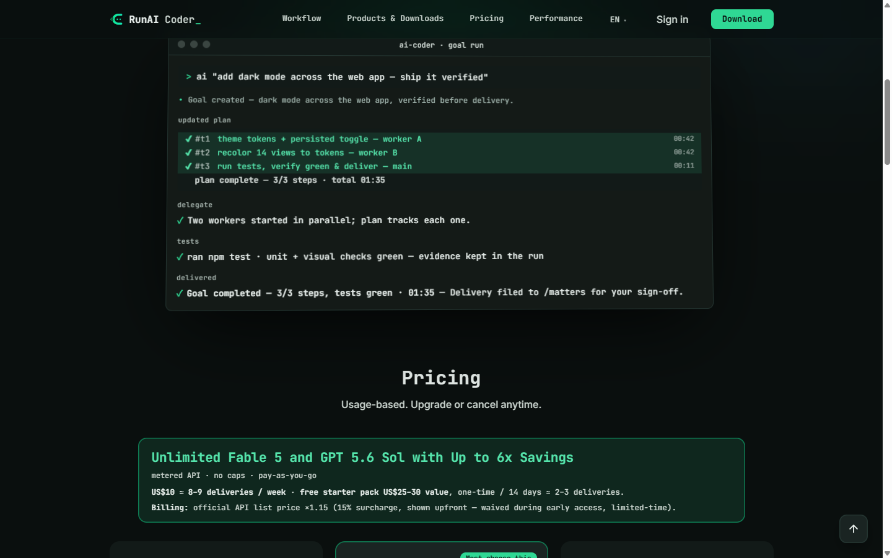
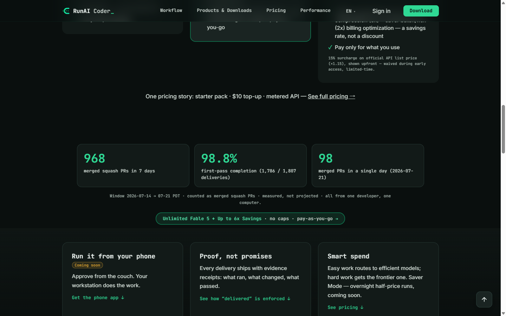

# One sentence in, one merged PR out

*2026-07-30 · the RunAI Coder team · [run.ceo/coder](https://run.ceo/coder/?utm_source=github_Official_Page)*

Every coding assistant we tried had the same failure mode: it turned us into the event loop. You ask for a change, the model writes something, you read it, you point out what's wrong, it apologizes, you paste the test output, it tries again. The code gets written by the machine, but the *project management* — checking, nudging, re-prompting, deciding whether "done" is actually done — that stays with you. Multiply that by ten tasks and you haven't hired an assistant; you've adopted ten interns who all report to you every ninety seconds.

That's the itch RunAI Coder came out of. We wanted the unit of work to be something you can't argue with: **a PR, merged to main, with the test run attached**. Not "here's a diff that should work". Not "I've completed the task!" printed by a model that hasn't run anything. A merged PR either exists or it doesn't.

So that's the product, in one line: you type one sentence, and some minutes later there's a merged PR — or an honest report about why not.

## What it actually is

RunAI Coder is an autonomous coding agent that runs on your machine — a terminal app for Windows, macOS (Apple Silicon) and Linux, with the CLI built in. It's built on the open-source codex CLI/agent, and most of our work has gone into the two things that matter for *autonomous, long-running* use rather than interactive chat: verification (does "done" mean anything?) and cost (can you afford to run it all day?). More on both below.

A run looks like this:

You give it a goal — the demo above is `ai "add dark mode across the web app — ship it verified"`. It writes a plan, fans the work out to parallel workers (theme tokens on one, recoloring fourteen views on another), runs the tests, and files the result as a *delivery* with the evidence attached: what ran, what changed, what passed. Deliveries land on a board called `/matters`, where you review and accept each one. It's closer to managing a small team than to pair programming: you hand out assignments in the morning and review merged work in the afternoon.

Three design decisions do most of the heavy lifting:

**"Done" is a verdict, not a message.** A goal is only marked complete after an audit that checks each requirement against real evidence — test output, diffs, run logs. The model saying "I finished" counts for nothing. If the checks are red, the report says red. This sounds obvious; it is remarkably rare.

**Gates hold.** Plans, proposals and mockups stop at approval gates and wait for you. The agent doesn't decide to refactor your auth module at 2 a.m. because it seemed related. When we say autonomous we mean "doesn't need babysitting", not "unsupervised".

**Everything is auditable.** Every step of every run is recorded. You can take over any live session from a browser, scroll back through what the agent did, and see exactly why it made each change. When something goes wrong — and with agents, something eventually goes wrong — you debug the run like you'd debug a program, not like you'd interrogate a coworker with amnesia.

## A week of dogfooding, with the caveats attached

We build RunAI Coder with RunAI Coder, and we measured one recent week of that (2026-07-14 → 07-21, PDT):

**968 merged squash PRs in seven days. 98.8% first-pass completion (1,786 of 1,807 deliveries accepted without a redo). 98 PRs merged on the single best day.** All of it from one developer and one machine.

Before you reach for the pitchfork, the caveats — the same ones we publish on the [performance page](https://run.ceo/coder/perf?lang=en): these are *our* numbers on *our* repos and *our* workload, measured from production ledgers, not projected. Squash PRs are a throughput measure, not a difficulty measure — plenty of those 968 are small, honest changes; some are not. We're not claiming your week looks like this. We're claiming the numbers are real, machine-recorded, and that we're willing to show the methodology. The performance page traces every figure to a ledger file or a reproducible script, and it includes a "known limitations" section we'd rather write ourselves than have someone write for us.

## Why it costs $10 and not $100

The reason agents haven't replaced the intern army is usually cost. Agentic workloads are brutally input-heavy: on our ledger day, input tokens were 99.0% of token volume. The same session context gets re-sent to the model over and over, and at frontier list prices (Fable 5 is $10 per million input tokens) an agent that works all day produces a bill that looks like a salary.

We attack that with three stacked levers, and we account for them separately because they're different kinds of claims:

- **Caching** (standard provider pricing): across that ledger day, 94.9% of our input tokens were cache hits billed at a tenth of list.
- **Compression** (measured): our pipeline delivers the model a compact representation of the session. Median 2.83× on 7,222 production requests, p10–p90 of 2.26–3.08×. This is the part we sweat over, because compression that loses information is worse than useless — so we ran SWE-bench Lite and SWE-bench Pro as an ON/OFF A/B with the official Docker graders. Lite: 10/10 both arms. Pro: 15/18 with compression on versus 16/18 off, agreeing on 17 of 18 tasks, and the one divergent task settled as run-to-run variance in a dedicated rerun (3/5 vs 3/5). Small samples, stated as such — we claim parity within noise, not superiority.
- **Saver lanes** (a pricing fact, not a measurement): batch and flex scheduling at half the standard lane price, same models, same output.

Blend those and the effective input price on our ledger works out to roughly **$0.26 per million tokens — about 2.6% of list**. That arithmetic is the reason "one sentence + US$10 = one merged PR" is a sustainable unit price rather than a subsidized demo, and it's also why a $10 top-up runs to about 8–9 deliveries a week in practice.

Compression pays a second dividend that we didn't fully appreciate until we lived with it: the model's context window holds the *compressed* session, so a 200K window effectively carries 450–620K tokens of session content. Long-running work stops slamming into context limits mid-task, which for autonomous agents is the difference between finishing and quietly losing the plot.

## What it isn't

Fair warning about the edges, since a tool you misdeploy is a tool you'll hate:

It's **not an IDE assistant**. If you enjoy driving line by line with a model riding shotgun, Cursor-style editors do that well and we don't try to. Coder earns its keep when you can phrase work as a goal with a checkable outcome — "add dark mode, ship it verified" — and walk away.

It's **terminal-first today**. Windows, macOS and Linux apps are stable; the zero-install web version and a full desktop GUI are still in the works. An Android app that remote-controls all your machines is rolling out (iOS next) — approve a delivery from the couch while your workstation does the work, which sounds like a gimmick until the first time you do it.

It's **not magic on vague goals**. "Make the app better" produces exactly what you'd expect. The audit machinery can only verify what you gave it a way to check.

And the models are what they are: it drives Fable 5 and GPT 5.6 Sol over a metered API at list price ×1.15 (the 15% is shown upfront, and waived during early access). We route easy work to efficient models and save the frontier ones for the hard parts, because paying flagship prices to rename a variable is silly.

## Trying it

The free starter pack is US$25–30 of value, one-time, good for 14 days — about 2–3 deliveries, no card required, phone sign-in. Enough to hand it a real task from your backlog and see whether the receipt convinces you. Downloads for all three platforms are at [run.ceo/coder](https://run.ceo/coder/?utm_source=github_Official_Page#download); the full UI speaks English and 中文.

This repo is where we'll publish write-ups like this one — real tasks, with the evidence. If you want the numbers behind anything above, the [performance report](https://run.ceo/coder/perf?lang=en) has the formulas, the sample windows, and the ledger paths. Questions and skepticism welcome in the issues; skepticism is kind of the point of the product.
