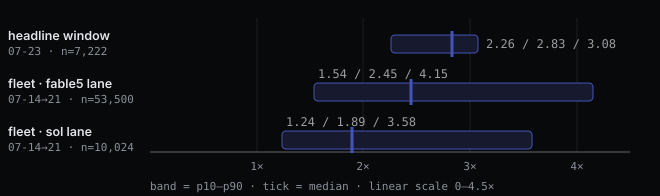
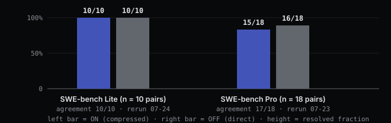
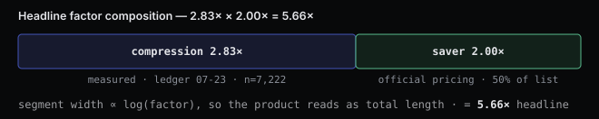

# The bill is 99% input tokens: cost engineering for a coding agent

*2026-08-03 · the RunAI Coder team · [run.ceo/coder](https://run.ceo/coder/?utm_source=github_Official_Page)*

On 2026-07-23, the most recent full ledger day we audited, our coding agent read 769,249,823 input tokens and wrote 7,387,431 output tokens. That is a 104:1 ratio. The agent is a much better reader than writer, by about two orders of magnitude.

This catches people off guard, because the price list points the other way. Output tokens cost five times more per unit ($50/M versus $10/M for fable 5 input, captured from the official pricing page on 2026-07-24). Intuition says watch the expensive line. But on our ledger, input was 99.0% of token volume that day, 95.4% of dollar cost at list prices, and still roughly 75.3% after cache discounts. The output line is a rounding error.

The reason is structural, and it applies to any agent that carries its session in the prompt, ours included. An agent works in a loop: read the workspace, act, read the result of the action, act again. Every API request re-sends what the session knows so far: file contents, diffs, test logs, the plan and its current state. A forty-turn run re-reads its own history forty times. Reading is the work. The tokens the model writes, a patch and a commit message, are closer to a receipt.

So when we set out to make ["one sentence + US$10 = one merged PR"](../001-one-sentence-one-merged-pr/README.md) hold up as unit economics, all of the engineering went into the input line. Three levers, deliberately kept independent, each with its own evidence trail on our public [perf page](https://run.ceo/coder/perf?lang=en). Here is the account, in the order the tokens meet each lever.

## Lever 1: cache hits take $10/M to $1.46/M

Prompt caching is the provider's own discount: input the API has already seen bills at $1/M instead of $10/M. The catch is that you only collect it if your prompts are laid out so that the long stable prefix actually stays stable. An agent that shuffles its system prompt, or injects a timestamp near the top, pays list price forever.

Our pipeline is built so the session prefix survives across turns. On the 2026-07-23 ledger day, 729,830,406 of 769,249,823 input tokens were cache hits: a 94.9% cache share, measured across 6,102 usage-bearing requests. Blend the two prices and the arithmetic is short:

$10/M × [(1 − 0.949) + 0.949 × ($1/$10)] = **$1.46/M** effective input.

Caching makes the re-reads cheaper, not free: a cache hit still bills at $1/M, and the model still processes every one of those tokens.

One caveat the perf page states rather than buries: cache writes carry a premium ($12.50–$20/M on the write channel), and that premium is not netted into this blend. The blended figure is an account of the read side.

## Lever 2: compression takes $1.46 to $0.52

The second lever is ours. Instead of re-sending the session transcript verbatim, the pipeline delivers the model a compact representation of the same session. The ledger records two numbers per request: the uncompressed baseline it would have sent, and what it actually sent. The compression factor is the baseline divided by what actually went out, per request, no modeling involved.

On the same ledger day, across n = 7,222 requests, the median factor was **2.83×** (p10–p90: 2.26–3.08×). Applied to the cache-blended price: $1.46/M ÷ 2.83 ≈ **$0.52/M**.

You can also watch this lever work in real time. The unedited screen recording below is a real public SWE task on pallets/flask (CLI feature plus tests, all green); the money-bag indicator in the bottom-left status bar is the live savings multiple, climbing from 2.0× at the start to 5.1× by the end of the run, peaking at 6.1×, with 92.4% cached input across the session. Replay is sped up 8×, labeled on screen; nothing else is altered.

Two honesty notes before anyone quotes the 2.83×. First, it comes from one machine's session ledger. As a cross-check at fleet scale, seven days of real gateway traffic (2026-07-14 → 07-21) show pure token compression of 2.49× on the fable5 channel (15.35B tokens in, 6.17B sent, n = 53,500 requests) and 2.14× on the sol channel (n = 10,024). The fleet view is lower, and the perf page publishes both precisely so they don't get mistaken for each other (baseline coverage in the cross-check is limited to traffic that recorded an uncompressed baseline). Second, coder is built on the open-source codex CLI, but the compression pipeline is our own: a third-party approach did not hold up in our production environment, so we kept our own algorithm. That history is also why this lever gets the heavy evidence treatment below.

## Did compression break anything? The A/B says no, within noise

A compression scheme that loses the plot is a cost increase routed through rework: the agent redoes the work, and rework bills at full freight. Cheap input tokens only count if the resolve rate holds.

So we ran the industry-standard suites as an internal A/B. Same tasks, same model, same pipeline build (8a9175d), official Docker harness scoring, pipeline ON (compressed) versus OFF (verbatim):

| Suite | ON | OFF | Agreement | Rerun |
|---|---|---|---|---|
| SWE-bench Lite (n = 10 pairs) | 10/10 | 10/10 | 10/10 | 2026-07-24 |
| SWE-bench Pro (n = 18 pairs) | 15/18 | 16/18 | 17/18 | 2026-07-23 |

The single divergent instance, navidrome-0488, got its own verdict run: N = 5 per arm, ON 3/5 versus OFF 3/5, Fisher exact p = 1.0. In all ten runs the compression path recorded zero rewrites of those transcripts (collapsed_turns = 0), and the four failures split evenly, two per arm, with the same model-side failure pattern in both. The divergence was run-to-run agentic variance, not compression damage. Ten reruns bought us the most boring possible answer, which from a benchmark is the best kind.

Alongside the suites, context-fidelity probes scored 98/98 on answerable recall in both arms, and 0/16 fabrication on probes that were deliberately unanswerable, in both arms.

The required disclosure, quoted in spirit from the perf page: these samples are small (10 + 18 pairs, N = 5 on one instance, and the fidelity matrix covers one model, one seed, one day). The claim is parity within noise on a fixed sample, not superiority, and not a universal guarantee across workloads.

## The side effect nobody prices: a bigger effective window

Compression has a second dividend that never shows up on an invoice. The model's physical context window holds the compressed representation, so its effective capacity scales by the same measured factor. At the measured ratios, a 200K-token physical window carries roughly 450K–620K tokens of session content.

The concrete version, from the same ledger day: one session accumulated 58,815,232 tokens of would-be input and actually shipped 18,622,941 (3.16×). A full working day of context traffic, carried at a third of its raw volume. The practical effect on long-horizon work is fewer compaction events and less context loss, which matters more than the dollar line on tasks that run for hours.

## Lever 3: the saver channels halve what's left

The third lever required no engineering at all; the price list did the work. The batch channel (submit asynchronously, collect later) and the flex channel (same streaming interface, scheduled on elastic capacity) both bill at 50% of the standard channel. Same models, same outputs. The tier changes scheduling, and nothing else.

$0.52/M × 0.50 ≈ **$0.26/M**, about 2.6% of the $10/M list price.

Note what kind of number this is: a pricing fact, not a measurement. The 2026-07-23 headline window contained no saver-channel traffic at all, which is exactly why the perf page enters this lever as a constant 2.00× from the published price list and never mixes it into the measured compression figures. It is also why our headline cost-efficiency factor is stated as 5.66× (2.83× measured compression × 2.00× saver pricing) rather than something larger: the cache lever rides on the provider's official discount, so we don't claim it in the factor we put our name on; the pipeline's contribution there is limited to not breaking its own prefixes.

## What this account does not say

The $0.26/M endpoint is ledger arithmetic, not a billing quote. Your mix will differ: cache share depends on session shape, the compression distribution has a p10 of 2.26× (some requests save less), and if your workload is generation-heavy, long documents, big boilerplate, then the bill is not 99% input and these levers grip less.

Batch is asynchronous by design. For interactive sessions where a person is watching the terminal, half price is not worth waiting for capacity, and we don't route that traffic there.

Output tokens still cost $50/M. Nothing on this page touches them; they are simply under 1% of our volume.

And none of these numbers compare us to anyone else. Every figure is coder measured against coder, on our own production ledgers, with credentials redacted at source. Comparative benchmarks against other agents are a different exercise with different failure modes, and we have opinions about those too, but not in this post.

## The rule worth stealing

If there is one thing to take from our perf page, it is not a lever, it is a discipline: a number appears only if it traces back to a machine-written record or a reproducible script. Median and percentiles from a named ledger file. A/B verdicts from the official harness, not from a model grading itself. Pricing facts labeled as pricing facts.

Cost engineering for agents turns out to be context engineering with a ledger attached. Pull one day of your own API usage and look at the input share. If it isn't around 99%, you have a different problem than we do. If it is, the levers sort themselves by effort: the saver channel is a routing change, caching is prompt-layout discipline, and compression is a research project that arrives with a quality bill you have to pay in evidence, up front.

We pay it in public, at [run.ceo/coder/perf](https://run.ceo/coder/perf?lang=en).

---

*RunAI Coder is an autonomous coding agent: one sentence in, one merged PR out, with approval gates and a full audit trail built in. Free starter pack at [run.ceo/coder](https://run.ceo/coder/?utm_source=github_Official_Page). Questions and pushback welcome in the issues.*
