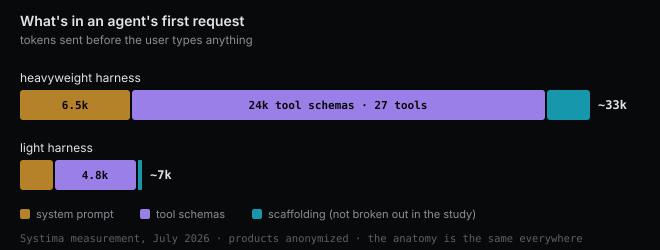
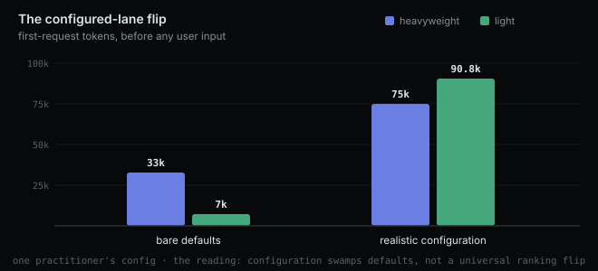
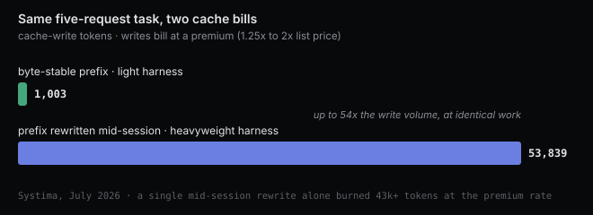

# 33k tokens before hello: the anatomy of your coding agent's preamble

*2026-08-05 · the RunAI Coder team · [run.ceo/coder](https://run.ceo/coder/?utm_source=github_Official_Page)*

Open a coding agent, type nothing, and watch the first API request go out. In a study Systima published this July, one popular harness sent about 33,000 tokens before the user's prompt appeared; another sent 7,000 for the same job. In what the measurement called a practical configuration, the count grew to around 75,000. The Hacker News thread about it ran past 700 points and nearly 400 comments, most of them some flavor of "so that's where my money goes."

The study names both products. Which two doesn't matter here, and we'll call them the heavyweight and the light harness, because the anatomy is the same everywhere and the point of this post is what the thread mostly skipped: what those tokens are, which of them you actually pay for, and what the full study says once you read past its headline. Spoiler on that last one: the 33k-versus-7k number is the least interesting finding in it.

## What's in the preamble

The measurement is worth trusting on anatomy because of how it was taken: a logging proxy between each harness and the model endpoint, capturing exact request payloads. Strip any agent harness to its first request and four layers show up.

| Layer | Heavyweight harness | Light harness |
|---|---|---|
| System prompt (rules, safety, output conventions) | ~6,500 tokens | ~2,000 tokens |
| Tool schemas (default set) | ~24,000 tokens, 27 tools | ~4,800 tokens, 10 tools |
| First-request baseline | ~33,000 | ~7,000 |

*(The published components don't sum exactly to the baseline; the remainder is harness scaffolding the study didn't break out.)*

The system prompt is the layer people imagine when they hear "33k", and it is the smallest surprise. The bulk is tool definitions: JSON schemas for file editing, search, shell execution, and in the heavyweight case a whole orchestration suite of subagent delegation, scheduled jobs, monitoring, worktree management, notifications. The gap between the two harnesses is not prose style. It is surface area. One walks in carrying every tool it owns, just in case.

Then come the layers you add yourself. Project instruction files (`AGENTS.md`, `CLAUDE.md`, and their cousins) load at session start; the study measured a 72KB instruction file at roughly +20,000 tokens on every request, on both harnesses, and it loads whether the task needs it or not. And every MCP integration you connect injects its tool schemas too: about 1,000 to 1,400 tokens for a single server in this measurement, +4,900 to +7,000 for five. A preprint from this spring measured the pattern at enterprise scale and named it the MCP tax: with seven servers connected, tool definitions alone consumed about 67,000 tokens, a third of a 200K window, before any conversation began. Ten to sixty thousand tokens is its typical range for multi-server setups.

## The plot twist the headline missed

Here is the finding the thread barely discussed. When the study moved from bare defaults to a realistic production configuration, instruction file plus several MCP servers, the heavyweight harness landed around 75,000 tokens before user input. The light harness landed around 90,800.

Read that again: in the configured lane, the villain of the headline was the lighter one. (That lane is one practitioner's configuration, so the right reading is "configuration swamps defaults", not a universal ranking flip.) The 4.7x gap between defaults did not survive contact with a real setup, because user configuration dwarfs harness defaults. The authors' own conclusion says it plainly: configuration, not inherent capability, accounts for the majority of production token bills. The harness sets the floor. You set the ceiling.

## Two ledgers, and people keep reading the wrong one

The instinctive math on a 33k preamble is 33,000 times list price, every turn, forever. That math ignores prompt caching, and for preambles, caching is the whole game.

The dollar mechanics, using one major provider's published price list as the example: a cache write bills at a premium over list (1.25x for the five-minute cache tier, 2x for the one-hour tier), and a cache hit bills at about a tenth of list. Other providers' discounts differ, but the shape is the same everywhere: pay extra once to store the prefix, then read it back cheap. So a preamble that stays byte-stable across turns is close to a fixed cost. What bleeds money is not size. It is churn: every change anywhere in the prefix invalidates everything after it, and you pay the write premium again on the full width.

The study caught both behaviors in the wild, and this is its sharpest result. The light harness emitted byte-identical prefixes across every request and every run; over a five-request task it wrote 1,003 tokens to cache, total. The heavyweight harness rewrote its full prefix mid-session, repeatedly: 53,839 cache-write tokens on the same task, with a single rewrite consuming over 43,000 tokens at the premium rate, reproduced at similar scale on a second model. Depending on the lane, that is 5.9x to 54x more cache-write volume for identical work. A small unstable preamble can genuinely out-spend a large stable one; a large unstable one is the worst of both.

The second ledger never shows up on an invoice. Caching makes tokens cheaper; it does not give the window back. A cached 33k preamble still occupies a sixth of a 200K context before your code enters, and the model still attends over it on every turn. The length-degradation studies (Chroma's 18-model sweep is the systematic one) are consistent on this point: performance drops as input grows, well before the window is full, and every resident token competes with the ones you care about. A cached preamble is cheap the way a stored piano is cheap. You are not paying rent on it, but it is still taking up the living room.

So the honest accounting: dollars, mostly fine if the prefix holds still; attention, charged in full, every turn, no discount for caching.

## Session shape decides who actually spends more

If the preamble were the whole story, the light harness would win every lane. It doesn't.

On a multi-step task (write code, run it, fix it), the heavyweight harness finished in 3 requests and about 121,000 metered input tokens, because it batched tool calls; the light one took 9 requests and about 132,000. The 33k opener won the round. Then the study reran the same lane on a different model and the picture inverted: 298,000 versus 133,000, because the batching behavior turned out to be model-dependent, not structural. And when the heavyweight harness fanned the task out to two parallel subagents, the same work cost 513,000 tokens against 121,000 done directly, a 4.2x multiplier, since each subagent re-reads its own preamble on every turn it takes.

Meanwhile the quality benchmark in the study found no difference at all: both harnesses passed 5 out of 5 implementation lanes, one spending about 268,000 input tokens per passing run, the other about 72,000. Overhead bought no correctness either way, in this sample.

The authors compress all of this into one line that deserves to outlive the headline: the meter starts higher; how the session unfolds decides who spends more. A fat preamble buying orchestration can pay for itself on a long autonomous run and be pure tax on "rename this variable". The bet is static; the work is not. That is the real complaint hiding under the thread's best one-liner, the commenter who compared it to a consultant who bills you for the time spent reading your email before even opening it. The bill is not the outrage. Billing before knowing what the job is, is.

## Measure your own in two minutes

Everything above is someone else's setup. The useful move is measuring yours, and it takes one command: most agent CLIs have a non-interactive print mode that returns usage as JSON (for ours, a print flag plus a JSON output flag). Ask for something trivial, then read the usage block. Your first-request context is the sum of three fields: uncached input, cache writes, and cache reads.

We ran it while writing this, on the harness installed on this machine, 2026-08-05, one run per scenario. In an empty directory: 31,782 tokens before our one-line prompt, independently landing in the same ballpark as the July study. Of that, 20,796 arrived as cache reads, billed at about a tenth of list because other sessions on the machine had already warmed the prefix; the dollar ledger at work. Then the same probe from inside a heavily configured project, MCP servers, plugins, a stack of skills: 31,948 tokens. The entire configuration added 166.

That second number looks like it contradicts the 75k story, and the reconciliation is the actual state of the art. This harness version defers tool loading: integrations contribute a one-line pointer up front, and full schemas are fetched only when the task reaches for them. The lazy-loading literature reports cutting tool-definition overhead by around 85 percent, with startup context cost dropping from around 40 percent of the window to a few percent, and the discovery-versus-fetch split shipped as a GA feature on at least one major platform this February. Both things are true at once: configuration can dominate your preamble, and a harness that loads lazily can neutralize most of it. Which of the two describes your setup is exactly what the two-minute probe tells you. Run the same probe on a harness that loads everything eagerly, or drop a 72KB instruction file into the project, and it will hand you a very different number.

The deeper fixes need harness support. The biggest lever doesn't: connect fewer things. An MCP server you use weekly has no business in every session's opening bid, and instruction files are preamble too, so write constraints in them, not essays.

The last habit is stability. Every dynamic fragment near the top of your configuration, a timestamp, a generated banner, a list that reorders itself, is a cache invalidation billed at premium across the full preamble width. The study's 43,000-token single rewrite is what that looks like when a harness does it to itself; a plugin that injects the date into your system prompt does the same thing to you.

## The honest boundaries

The specific numbers here are July 2026 snapshots of software that ships weekly, and our own probe is one run per scenario on a different version than the study measured; treat all of it as portraits, not specs. The study itself discloses real limitations: a single machine, single-digit runs per lane, traffic through a gateway whose constant overhead had to be subtracted, and a "realistic configuration" that is one practitioner's setup. Several of the thread's sharpest comments attack exactly these points, fairly. The lazy-loading gains come from early benchmarks and preprints, not years of production. And nothing in any of this measures output quality; the one quality check in the study came out a tie.

What survives all those caveats is the method and the two ledgers. Your agent's first request is its opening bid about the work it expects, and unlike almost everything else about a model, this part is fully visible: one command, three fields, no trust required. The most expensive tokens in your setup are the ones you send on every turn and never use. Go count them.
