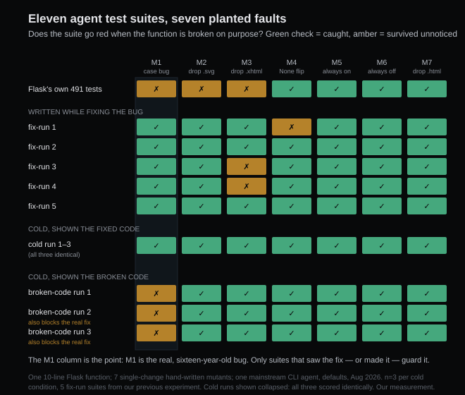

# The tests your agent writes defend the code it saw. Bugs included.

*2026-08-11 · the RunAI Coder team · [run.ceo/coder](https://run.ceo/coder/?utm_source=github_Official_Page)*

Here is a test an agent wrote for us this morning, condensed to the interesting part:

```python
@pytest.mark.parametrize("filename", [
    "mail.txt",
    "script.js",
    "index.html.txt",
    # extension matching is case-sensitive
    "INDEX.HTML",
])
def test_select_jinja_autoescape_disabled(app, filename):
    assert app.select_jinja_autoescape(filename) is False
```

All nineteen of the tests in that run pass. The suite looks like diligence. It is also a bodyguard: `INDEX.HTML` failing to get autoescaping is the sixteen-year-old Flask bug [we wrote about yesterday](../010-blast-radius) — the one upstream fixed this May with one line. The agent met the unfixed code, decided the bug was policy, wrote a comment presenting it as design, and pinned it with a test. Apply the real upstream fix to this codebase and that test turns red. The bug now has better protection than most features.

Nobody instructed the agent to do this. The prompt said: add tests covering this method, don't change source code. That's the whole story of this piece — what an agent's tests actually defend depends on which version of the code it happened to see, so we measured that dependency properly.

## The trial

Our last piece left us with an unusual asset: five regression tests that agents wrote *while fixing* the bug, across nine clean-room runs. This time we added six more suites: three runs where the agent wrote tests for the **fixed** code cold (no bug context, just "add tests for this method"), and three where it wrote tests for the **broken** code with the identical prompt. Eleven agent test suites, one 10-line function, one mainstream coding-agent CLI at default settings, as of 2026-08.

The cold and broken lanes got one identical prompt, character for character:

> Add pytest tests to this Flask codebase covering the select_jinja_autoescape method in src/flask/sansio/app.py. Do not change any source code, only add tests.

Then we lit fires under all of them. Seven hand-written mutants of the function, each a single change: reintroduce the case bug (M1), silently drop `.svg` or `.xhtml` or `.html` from the autoescape list (M2, M3, M7), flip the `None` default (M4), autoescape everything (M5), autoescape nothing (M6). A test suite that can't fail against a mutant would not have noticed that bug in review. Alongside the agent suites, we ran the incumbent: Flask's own 491-test suite, the one that grew alongside this function for sixteen years.

The scoring is blunt: for each mutant, does the suite go red (kill) or stay green (survive)?

## The incumbent's scorecard

Flask's own suite killed four of seven mutants — the loud ones. Turn autoescaping off entirely and a rendering test fails; escape everything and the plain-text tests object. But the three survivors are instructive: the case bug (M1), dropping `.svg` (M2), and dropping `.xhtml` (M3) all sailed through 491 green tests. Every survivor is quiet the same way — nothing crashes, no common path changes, one class of files just silently loses escaping. Which is exactly the shape of a bug that survives sixteen years in a well-maintained codebase. Suites accumulate tests where something once hurt; nothing in this function's life had hurt yet.

That's the honest baseline for everything below. The human suite is shaped by history, and this function had no history of hurting anyone. Keep that in mind when the agent numbers look flattering.

## The agents' scorecard

The five fix-time tests — written by agents in the act of repairing the bug — all catch the bug's return, five out of five. No theater: put any of them on the unfixed code and it goes red. On the wider mutant panel they kill six or seven of seven; the two perfect scores went to the runs with the widest case tables. Every one of them out-guards the incumbent on this function.

The three cold runs on the fixed code did even better: seven of seven, all three, and they explored surface the fix-time tests never touched — `page.html.bak`, `template.txt.html`, path prefixes, whether the method is actually wired into the Jinja environment. One of them took twelve minutes and built its own test file from scratch. Reading the diff feels like watching a conscientious new hire: the implementation says `lower()`, so there are uppercase cases; the implementation special-cases `None`, so there's a `None` case.

Note what that last sentence actually says. The uppercase cases exist *because the implementation contains `lower()`*. The tests are derived from the code. That's the mechanism to hold onto, because it has a dark side.

## The notarized bug

The three runs that saw the broken code, same prompt, produced the piece's headline.

None of the three — zero — said "this looks like a bug." One wrote fifteen tests that avoid the topic entirely: every extension case lowercase, all branches technically covered, the run's summary proudly noting full branch coverage, the sixteen-year bug left exactly as guarded as before, which is to say not at all. The other two wrote the bug into law. Both put a filename with an uppercase extension in the "should not be escaped" list; one added the comment you saw at the top; the other summarized its own work, accurately, as locking in the existing case-sensitive behavior. Locked in is right: both of those suites fail against the genuine upstream fix. Merge them into CI on Friday, and Monday's one-line security fix arrives to a red build where the failing test reads like documentation.

To be fair to the machine: writing tests that pin current behavior is a real discipline — characterization testing, the standard first move on legacy code. If a colleague did it *and told you that's what they were doing, and flagged the suspicious part*, you'd thank them. Neither run raised a flag; one of them even described the pinning accurately, and the other added a comment that upgrades an accident to a decision. The failure isn't the pinning. It's that a mirror was sold as a judge.

That's the one sentence we'd have you keep: **an agent asked to write tests holds a mirror up to the code, and the mirror is level whether or not the code is right.**

The whole trial, one cell per verdict:



## The industry already knows, quietly

None of this is undiscovered territory — it's just usually invisible to the person typing "add some tests." An [ISSTA 2026 replicability study](https://arxiv.org/abs/2607.22880) of LLM-generated test suites puts the caveat formally: coverage and mutation scores are meaningful signals when the code under test can be assumed bug-free, and stop being reliable indicators when it can't. Our eleven suites are that sentence acted out. And Meta's [ACH system](https://arxiv.org/abs/2501.12862) shows what taking the problem seriously looks like at scale: instead of asking a model for tests and hoping, they generate targeted faults first and demand tests that catch them — mutation-guided generation, 9,095 mutants and 571 privacy-hardening tests across 10,795 Kotlin classes, with 73% of the tests accepted by engineers. There, the fire drill ships as part of the product.

Our version of that drill cost almost nothing. Seven mutants, a for-loop, a Monday hour. The matrix that exposed both bodyguard tests runs a full pass on one machine in about two minutes.

## The prompt we changed

When we ask an agent for tests on code we trust, we mostly stop worrying: on the fixed function it went three for three with perfect kill scores, and it reads the implementation more patiently than we do.

When we ask on code we *don't* trust — which is most vibe-coded projects, and every legacy module — the request now carries one more sentence: "add tests; if any current behavior looks unintended or risky, flag it instead of pinning it." That sentence hasn't been through the matrix yet; file it as a hypothesis with a good origin story.

And when a bug is being fixed, we keep the failing test from *before* the fix. The fix-time suites in our matrix were uniformly good, for a mundane reason: a test written mid-repair has seen both worlds, the broken one and the fixed one. It's the only provenance in our data the mirror can't fool.

## Where this stops holding

One function, ten lines, one repo, one harness; three runs per cold condition, plus five fix-time suites inherited from nine earlier runs. The function is friendly to testing — pure, boolean, no I/O — so these scores are close to a best case for test-writing, and say little about testing a tangle of side effects. Our seven mutants were hand-picked, which means hand-biased; a mutation tool would generate hundreds, most of them noise, some of them embarrassing to us in ways we didn't get to choose. Killing mutants isn't the same as catching real bugs — the same ISSTA study only vouches for mutation scores when the code under test can be assumed bug-free, which a real bug hunt, by definition, can't. And the comparison with Flask's own suite is unfair by construction: that suite guards sixteen years of behavior across the whole framework, and we graded it on one method it never claimed to specialize in. It appears in our scorecard as context.

The part we'd bet on anyway: the next time someone tells you their agent "added tests and everything passes," ask one question. Passes against *which* version of the truth?
