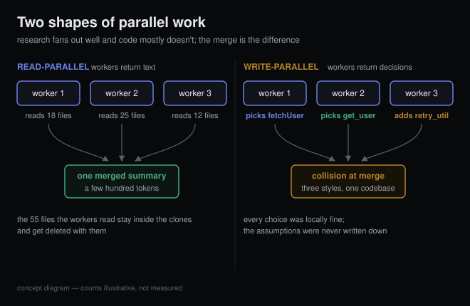

# Why your coding agent spawns clones of itself

*2026-08-11 · the RunAI Coder team · [run.ceo/coder](https://run.ceo/coder/?utm_source=github_Official_Page)*

You ask your coding agent where rate limiting lives in a 400k-line monorepo. It announces it's spawning an explore agent, goes quiet for half a minute, then comes back with three file paths and a two-sentence explanation. Your conversation grew by maybe 150 tokens. In the background, a complete copy of your agent just read sixty files and was deleted.

As of 2026, some version of this ships in the major coding CLIs: subagent forks, background explore tasks, whole "agent teams" sharing a repo. The feature usually gets explained as teamwork. We've found the accounting framing far more predictive: a subagent is a disposable context window. The clone is how your agent reads sixty files without having to remember them.

## Search is a messy tenant

A context window is a single shared surface. The system prompt lives there, the tool definitions live there, your conversation lives there, and so does every file the agent has ever opened. The trouble is that search fills that surface with garbage at a spectacular rate: to find one function you might open forty files, and thirty-nine of them turn out to be dead ends. In a single-context agent, those thirty-nine files stay in the window for the rest of the session. You pay for them again on every following turn, because the model re-reads its whole history each time it responds (caching discounts the re-read; it doesn't erase it), and they keep dragging on answer quality long after they stop being useful, which is the context-rot problem we wrote [a field guide to](https://github.com/RunAI-Coder/aicoder-showcase/blob/main/posts/006-why-coding-agents-forget/README.md) last week.

A subagent sidesteps this with a structure so simple it feels like cheating. Fork a fresh context. Hand it one question. Let it fill itself with dead ends. Take the two-sentence answer back, and throw the entire context away.

That's the whole trick. Everything else about subagents is consequences.

## The clone knows nothing you didn't write down

The isolation cuts both ways, and this is the part that bites people. A forked subagent does not see your conversation. It gets a system prompt, its tools, and whatever brief the main agent wrote when spawning it. Every assumption that lived in your chat and didn't make it into that brief is simply gone: the library you already rejected, the API version you're pinned to, the constraint your teammate mentioned two hours ago.

Cognition built their whole argument on this in a June 2025 essay, [Don't Build Multi-Agents](https://cognition.com/blog/dont-build-multi-agents). Their two principles: "Share context, and share full agent traces, not just individual messages," and "Actions carry implicit decisions, and conflicting decisions carry bad results." Run two writers in parallel and each makes small unstated choices about naming, style, and edge cases. Each writer's output is internally fine; together they disagree, and no merge step can recover intentions that were never written anywhere.

The same essay points at a design detail of one popular CLI that's easy to miss: its subagents were usually "only tasked with answering a question, not writing any code." A wrong answer to a question is cheap to catch and cheap to discard. Wrong code is neither.

## The month the industry argued with itself

June 2025 produced both the strongest public case for multi-agent systems and the strongest public case against them, and the funny part is that both were right.

Anthropic's engineering post on their [multi-agent research system](https://www.anthropic.com/engineering/multi-agent-research-system) reported that an orchestrator with parallel subagents "outperformed single-agent Claude Opus 4 by 90.2%" on their internal research eval. Cognition's post, above, said don't build multi-agents at all. The resolution is that they were describing different shapes of work.

Research is read-parallel. Each worker's product is a report, and reports are plain text, which a lead agent can merge the way editors merge text. Coding is write-parallel: each worker's product is a pile of decisions embedded in files, and the decisions have to coexist. Even the pro-multi-agent post conceded this boundary in one line: "most coding tasks involve fewer truly parallelizable tasks than research."

## The bill for the fork

The same Anthropic post published the bill, which almost nobody quotes. Agents use about 4× the tokens of a chat interaction; multi-agent systems, about 15×. And on their BrowseComp evaluation, token spend by itself explained 80% of the performance variance between systems.

Read that last number again. On that eval, at least, multi-agent won mainly by spending more compute in parallel without drowning any single context, and the post itself frames it that way. Seen from the billing side, the architecture is a mechanism for buying performance that one window can't hold, and whether that's brilliant or wasteful depends entirely on the task underneath it. A deep audit of an unfamiliar codebase can be worth 15×. A README typo can't.

## Where this landed by mid-2026

As of August 2026, the argument has mostly converged, from both directions at once.

Cognition published a follow-up in April 2026, [Multi-Agents: What's Actually Working](https://cognition.com/blog/multi-agents-working), with a sharper rule than their 2025 one: "multi-agent systems work best today when writes stay single-threaded and the additional agents contribute intelligence rather than actions." The setups they now endorse share that shape. A review agent that deliberately shares no context with the coding agent, because fresh eyes are the point. A mid-task consult where the working model calls a smarter one. A manager that splits work, hands it to children, and synthesizes what comes back. Parallel writers stay on the do-not list.

The tools converged onto the same lines. Mainstream CLIs now ship disposable subagents aimed squarely at read-heavy work (code search, history digs, log analysis), and when genuinely parallel writes are unavoidable they reach for git worktrees: each writer gets its own checkout, and the merge moves into git, where conflicts are at least visible and the tooling is twenty years old. The isolation just moved house: out of the context window, into the filesystem.

The academic postmortem points the same direction. The [MAST taxonomy](https://arxiv.org/abs/2503.13657) (NeurIPS 2025) annotated 1,600+ execution traces across seven multi-agent frameworks and sorted the failures into fourteen modes in three clusters: system design issues, inter-agent misalignment, and task verification. None of those three cluster names is "the model wasn't smart enough." Multi-agent systems fail like distributed systems, with one new disease on top: the nodes improvise.

## How we actually use the fork button

Our own rules of thumb, from running these things daily rather than from a benchmark:

- **Delegate reads without hesitation.** "Where is X handled," "what would break if we changed Y," "read these three PRs and summarize the disagreement." The result merges into your session as a paragraph, and paragraphs don't conflict.
- **Delegate verification deliberately.** An agent that didn't watch the code being written makes a better skeptic. Sharing your conversation with a reviewer mostly teaches it your assumptions, and then it agrees with you.
- **Delegate writes narrowly.** Only when the files partition cleanly, like a per-directory migration with a mechanical spec, and give each writer its own worktree.
- **Write the brief like a spec.** The subagent starts from zero. State the constraints it can't guess, name the files it should start from, and say what shape of answer you want back. If the brief is hard to write, the task usually isn't delegable yet.
- **Skip the fork for small jobs.** Spawn overhead plus re-reading the relevant files makes the clone slower and pricier than just doing the thing inline.

## What this doesn't solve

Fan-out doesn't rescue a bad plan; it executes the bad plan in nine places at once, faster. The fresh-eyes reviewer will, by construction, miss any bug that requires knowing a requirement your conversation established earlier, unless the brief carries it in. And verification is itself one of MAST's three failure clusters, so "the manager checks the children's work" is a thing that fails too, most classically by rubber-stamping.

There's also a number we'd genuinely like to see and can't find: a clean public benchmark of single-agent versus multi-agent on identical coding workloads. Anthropic's 90.2% is a research eval. Vendor numbers for coding aren't apples to apples. Until someone runs that, "writes stay single-threaded" is the industry's best current judgment: the position behind it has held since mid-2025, the sharpened phrasing only arrived this April, and our observation from daily use is that it's correct.

Pressing the fork button is easy now; the major CLIs have all grown one. Writing the brief that makes the clone worth its tokens is the part nobody has automated.
