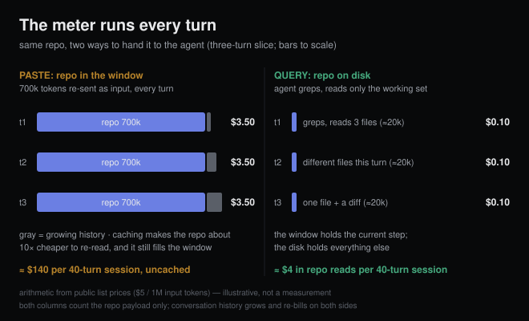

# A million tokens of context, and the agent still greps

*2026-08-12 · the RunAI Coder team · [run.ceo/coder](https://run.ceo/coder/?utm_source=github_Official_Page)*

The complaint keeps showing up under coding-agent threads, usually phrased as a gotcha: the window is a million tokens, my repo is 700k, so why is this thing still running grep like it's 2024? Paste everything in and it knows everything. And as of August 2026 the last practical excuses are gone: on Anthropic's current flagships a 1M window is now [the default](https://platform.claude.com/docs/en/build-with-claude/context-windows), no beta flag, and the long-context surcharge that used to kick in above 200k tokens is gone, with long-context requests "billed at standard pricing."

So the question deserves a real answer. Why do the tools still search?

The short version: the window bills by the turn, and a model reads a stuffed window worse than a lean one. The long version has price tags and papers.

## The meter runs every turn

An agent conversation re-sends everything on every turn: system prompt, tool definitions, the whole history, and your pasted repo, all of it billed as input again (the mechanics behind [our earlier cost breakdown](https://github.com/RunAI-Coder/aicoder-showcase/blob/main/posts/005-cost-engineering-for-coding-agents/README.md)). Take a 700k-token repo on a [$5-per-million-input model](https://platform.claude.com/docs/en/about-claude/pricing) and the paste costs about $3.50 per turn, by list-price arithmetic. Agent sessions run dozens of turns. Call it forty, and the repo alone bills around $140 for one working session, before the model has written a line of code.

Prompt caching softens this a lot: a cached prefix reads back at a tenth of the base price, so the steady state drops to roughly $0.35 a turn. Two catches. Caching is prefix-based, so anything that changes early in the context re-bills everything after it at full price. And the vendor docs are blunt about the part people forget: caching "changes what you pay for those tokens, not whether they count." The window is just as full either way.

There's also a wait. Processing a near-full window before the first output token takes visibly longer in our daily use, though we haven't measured it carefully enough to quote numbers, so file that one under observation.

## Paying doesn't buy comprehension

Even at flat prices, dumping the repo would only make sense if the model read all of it well. The paper trail says it doesn't, and it all points the same direction.

[Lost in the Middle](https://arxiv.org/abs/2307.03172) (TACL 2024) established the shape: "performance is often highest when relevant information occurs at the beginning or end of the input context, and significantly degrades when models must access relevant information in the middle of long contexts."

[NoLiMa](https://arxiv.org/abs/2502.05167) (ICML 2025) removed the crutch most long-context demos lean on, the literal word overlap between question and needle, and the floor gave out: "At 32K, for instance, 10 models drop below 50% of their strong short-length baselines." Their effective-length table is the brutal part. A model advertising 128k held its quality bar to 8k, and that was the good case; several others made it only to 2k, including one advertising two million. That's the 2024 model cohort; newer models do better in our daily use, though nobody has published the same table for them. What hasn't changed is the direction of the curve.

Chroma's [Context Rot report](https://www.trychroma.com/research/context-rot) (July 2025, 18 models including then-current flagships) went after the benchmark itself: needle-in-a-haystack "measures a narrow capability: lexical retrieval," and strong scores on it have "led to the perception that long-context is largely solved." The strangest detail in the report: shuffled haystacks beat logically coherent ones. If that transfers to code, it's bad news for pasted repos: a real codebase is exactly the coherent kind of haystack.

And the concession is now printed in the seller's manual. The same docs page that announces the million-token default warns that "more context isn't automatically better," names the failure mode context rot, and says curating what's in context is "just as important as how much space is available." When the people who bill you per token advise you to send fewer tokens, believe them.

## Why it degrades: not our department, but here's the map

We use models; we don't train them. So the mechanism section comes with that caveat attached. Researchers point at attention spreading thinner as sequences grow, at training distributions dominated by short sequences, and at distractors: one of Chroma's experiments measures how topically-related-but-wrong content drags accuracy down, which is exactly what a big codebase is full of (four functions named `validate`, three deprecated copies of the config loader). Whether those explanations are the whole story isn't ours to judge. The behavior is measurable from the outside, and the behavior is what we plan around.

## What the tools do instead

The mainstream coding CLIs (at least every one we run daily) took the other road: treat the repo as a filesystem to query rather than a payload to ship. The agent greps for the symbol, opens the three files that matter, reads 20k tokens instead of 700k, and pulls more only when the task turns a corner. It's the workflow of a senior engineer dropped into an unfamiliar codebase, minus the coffee. When the reading load gets heavy, it gets delegated: fork a separate context, let it do the dirty reading, keep the summary ([we wrote about that mechanism yesterday](https://github.com/RunAI-Coder/aicoder-showcase/blob/main/posts/012-why-agents-spawn-clones/README.md)).

What lands in the window is a working set, and it changes as the task moves. The window holds what the current step needs. The disk holds everything else, and search is the pump between the two.

## When pasting everything is actually right

The dump strategy has a legitimate home: single-shot work. One question over a fixed corpus, and the conversation ends with the bill. Summarizing an unfamiliar codebase's architecture, or checking a diff against the entire style guide: breadth is the whole point there, and nothing accumulates because the conversation ends. Small repos flip the math too. At 50k tokens the entire argument above is noise; paste away.

The failure mode is specifically the combination: big corpus, many turns, needle-shaped questions. Which is, unfortunately, the exact shape of a normal agent coding session. That's why the default stayed grep.

## What we don't know

We haven't run our own crossover measurement: at what corpus size, for a fixed task set, does full-paste stop losing to retrieval? If someone has published that curve for the 2026 model generation, we haven't found it. The effective-length tables above are a model generation old, and current models clearly do better in absolute terms while clearly still degrading (the vendor docs adopting the phrase "context rot" is the tell). And the ground is shifting under this post as we write it: server-side compaction and context-awareness features are changing what "a full window" even means. Everything here is marked as of 2026-08 for a reason.

You don't understand a codebase by having all of it open in tabs, and neither does the model. The agents that work best still open files the way good engineers do: a few at a time, on purpose.
