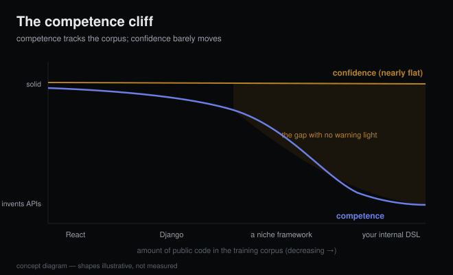

# Agents code best where the internet coded most

*2026-08-13 · the RunAI Coder team · [run.ceo/coder](https://run.ceo/coder/?utm_source=github_Official_Page)*

Same afternoon, same agent, two tasks. Task one: a React data table with sorting and pagination, plus optimistic updates. First try, clean, idiomatic, done. Task two: a small change in a service built on a niche workflow framework, where the agent confidently calls `pipeline.checkpoint_every(n)`. That method doesn't exist. It has never existed in any version of the library. And the agent didn't slow down, didn't ask.

If you've run agents outside the mainstream stacks you know this cliff, and it isn't random. The model's competence is a map of where the internet wrote the most code, and your stack has a fixed address on that map.

## The corpus is the skill map

The mechanism section comes with our usual caveat: we run models all day, we don't train them, so this part leans on published research. Language models learn API surfaces from frequency. The public code they train on is enormously skewed toward a few ecosystems, and a [survey in ACM TOSEM](https://arxiv.org/abs/2410.03981) puts the consequence plainly: performance on low-resource and domain-specific languages "remains a significant challenge, affecting millions of developers," with the causes named as "data scarcity and, for DSLs, specialized syntax that is poorly represented in general-purpose datasets."

The benchmark family that maps this terrain, [MultiPL-E](https://arxiv.org/abs/2208.08227), was built specifically to "explore the impact of language frequency and language features on model performance" across 19 languages. One nuance from that line of work is worth keeping: the study's model (Codex, 2022-era) matched or even beat its Python scores on several other languages. The cliff isn't Python versus everything else. It's high-frequency versus low-frequency, and the drop starts where the blog posts stop.

## The cliff has a second edge: time

Even the most popular framework in the world is a niche framework at the version boundary. The model knows your stack as of its training window, and APIs keep moving after that. [CodeUpdateArena](https://arxiv.org/abs/2407.06249) built a synthetic benchmark for exactly this question and found the uncomfortable part: for the open-source code models they tested, even prepending documentation of an API update didn't reliably get the model to use the changed behavior. Knowing about a change and reasoning with it are different skills.

The shape of the failure is what makes it expensive. The outward reflex does exist: in [a probe we ran this month](https://github.com/RunAI-Coder/aicoder-showcase/blob/main/posts/010-blast-radius/README.md), one run that got only a vague symptom description pulled the current upstream source from GitHub before touching any code (sensible in real work; in our experiment it cost that run its clean-room diagnosis credit). But we have yet to see that reflex fire ahead of a confidently hallucinated API. `checkpoint_every` gets called at full cruising speed, and the first thing in the room that knows something is wrong is your test runner, if you have one.

## What actually pulls the floor up

None of this means niche stacks are agent-free zones. Our working list, roughly in order of how much each helps:

- **Working examples beat reference docs.** A real snippet in your repo that uses the framework correctly does more than a page of API documentation, because in our experience the model imitates a working snippet far more reliably than it applies a doc page. Your existing codebase is the closest thing your stack has to a high-frequency corpus.
- **Pin versions as hard rules, and put them in the brief.** "We are on v2; v3 APIs are wrong here" works much better as a constraint than as backstory. The model's prior leans toward whatever version dominated its training data, and a soft mention won't beat a strong prior.
- **Feed docs, but bill them honestly.** Pasting docs into context helps with facts, costs tokens on [every single turn](https://github.com/RunAI-Coder/aicoder-showcase/blob/main/posts/013-million-tokens-still-greps/README.md), and per CodeUpdateArena is weakest exactly where you need it most: changed behavior. It's a supplement, and the dosage matters.
- **Make wrongness loud.** The agent discovers it invented an API through exactly one channel: something red. A test suite or compiler that fails fast, at the right line, corrects what no amount of prompting can prevent.

There's also an ecosystem-level race happening as we write this, marked as of 2026-08. The [llms.txt](https://ai.aeo.press/the-state-of-llms-txt-in-2026) convention (agent-readable doc indexes at your domain root) sits at roughly one adopting site in ten, per a widely cited 300k-domain crawl we haven't verified firsthand, and one large docs platform, Mintlify, has reported agent traffic approaching half of its documentation visits. The countercurrent is real too: Google's John Mueller said in mid-2025 that no AI system was actually using llms.txt, and Google's 2026 AI guidance says the file isn't needed for its features. For coding agents specifically, our observation is that docs get consumed by fetch-on-demand inside the harness, so the format that wins is whatever your agent can grab and parse mid-task, standard or not.

## Should agent-friendliness pick your stack?

It has become a real input: one row in the decision matrix, and in our view it belongs below domain fit.

Where it genuinely tips the scale: greenfield projects, small teams, heavy agent usage. There the mainstream boring choice pays twice, once in agent reliability and once in every future hire who already knows the stack. The old "choose boring technology" argument just gained a new line item, and it's a big one.

Where it shouldn't: when domain fit beats corpus fit. A specialized language or framework that halves the actual complexity of your problem is worth the agent tax, because the mitigation list above recovers a lot of the gap, and nothing recovers a wrong abstraction. Teams porting away from a good DSL because "the agent knows React better" are optimizing the assistant at the expense of the thing being assisted.

## What this doesn't solve

We couldn't find a clean public number for the question we most want answered: on a genuinely niche stack, how much of the gap do examples-plus-docs-plus-pins actually recover? Vendors don't publish training mixtures, so the skill map can only be probed from outside, one stack at a time. The llms.txt consumption numbers are contested enough that we've stated them with hedges. And all of it shifts with every model generation.

The asymmetry worth remembering is the human one. A junior engineer dropped onto an unfamiliar framework slows down, asks questions, and radiates visible uncertainty. An agent mostly keeps its cruising speed, and off its home field the failures arrive at exactly that speed. The cheapest insurance we know is also the fastest: give your own stack the two-task afternoon — one mainstream chore, one deep-in-your-domain chore — and read the diff. The map answers in about an hour.
