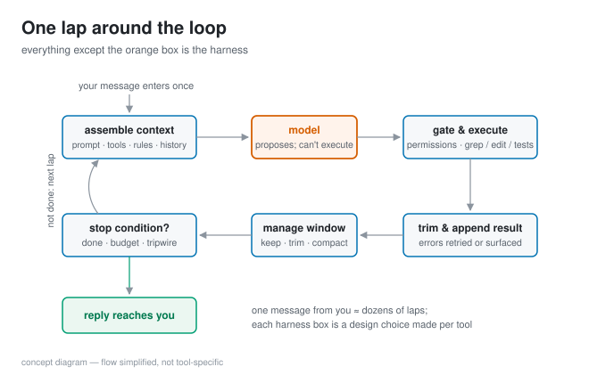
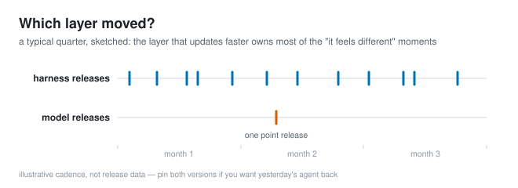

# The harness is half your agent

*2026-08-14 · the RunAI Coder team · [run.ceo/coder](https://run.ceo/coder/?utm_source=github_Official_Page)*

Every few weeks the same post goes around: "did the model get nerfed this week? it's suddenly worse at everything." Sometimes the model did change. But ask what else changed and a familiar answer comes back: the coding tool auto-updated, or the complaint compares the model in one tool against the model in another. Same weights, different animal.

That confusion has a boring explanation with big consequences. When you use a coding agent, the model never touches your keyboard, your filesystem, or your terminal. A program does, and that program is the harness: the loop that wraps the model, feeds it, executes what it proposes, and decides when it's done. You form impressions of "the model." Most of the time you're forming impressions of the pair.

## One message from you, one lap around the loop

Here's what actually happens to the sentence you type, and this is our home turf, so we'll take the long way through it.

Before the model sees your request, the harness assembles a context: its own system prompt, the definitions of every tool the agent may call, project rules files, and the conversation so far. That preamble is substantial — we once [measured 31,782 tokens of it](https://github.com/RunAI-Coder/aicoder-showcase/blob/main/posts/007-agent-preamble-anatomy/README.md) before the first word of the user's request. The model then replies with either text or a request to use a tool. A request, because the model has no way to execute anything itself.

The harness is the one that acts. It checks the request against a permission policy, executes the grep or the file edit or the test run, captures the output, usually trims it, and appends the result to the context for the next lap. It manages [what stays in the window](https://github.com/RunAI-Coder/aicoder-showcase/blob/main/posts/013-million-tokens-still-greps/README.md) as the session grows. It decides what happens when a tool call fails, when output doesn't parse, or the same fix comes back a third time. And it decides when the loop ends: the model says it's done, a budget runs out, a tripwire fires. One message from you can be forty laps around this loop, and every design choice inside it happened before you typed anything.

A 2026 [taxonomy of thirteen open-source coding agents](https://arxiv.org/abs/2604.03515) maps this territory across "the control loop, tool definitions, state management, and context strategy," sorted into three layers: control architecture, tool and environment interface, and resource management. The detail we found most telling: eleven of the thirteen compose multiple control primitives (plan-execute, generate-test-repair, retries, and so on) rather than running one simple pattern. Harnesses turn out to be opinionated programs, and the opinions differ tool to tool.

(Simplified. Every tool draws these boxes differently, which is rather the point.)

## The layer moves the numbers

If the harness were cosmetic, benchmark scores would follow the model alone. They don't.

The cleanest signal is the vendor's own writing. Anthropic's engineering post on [long-running agent harnesses](https://www.anthropic.com/engineering/effective-harnesses-for-long-running-agents) states the position flat out: "out of the box, even a frontier coding model like Opus 4.5 running on the Claude Agent SDK in a loop across multiple context windows will fall short of building a production-quality web app if it's only given a high-level prompt." That is the model's own maker saying a frontier engine plus a capable general-purpose harness, driven by nothing but a high-level prompt, still doesn't get there — and the missing piece the post goes on to describe is more harness work.

The benchmark world agrees. [One 2026 analysis](https://docs.bswen.com/blog/2026-04-20-swe-bench-pro-agent-scaffold/) of SWE-bench Pro submissions (a third-party analysis we haven't verified against the leaderboard ourselves) found three agent systems on the same base model spanning about five points of resolve rate on scaffold differences alone. And [SWE-Effi](https://arxiv.org/abs/2509.09853), which scores agents on accuracy against tokens and time rather than accuracy alone, lands on the conclusion that effectiveness "depends not just on the scaffold itself, but on how well it integrates with the base model". Their failure catalog is a harness-design catalog: token consumption that snowballs as context grows, and agents burning through resources on exactly the tasks they can't solve. Our reading of why: nothing in the loop tells them to stop digging.

That last one deserves a second look. Whether a failed run costs you forty cents or four dollars is almost entirely a harness property; the model just supplies the optimism.

## What we do with this

Four habits, all cheap, all from running these things daily:

- **Log both version numbers.** Every probe we run records the harness version alongside the model. When behavior shifts, the first question is which of the two moved. Tool changelogs read mundane ("improved tool descriptions") and quietly rewrite the preamble your model sees every turn.
- **Compare models inside a single harness.** A model that looks smarter in a different tool may just be wearing a better loop; cross-tool comparisons measure pairs.
- **Read your own config as part of the harness.** Rules files, hooks, permission mode, connected MCP servers: that's harness surface you author. Two teammates on identical tools and identical models can still be running meaningfully different agents.
- **Watch the failure bill, and pull the plug on loops that dig.** If a session is going nowhere, the kindest thing you can do is stop it yourself; the harnesses we run daily are all more patient than we'd like, and patience is billed by the token.

## What this doesn't settle

Closed harnesses can only be observed from the outside, through token counts and transcripts, so parts of the loop tour above are inference for any tool that isn't ours. The isolation experiment that would settle things — same model, same tasks, same config surface, harness swapped — is one nobody has published in a form we can check, and we want to run it ourselves. It would also let us defend the "half" in this title with a number instead of a shrug; until then, that word is rhetoric, and we're using it on purpose. One more caution: harnesses tend to ship weekly; models, a few times a year. The impression drift usually comes from the layer that updates faster, and every claim here wears a 2026-08 date stamp for exactly that reason.

So next time an agent stuns you, in either direction, file the impression under two names instead of one. The model earned some of it. The loop earned the rest.
