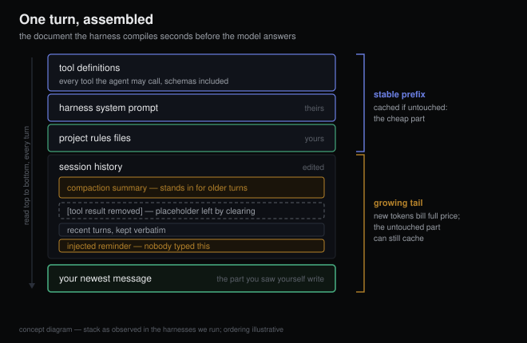
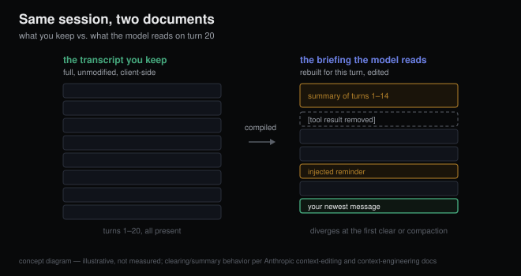
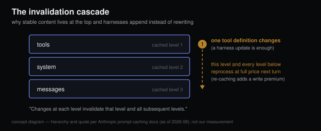

# Every turn, the harness decides what the model sees

*2026-08-17 · the RunAI Coder team · [run.ceo/coder](https://run.ceo/coder/?utm_source=github_Official_Page)*

Somewhere in your coding agent's debug output is the full context of the request it just sent. We started reading these transcripts around the time we measured what a session costs before you type anything: [31,782 tokens](https://github.com/RunAI-Coder/aicoder-showcase/blob/main/posts/007-agent-preamble-anatomy/README.md) by our own probe, though the study we were reading alongside got the headline with its rounder 33k. The number faded. The shape of the document is what stayed with us: one long document, assembled seconds before the model answered — a system prompt, a wall of tool definitions, our rules file, an edited history of the session so far, and at the very bottom, the sentence we had just typed.

The Messages API underneath keeps no session. Anthropic's Messages API docs describe "stateless multi-turn conversations" where "you specify the prior conversational turns with the `messages` parameter" — every request, from the beginning. (Prompt caching does persist server-side, but it only discounts the re-send; it stores nothing your request doesn't carry.) The chat window you scroll is a rendering for your benefit. What the model reads is a briefing, not a transcript, and the briefing is recompiled every single turn.

So the model has perfect attendance and no memory of attending. It re-reads the whole thing from the top, every time it speaks.

## The briefing has an editor

Who decides what goes in? The harness: [the loop that wraps the model](https://github.com/RunAI-Coder/aicoder-showcase/blob/main/posts/015-harness-half-your-agent/README.md). A 2026 [taxonomy of thirteen open-source coding agents](https://arxiv.org/abs/2604.03515) puts "context strategy" among the four things that define one, next to "the control loop, tool definitions, state management". Context strategy is a quiet phrase for a large power: out of everything that has happened in this session, what makes this turn's document, in what form, and in what order.

In the transcripts of the harnesses we run daily, the stack reads roughly the same way every time: tool definitions and the harness's own system prompt up top, then project rule files, then the session history, newest material at the bottom. Plus things nobody typed. Harnesses insert reminders mid-session (a nudge about an unfinished todo list, a notice that a file changed on disk), and they leave placeholders where removed content used to be. That's our observation from our own transcripts, and it's a sketch: this layer is mostly undocumented, and every harness stacks it differently.

## The cuts you don't watch happen

The editing is explicit now, at least at the API layer. Anthropic's [context editing feature](https://platform.claude.com/docs/en/build-with-claude/context-editing) "clears tool results when conversation context grows beyond your configured threshold", and it happens out of sight: "Context editing is applied server-side before the prompt reaches Claude." The model finds "placeholder text indicating to Claude that it was removed" — it is informed, politely, that something used to be here. Then comes the sentence we keep re-reading: "Your client application maintains the full, unmodified conversation history." Your history and the model's context are officially two different documents. They agree at turn one; the first cleared result or compaction is where they part. (The harness signs off on these cuts: it's the one that turns the feature on, even when the API wields the knife.)

Compaction is the biggest cut. Anthropic's [engineering post on context](https://www.anthropic.com/engineering/effective-context-engineering-for-ai-agents) defines it as "taking a conversation nearing the context window limit, summarizing its contents, and reinitiating a new context window with the summary": the history, replaced wholesale by a précis of itself. What survives is a judgment call, and per the same post it's the model's own judgment: "architectural decisions, unresolved bugs, and implementation details" stay, "redundant tool outputs or messages" go overboard. If an agent has ever dropped a constraint you stated an hour earlier, here's one plausible autopsy: the constraint didn't make the summary.

And none of this is malpractice. The same post insists context "must be treated as a finite resource with diminishing marginal returns" and frames the whole craft as finding the "smallest possible set of high-signal tokens that maximize the likelihood of some desired outcome". An editor who cuts nothing produces a document nobody can act on; [we've argued before](https://github.com/RunAI-Coder/aicoder-showcase/blob/main/posts/013-million-tokens-still-greps/README.md) that stuffing the window is the wrong dream anyway. The point here is narrower. Cutting is happening, it follows a policy, and which cuts run, and when, is a harness property you didn't write and mostly can't read.

## Why the stack is shaped like that

The assembly order follows the money. [Prompt caching](https://platform.claude.com/docs/en/build-with-claude/prompt-caching) only pays out when this turn's document opens exactly like last turn's. "Cache prefixes are created in the following order: `tools`, `system`, then `messages`", and "Changes at each level invalidate that level and all subsequent levels." Touch a tool definition and everything downstream of it reprocesses at full price next turn, plus a write premium if the harness re-caches it. The layering itself is the API's structure; the harness's part is discipline: keep the top byte-stable, sink volatile content to the bottom, append rather than rewrite. All the cache ever sees of your session is the hash of its prefix.

## The reflexes this trained into us

- **Check the briefing before blaming the model.** When the agent acts like it never saw something, "I told it that" means you put it in the history an hour ago. Whether it survived into this turn's document — past a clearing threshold, past a compaction — is a separate question, and usually the right first question.
- **Say durable things in durable places.** A rule in a rules file rides near the top of every compile. A rule stated once in chat is one compaction away from becoming a clause in a summary, if it makes the summary at all.
- **After a compaction, re-state what's load-bearing.** Costs one sentence and removes the guessing about what the summary kept. Restating at phase boundaries was already our habit; compaction events earned a spot on the same list.
- **Read one raw request a month.** Ten minutes in a debug transcript recalibrates what you believe the model knows better than any documentation will.

## What we can't see from here

Everything above about editing policy comes from one vendor's public documentation plus the transcripts of harnesses we personally run. Most tools document none of this layer; a closed harness can be read only from outside, through token counts and behavior. That's thin instrumentation. So treat our anatomy as a sketch drawn from the harnesses we can see. The missing number is behavioral: what a single cut costs in outcome quality — same session, same tasks, with and without tool-result clearing, scored. That measurement belongs in the harness-swap experiment already on our list. And everything quoted here is as of 2026-08: the API strategy names literally embed dates (`clear_tool_uses_20250919`), which tells you how fast this layer expects to change.

The model cannot audit its own briefing: it has no copy of the original to diff against, no way to know whether a summary was faithful or whether a cleared result mattered. The only participant holding the unabridged session is the person scrolling the rendered chat. The editor answers to nobody — unless you count yourself.
