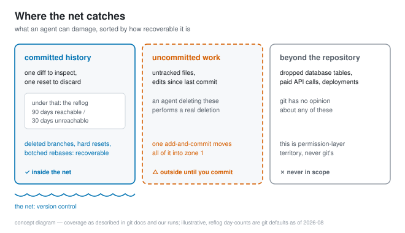
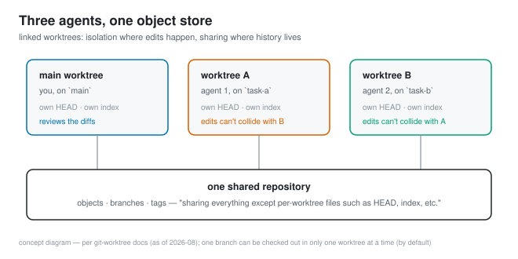

# Your coding agent's safety net was written in 2005

*2026-08-18 · the RunAI Coder team · [run.ceo/coder](https://run.ceo/coder/?utm_source=github_Official_Page)*

Midway through [our agent-written-tests experiment](https://github.com/RunAI-Coder/aicoder-showcase/blob/main/posts/011-agent-written-tests/README.md), we broke the lab without noticing. Building a fixture, we committed directly on `probe-base`, the branch every run measured against, and shoved it forward. A whole round of results came back subtly wrong before a contradiction in the numbers gave it away. The repair was one command: `git branch -f probe-base 06ea505`. Move the pointer back, rerun, done. The mistake cost us a full rerun of the round; without that command, the repair would have meant rebuilding the lab instead of moving a pointer.

That incident is why this post exists. Ask why it's suddenly acceptable to let a program edit code mostly unsupervised, and the answers you'll hear are about models getting smarter and [harnesses getting better](https://github.com/RunAI-Coder/aicoder-showcase/blob/main/posts/015-harness-half-your-agent/README.md). Both real. But the layer doing the quiet risk management under all of it is older than either: version control — in our case git, designed in 2005 — back when the dangerous change-generator in the room was other people.

## What the agent is actually allowed to break

Watch what an agent session risks, mechanically. It edits files in a working tree. If the tree was clean when it started, every change it makes sits on top of a commit, and a commit is a checkpoint: the whole session's damage can be inspected with one diff (plus a `git status` for the files it invented) and discarded with a reset and a `git clean`. A branch costs almost nothing to create, so each task can live on its own one, and merging is a decision a human makes after reading the evidence. The blast radius question we [spent nine clean-room runs on](https://github.com/RunAI-Coder/aicoder-showcase/blob/main/posts/010-blast-radius/README.md) has a boring structural answer underneath it: whatever the agent does through file edits, the reachable history is not in play.

Agents lean on this from the inside, too. In our blast-radius runs, one run's diagnosis began with real git archaeology: `git log -p -S 'filename = filename.lower()'`, asking whether a `.lower()` had ever been deleted from the codebase (an instinct our own clean-room surgery had, that day, made useless — more on that below). And Anthropic's [best-practices doc for its coding CLI](https://code.claude.com/docs/en/best-practices) now teaches this as prompting technique: instead of asking why an API is weird, the suggested prompt is "look through ExecutionFactory's git history and summarize how its api came to be". For an agent, the history doubles as a queryable database of why the code looks like this.

## The undo stack under the undo stack

The layer most people meet only in a crisis: the reflog. [Git's docs](https://git-scm.com/docs/git-reflog) describe it in one line — reflogs "record when the tips of branches and other references were updated in the local repository." Every commit, reset, rebase, and branch move leaves an entry. Reachable entries are kept 90 days by default; entries for commits nothing points at anymore, 30. Which means that for a month or three, almost nothing an agent does to your history with everyday commands is actually gone. Deleted the branch? HEAD's reflog still remembers where it pointed. Reset past your work? `HEAD@{2}` remembers.

We can offer an unusual proof of how strong this net is: we once needed to defeat it on purpose. For the clean-room runs, the fix commit had to be unfindable, and making that true took [deliberate surgery](https://github.com/RunAI-Coder/aicoder-showcase/blob/main/posts/010-blast-radius/README.md): delete the remote, delete every branch and tag past the checkout, expire the reflog, garbage-collect, then verify with `git cat-file` that the object was gone. Five steps to truly lose one commit. That's the strongest endorsement of a safety net we know how to write.

## Parallel agents were the use case all along

The current answer to "how do I run three agents on one repo" is a git feature from 2015: worktrees. [The docs' pitch](https://git-scm.com/docs/git-worktree) reads like it was written for this decade — "A git repository can support multiple working trees, allowing you to check out more than one branch at a time" — each linked worktree sharing the object store while keeping its own `HEAD` and index. [Our position on parallel agents](https://github.com/RunAI-Coder/aicoder-showcase/blob/main/posts/012-why-agents-spawn-clones/README.md) has been that isolation comes from structure, and this is the structure: the same Anthropic doc's parallel-sessions guidance includes "run separate CLI sessions in isolated git checkouts so edits don't collide."

The same page carries our favorite sentence in this genre. Describing its own built-in checkpoint feature, the doc warns that changes made outside the agent's editing tools "are not captured" and closes with: "This isn't a replacement for git." The harness's own undo button, deferring to the one from 2005.

## What we do before handing over the keyboard

- **Start clean, commit first.** As far as git is concerned, an agent set loose on a dirty tree is the genuinely dangerous configuration: everything uncommitted is standing outside the net. The cheapest safety action in this whole field is `git commit` before you hand over the keyboard.
- **Small commits on a task branch, review by diff.** We'd rather read one honest diff than watch a session scroll by. The commit granularity the agent uses is the resolution of your undo, so we ask for commits at every working state, and squash later if it matters.
- **Point the agent at history when the question is "why".** Blame and pickaxe answer questions that no amount of reading the current code answers. Agents are surprisingly good at this kind of archaeology when told it's allowed.
- **Treat branch pointers as instruments.** Our probe-base incident taught us to eyeball the baseline branch's tip before every measured run. One glance, and the failure mode that silently poisoned a whole round can't recur unannounced.

## Where the net has holes

Being precise about the edges, because the net's reputation depends on it. Untracked and uncommitted files are outside it entirely: an agent that deletes a file you never committed has performed a real deletion, and the vendor checkpoint feature quoted above won't catch what happens through shell commands either. Side effects beyond the repository were never in scope: a dropped database table, a paid API call, a deployment — git has no opinion about any of them, which is [why permission layers exist](https://github.com/RunAI-Coder/aicoder-showcase/blob/main/posts/009-approval-fatigue/README.md). The reflog is local and it expires: 90 and 30 days are defaults you can shorten by accident, and a fresh clone starts its reflog from scratch. The net is also woven from git commands, and an agent with shell access is holding the same scissors: reflog expiry, aggressive gc, a force-push. History-level operations belong behind the permission layer with the rest of the destructive verbs. And the net's memory cuts the other way for secrets: a token committed once is recoverable precisely as long as everything else is, and truly removing it is the same five-step surgery we performed above, plus every clone you don't control — which is why the real fix for a leaked credential is revoking it, not editing history. As of 2026-08, all numbers here are current git defaults.

Git was built in 2005 for the Linux kernel: a project defined by thousands of contributors and no assumption of trust between them. Twenty-one years later, that turns out to be the right design to put under a code generator that types faster than it thinks — it never assumed its users were careful, so it doesn't mind that they've stopped being human.
