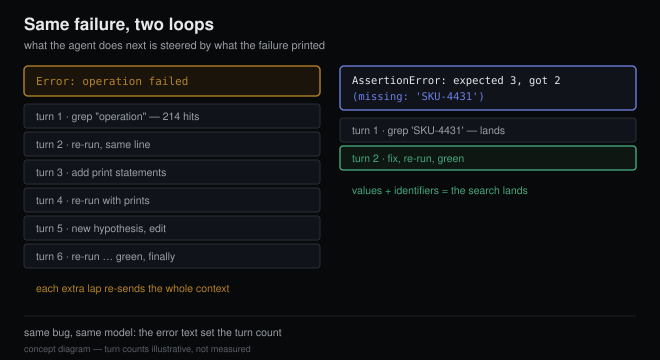

# Agents debug as well as your error messages let them

*2026-08-19 · the RunAI Coder team · [run.ceo/coder](https://run.ceo/coder/?utm_source=github_Official_Page)*

Watch an agent transcript at the moment a test fails. Nearly everything that happens next is steered by one thing: whatever that failure printed. If the output says `AssertionError: expected 3 items in cart, got 2 (missing: 'SKU-4431')`, the next turn is usually a grep for `SKU-4431` and a fix. If the output says `Error: operation failed`, the next turn is a guess. So is the one after that. The model didn't get dumber between those two runs. It got blinder.

This is the part of agent performance nobody budgets for, because the lever sits outside both the model and [the harness](https://github.com/RunAI-Coder/aicoder-showcase/blob/main/posts/015-harness-half-your-agent/README.md): in your codebase, in the strings your software prints when something goes wrong. Between actions, almost the entire sensory experience an agent has of your running system is tool output. Error messages are usually the highest-signal lines in that output, which makes them prompts — written by whoever raised the exception, years ago, for an audience they never imagined.

## The loop runs on what failures print

Mechanically, a coding agent is a proposal loop: it acts, something executes, and the result comes back as text [in the next turn's context](https://github.com/RunAI-Coder/aicoder-showcase/blob/main/posts/016-what-the-model-sees/README.md). Anthropic's [best-practices doc for its coding CLI](https://code.claude.com/docs/en/best-practices) describes the happy path plainly: the agent "does the work, runs the check, reads the result, and iterates until the check passes", where the check is "anything that returns a signal Claude can read in the conversation". Read the second quote again as an engineering constraint. The signal is the whole interface. There's no debugger attached, no watch window, no colleague leaning over: the agent knows exactly what the text says and nothing that it doesn't.

The research says feedback richness moves real numbers. In [Teaching Large Language Models to Self-Debug](https://arxiv.org/abs/2304.05128) (Chen et al., 2023), letting a model iterate against unit-test feedback improved accuracy "by up to 12%" on benchmarks where tests exist; on a benchmark with no unit tests, explanation-only feedback bought 2–3%. Different benchmarks, so not a clean head-to-head — but the direction matches everything we see in transcripts: the more executable and specific the failure signal, the more the loop converges instead of orbiting.

Language designers figured this out for humans years ago, and their reasoning transfers almost embarrassingly well. [Python 3.11](https://docs.python.org/3/whatsnew/3.11.html) stopped pointing tracebacks at lines and started pointing at expressions: "the interpreter will now point to the exact expression that caused the error, instead of just the line", because before, an error on a chained lookup left it "ambiguous which object was `None`". Ambiguity is precisely what burns agent turns. And the [rustc developer guide's diagnostics chapter](https://rustc-dev-guide.rust-lang.org/diagnostics.html) contains our favorite spec in this genre: an error message should be understandable by "a normal programmer, who just came out of bed after a night partying" reading a small, dirty screen. That target audience — reads fast, has no context, isn't at its sharpest — describes a language model uncannily well.

## What a machine-legible failure contains

From reading a lot of transcripts, the errors that end debugging loops instead of extending them tend to carry four things:

- **A location down to the expression, tracing through real frames.** The agent's next action is almost always "open file X around line Y". Standard tracebacks do this; hand-rolled `catch`-and-rethrow wrappers that flatten the stack take it away.
- **Expected versus got, with values.** `expected 3, got 2` turns a mystery into a diff. In pytest this is nearly free: bare `assert x == y` gets rewritten to show both sides, which is exactly the introspection you destroy when a wrapper catches it and re-raises `RuntimeError("assertion failed") from None`, cutting the exception chain.
- **Identifiers that grep.** An exact symbol, key, or SKU in the message means the agent's next search lands. `'SKU-4431'` is a thread to pull; "an item" gives the next search nothing to land on. Retrieval is how agents read your codebase, and an error message that names its objects is doing the retrieval planning for it.
- **A next step, kept separate.** Rust's guide is strict that the error names the problem and only the help sub-diagnostic suggests fixes. Good split for agents too: a wrong hint is worse than none, because the model weights hints heavily. `Did you mean 'connect_timeout'?` is gold when right and a tarpit when stale.

The inverse list is shorter. `Error: operation failed` fails all four at once, and somewhere in your dependency tree, something prints exactly that. Probably twice.

## The billing footnote

A vague error slows the fix and multiplies what you pay for it. Every extra lap the agent takes re-sends the whole assembled context — [the arithmetic we walked through in 013](https://github.com/RunAI-Coder/aicoder-showcase/blob/main/posts/013-million-tokens-still-greps/README.md) — so the difference between a two-turn fix and a six-turn orbit is four additional re-reads of everything. Caching discounts what a re-read costs (013 has the rates), but every lap's new tool output bills at full price, and the laps still happen. That's the multiplier. Somewhere in your codebase there's a bare `raise Exception("failed")` that has quietly become one of the more expensive lines you ship.

## Where we now spend the extra sentence

- **Let the test framework talk.** Bare asserts in pytest, real assertion messages elsewhere, and no exception-eating wrappers between the failure and the transcript. The richest error text in most codebases is the one the tooling already writes, if nothing swallows it.
- **Echo the inputs at the failure site.** When we raise, the string carries the operative values: the path that didn't exist, the key that collided, the size that overflowed (business values only; secrets stay out, because transcripts are logs). One formatted string at raise-time is cheaper than the investigation it replaces, whether the reader is us or the agent.
- **Paste the traceback whole.** When handing a failure to an agent, the same Anthropic doc's prompt-table example is "the build fails with this error: [paste error]". Summarizing a traceback for an agent throws away the only instrument reading it has.
- **Treat error strings as review surface.** A vague `raise` in a diff costs the same review comment as a vague function name. It's the string most likely to be read by the next machine that touches the code.

## What we can't claim

The controlled version of this claim doesn't exist yet as far as we know: same bug, same agent, two error-message qualities, turns-to-fix measured. We haven't run it either, and we'd rather flag the gap than promise a study. Treat the mechanism as well-evidenced — the loop demonstrably steers by failure text — and the magnitude as folklore. Folklore can still be right. There's also a counterweight [from the training-data side](https://github.com/RunAI-Coder/aicoder-showcase/blob/main/posts/014-agents-home-field/README.md): models have read millions of standard Python tracebacks and rather fewer bespoke error formats, so the win is enriching the content inside familiar shapes rather than inventing a beautiful new format the corpus has never seen. And everything here is a no-regret spend: every improvement that helps the agent reads just as well to the human on call. As of 2026-08, the tracebacks are the same ones you already have; the only question is what they say.

Error messages used to be the documentation nobody read until something broke at 2 a.m. Now they're read on every failure, by the thing doing the fixing, at your expense. The cheapest upgrade to your agent might be hiding in the strings you raise.
