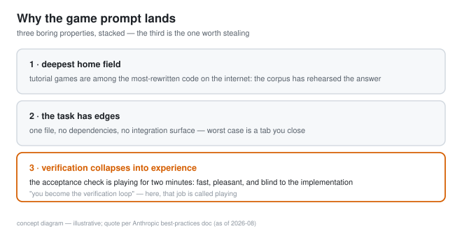
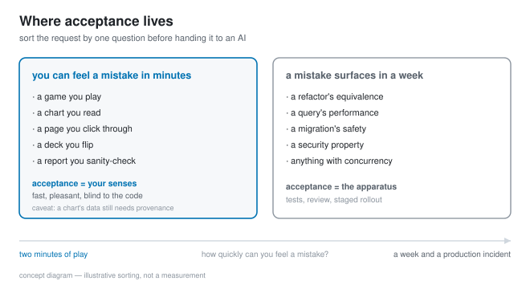

# AI one-shots tiny games because you are the test suite

*2026-08-20 · the RunAI Coder team · [run.ceo/coder](https://run.ceo/coder/?utm_source=github_Official_Page)*

By now you've seen the demo. Someone types "make me a snake game with a twist" into an AI tool, and a minute later there's a single HTML file with a playable game in it. It has landed on the first try in enough public demos that people stopped being surprised, which is its own kind of remarkable, because "add rate limiting to our billing service" does still surprise people, in the other direction. Same models. So the interesting question sits in the gap: what makes the tiny game the task these systems almost never fumble?

We think the answer is three boring properties stacked on top of each other, and the third one is the one worth stealing for everything else you ask an AI to do.

## The deepest home field there is

Models are [best where the internet wrote the most](https://github.com/RunAI-Coder/aicoder-showcase/blob/main/posts/014-agents-home-field/README.md), and the tutorial game is among the most-rewritten code the internet has. Snake, breakout, flappy clones, pong: generations of web developers rewrote them as a rite of passage, teaching sites host variants by the dozen, and the canvas tutorial that ends in one is practically a genre. Nobody has counted the copies, but a decent share of everyone who ever learned to code contributed one. A prompt asking for a small canvas game lands in the densest, most-rehearsed neighborhood of the training corpus.

## The task has edges

A tiny game is a closed object. One file, no dependencies to resolve, no schema to migrate, no integration surface where it has to agree with code it can't see. It runs entirely inside a browser tab, so [the blast radius conversation](https://github.com/RunAI-Coder/aicoder-showcase/blob/main/posts/017-git-safety-net/README.md) barely applies: the worst case is a tab you close. (Treat the file like any untrusted HTML — a generated page can still make network calls — but your repo, your database, and your credentials are not in the room.) And the scope is naturally bounded — a game either has a loop, input, collision, and a score, or the absence is on the screen. Compare that with "improve our onboarding flow", where the request quietly touches half a dozen files and two teams' opinions. The game prompt cannot creep, because the artifact defines its own edges.

## Verification collapses into experience

This is the load-bearing one. Anthropic's [best-practices doc](https://code.claude.com/docs/en/best-practices) is blunt about what happens when an AI works without a runnable check: "Claude stops when the work looks done. Without a check it can run, 'looks done' is the only signal available, and you become the verification loop: every mistake waits for you to notice it."

Being the verification loop is usually the tedious part of working with these tools. It means reading diffs, running tests, checking outputs against intent. But for a game, being the verification loop has a different name: playing. You click, the snake turns or it doesn't, the collision feels right or it doesn't. Two minutes of play covers the acceptance criteria better than any assertion file, because the acceptance criteria were never really writable in the first place — "feels responsive" lives in your hands, and your hands are attached to the reviewer. Convenient.

This is also what "no coding required" actually means, when it means anything. The post that named [vibe coding](https://en.wikipedia.org/wiki/Vibe_coding) — Andrej Karpathy's, February 2025; quotes as recorded in Wikipedia's article — described it as coding where you "fully give in to the vibes, embrace exponentials, and forget that the code even exists." The code does still exist. What the tiny game changes is that you never have to meet it: generation never needed your code literacy, and for this one task shape, acceptance doesn't either. An agent's own tests only vouch for [the version of the code they were written against](https://github.com/RunAI-Coder/aicoder-showcase/blob/main/posts/011-agent-written-tests/README.md), so self-verification has a mirror problem; a human playing the artifact is a reviewer whose verdict owes nothing to the implementation, because play never opens the file. Independent, if not infallible.

## The part worth stealing

The generalizable rule hiding in the game demo: **put the acceptance where your senses are.** Requests that produce a directly experienceable artifact — a chart you can read, a page you can click, a slide deck you can flip through, a report you can sanity-check line by line — inherit the cheapest part of the game's reliability, the acceptance check, because the human check is fast, pleasant, and blind to the code. One trap worth naming, though: reading a chart verifies the rendering; the query behind it goes unexamined. A chart built on the wrong data reads exactly like one built on the right data. Your senses check the surface, and the numbers still need their own provenance. Requests whose correctness is invisible (a refactor's equivalence, a query's performance, a migration's safety) don't inherit any of this. They need the whole apparatus: tests, review, staged rollouts.

So when scoping work for an AI, the question we ask is the one this whole genre answers: how long before a person feels a mistake? Two minutes of play is the best case. If feeling the mistake takes a week and a production incident, that task needs the apparatus, and no demo should convince you otherwise.

## Where the trick stops working

Honest edges, because the demo hides them. Most work isn't a game. Leave the tutorial neighborhood and the home-field advantage fades fast: a genuinely novel mechanic, a custom engine, anything without ten thousand corpus ancestors puts you back on [the competence cliff](https://github.com/RunAI-Coder/aicoder-showcase/blob/main/posts/014-agents-home-field/README.md), where invented APIs read exactly as confidently as real ones. Playable is also a low bar: two minutes of play verifies that the game runs, and says almost nothing about whether it's any good — or subtly wrong: an off-by-one in the score passes for a design choice. Balance, difficulty curves, and feel are taste, and taste doesn't come with an error message. And the shape itself is the exception, which Karpathy flagged in the same post that named the genre: "It's not too bad for throwaway weekend projects, but still quite amusing." Most software's correctness can't be experienced in two minutes: it hides in concurrency, in data integrity, in the security property nobody can play. That's why [the approval layer](https://github.com/RunAI-Coder/aicoder-showcase/blob/main/posts/009-approval-fatigue/README.md) and the test suite still have jobs. As of 2026-08, the one-sentence game is, by our observation rather than any benchmark, the most repeatable trick in these systems' repertoire — as long as everyone stays clear on which of those three properties their next request actually has.

When someone asks where AI-generated software works best today, the honest answer is a question back: how quickly can you feel a mistake?
