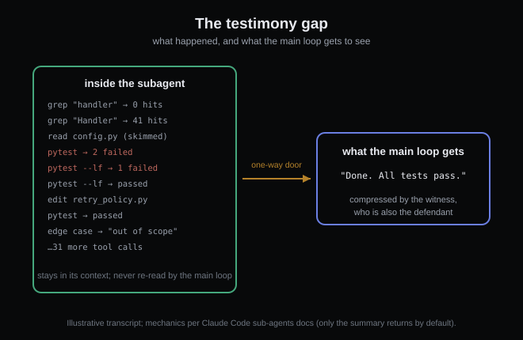
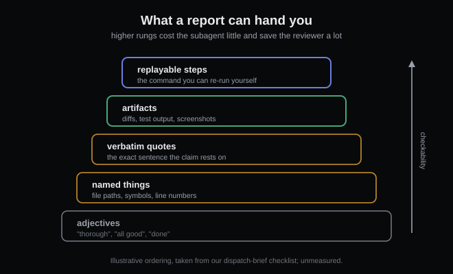

# Don't take your subagent's word for it

*2026-08-23 · the RunAI Coder team · [run.ceo/coder](https://run.ceo/coder/?utm_source=github_Official_Page)*

A while back we sent a subagent to audit a batch of documents full of sourced claims. It came back confident: one claim, it said, had no source behind it. Specific, plausible, exactly the kind of catch we'd built it to make. Except the source existed — we found the sentence in the vendor's own documentation and stapled it to the rebuttal. Another run flagged a "missing" sentence that was sitting in the file the whole time. This is a subagent whose entire job is distrusting other people's claims, and its own claims needed checking.

The rest of this post is the mechanics behind that, and what we do about it.

## The report is the only thing that comes back

Mechanically, nothing a subagent does flows back into your main context by default. The [Claude Code docs](https://code.claude.com/docs/en/sub-agents) state the isolation plainly: "Each subagent starts with a fresh, isolated context window." And the split is the point of the design: the verbose middle "stays in the subagent's context while only the relevant summary returns to your main conversation". The transcript isn't destroyed — Claude Code keeps it on disk and can even resume the subagent from it — but the main loop never reads it back unless you go digging. Every search that returned nothing, every command that failed twice before passing, every file skimmed instead of read: present in the record, absent from the report.

This is a feature. It's most of the point: [we've written before](https://github.com/RunAI-Coder/aicoder-showcase/blob/main/posts/012-why-agents-spawn-clones/README.md) about subagents as disposable context windows, and the economics only work because the verbose middle never bills your main loop. But notice what else never arrives: the raw material you'd need to check the summary. The main loop doesn't receive evidence. It receives testimony, compressed by the witness, who is also the defendant.

And the isolation cuts both ways. The subagent "doesn't see your conversation history", which also means it doesn't know what you already believe, what you'd find surprising, or which of its twenty findings is load-bearing for your next decision. It's summarizing for a reader it has never met.

## Three ways a true-ish report goes wrong

None of this requires the model to lie. The failure modes are structural:

**Lossy by construction.** A summary of forty tool calls is lossy the way any compression is lossy. The subagent decides what was important, and it decides that *before* knowing how the result will be used.

**Optimism is cheaper to write.** "Done" is one token. "Done, except the flaky test I retried until it passed, and one edge case I decided was out of scope" is a paragraph — and nothing in the loop charges the subagent for omitting it. Anthropic's [multi-agent research writeup](https://www.anthropic.com/engineering/built-multi-agent-research-system) states the dispatch-side version outright: "Without detailed task descriptions, agents duplicate work, leave gaps, or fail to find necessary information." Gaps happen on the way out, and the report is where they get papered over.

**Confidence survives compression better than doubt.** In every incident we've caught, the assertion made the final message and the hedges didn't. The no-source claim above arrived stated flat, zero qualifiers. Assertions travel well. Caveats travel badly.

## What we ask for instead of trust

The fix is making the report checkable at a cost lower than redoing the work — blanket distrust would just delete the reason you delegated. Four habits, in the order we adopted them:

**Write the evidence format into the dispatch.** An evidence requirement, on top of the output format. "Report each finding with the verbatim quote and file path" changes what comes back more than any amount of please-be-thorough. Anthropic's own pipeline enforces a version of this downstream: findings go to a CitationAgent, and their evaluation used an LLM judge scoring "factual accuracy (do claims match sources?)" and "citation accuracy (do the cited sources match the claims?)". The rubric assumes reports need auditing. So should yours.

**Prefer artifacts to narration.** A diff, a failing-then-passing test output, a file path, a command that can be re-run. Anything replayable beats any adjective. When a report says "all tests pass," the checkable version is the test command's actual output — which the subagent has and the summary usually eats.

**Anchor both sides to the same ground.** When we dispatch an auditor now, the task brief carries a verbatim ground-truth block — the exact quotes both parties must argue from. Disagreements stopped being "the subagent feels strongly" and became "here's the sentence." That's also how the rebuttal above got settled in minutes.

**Spot-check proportional to blast radius.** A rename across ten files: skim the diff. A conclusion that changes what you ship: re-derive one finding end-to-end. We re-check every claim an auditor makes *before* acting on it, because acting is the expensive part. That re-check is cheap on purpose: with a quote attached it's a grep, and the finding was the search we delegated in the first place.

## What this doesn't solve

We have no measured distortion rate: a handful of caught errors is an anecdote ledger rather than a statistic, and our observation is that most reports are fine. Verification burns tokens and attention, and checking everything would erase the reason you delegated; where the floor is depends on numbers we don't have. And some work genuinely doesn't need any of this: idempotent tasks, cheap re-runs, anything where being wrong costs a shrug. The apparatus is for reports you're about to build on.

The auditor that opened this post is still on the payroll, by the way; we just changed what it's allowed to hand in. Every claim now arrives holding a quote. It catches as much as it ever did — and the time we spend arguing with it dropped, because the sentence is either there or it isn't.

