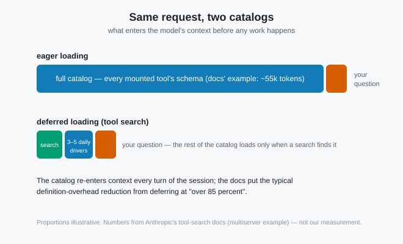

# The tools your agent never called are still on the bill

*2026-08-25 · the RunAI Coder team · [run.ceo/coder](https://run.ceo/coder/?utm_source=github_Official_Page)*

Ask your agent something trivial — "what does this error mean" — and look at the usage block on that one request. If you run a few MCP servers, the input side is mostly things that never participated: the complete JSON schema of every tool you have mounted, shipped to the model so it *could* have called them. [We dissected that opening payload back in 007](https://github.com/RunAI-Coder/aicoder-showcase/blob/main/posts/007-agent-preamble-anatomy/README.md): 24k tokens of schemas across 27 tools on one harness in the study we walked through there, and Anthropic's own docs now put "a typical multiserver setup (GitHub, Slack, Sentry, Grafana, and Splunk)" at "~55k tokens in definitions before Claude does any work". That post weighed the whole backpack: system prompt, schemas, instruction files, cache churn. This one opens a single compartment, the tool catalog, because it turns out to carry a hidden billing line of its own and a purpose-built fix that landed since.

## Why the catalog can't stay behind

The Messages API is stateless, so [everything the model is supposed to know arrives fresh on each request](https://github.com/RunAI-Coder/aicoder-showcase/blob/main/posts/016-what-the-model-sees/README.md), and the tool catalog is part of that everything. The catalog rides along on every one of them. The [tool-use docs](https://platform.claude.com/docs/en/agents-and-tools/tool-use/overview) price it plainly: requests are billed on "the total number of input tokens sent to the model (including in the `tools` parameter)", and the extra tokens come from "the `tools` parameter in API requests (tool names, descriptions, and schemas)", with tool calls and results stacking on once work actually happens.

There's also a line item most people have never seen: the moment your request includes any tools at all, "the API also automatically includes a special system prompt for the model that enables tool use." The docs publish the exact rates per model: 286 tokens on Claude Opus 5 with the default tool choice, 354 on Sonnet 5, up to 675 on Opus 4.7. Small numbers, but they illustrate the shape of the thing: tool use has a fixed cover charge before your first schema, and your schemas stack on top, once per turn, for the life of the session. A 20-turn debugging session with a 30k catalog re-sends that catalog 20 times. None of those tools has to be called even once.

Caching is the standard rebuttal, and it's half right. Tool definitions sit at the base of the cache prefix, serialized first, with system and messages stacked on top, so across turns the catalog is mostly billed at the cached-read discount rather than full price. But that placement cuts the other way too, and this is the sentence worth pinning to the wall, straight from the [prompt-caching docs](https://platform.claude.com/docs/en/build-with-claude/prompt-caching): "Modifying tool definitions (names, descriptions, parameters) invalidates the entire cache". Tools sit below system and messages in the hierarchy, and per the same page, a change at any level takes every level after it down with it. Rename one tool mid-session and you've demolished the building it was holding up. Every floor. This, incidentally, is why mounting or unmounting an MCP server is the most expensive innocuous-looking thing you can do to a running session. It is also why harnesses treat the tool panel as load-bearing architecture nobody touches.

And the tax isn't only monetary. The tool-search docs state a capability cost with unusual bluntness: "Claude's ability to pick the right tool degrades once you exceed 30–50 available tools." Past that line you're paying twice: once in tokens for the catalog, once in accuracy because of it.

## The fix is a search index, not a diet

The current answer (shipped in the API as the [tool search tool](https://platform.claude.com/docs/en/agents-and-tools/tool-use/tool-search-tool); [Claude Code turns it on by default](https://code.claude.com/docs/en/agent-sdk/tool-search)) is to stop treating the catalog as context and start treating it as a corpus to search. You mark tools with `defer_loading: true`, keep a search tool plus your few daily drivers loaded, and the model discovers the rest by querying the catalog when a task needs them.

The detail we find most clarifying: "`defer_loading` controls what enters the context window, not what you send in the request." Your application still ships every schema on every request — the server needs them to run the search — but the model's context only receives "the 3–5 tools Claude needs for a given request", and the docs claim the definition overhead typically drops "by over 85 percent" (their number, from their multiserver example; we haven't reproduced it). Billing tracks the context window rather than the wire: "the tool definitions that search loads into context count as input tokens like any other tool definition", and what search never loads never enters the count. Discovered definitions get appended inline in the conversation rather than spliced into the prefix, which preserves the cache: "The prefix is untouched, so prompt caching is preserved." The catalog stops being a fixed cost and becomes retrieval — [the same trade](https://github.com/RunAI-Coder/aicoder-showcase/blob/main/posts/013-million-tokens-still-greps/README.md) that already won for code and docs, now applied to the toolbox itself.

The honest asymmetries, since a search step is not free: discovery adds a hop (search, expand, then call — a turn shape that didn't exist before), a badly-described tool becomes *invisible* instead of merely ignored, and Anthropic's own guidance says don't bother below the threshold — standard eager loading "is a better fit when you have fewer than 10 tools" or your definitions are small. Their recommended split is the pragmatic one: keep the 3–5 tools you use constantly non-deferred, defer the long tail. We also haven't measured the two search variants (regex vs. BM25) against each other; if you have, that's a comparison we'd read.

The two-minute version of this post, runnable today: take one trivial prompt and run it twice in fresh sessions, once with every MCP server mounted, once with none. The difference between the two first-turn input-token counts is your catalog tax, and now you know which dial turns it down.

