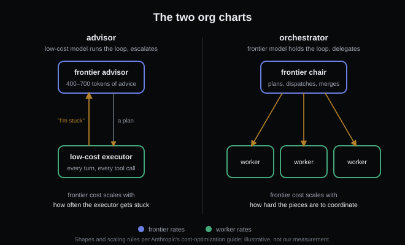
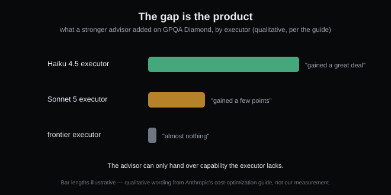

# A second model pays off in two shapes

*2026-08-27 · the RunAI Coder team · [run.ceo/coder](https://run.ceo/coder/?utm_source=github_Official_Page)*

The phrase is Anthropic's, from their [cost-optimization guide](https://platform.claude.com/docs/en/about-claude/models/optimizing-for-cost-and-intelligence): "a second model paid off in two shapes, an advisor and an orchestrator." It's a quiet sentence with a strong claim inside it: in their measurements, only two org charts made the list, and nothing else earned a mention. This post is us taking that sentence apart, because we run one of the two shapes daily and had never seen the other one priced.

The pricing gap that makes any of this worth discussing: on the [current lineup](https://platform.claude.com/docs/en/models/overview) (list prices as of 2026-08), Claude Fable 5 runs $10/$50 per million tokens in and out, Opus 5 $5/$25, Sonnet 5 $2/$10, Haiku 4.5 $1/$5. A 10× spread between the top and bottom of one vendor's own menu. If every token in your loop gets frontier treatment, you're paying frontier rates to read `package.json`.

## Shape one: the intern who asks

In the advisor shape, the low-cost model owns the loop and phones upstairs only when it has to. The [advisor tool](https://platform.claude.com/docs/en/agents-and-tools/tool-use/advisor-tool) (in beta as of 2026-08) wires this in server-side: "a faster, lower-cost executor model consult[s] a higher-intelligence advisor model mid-generation", the advisor "reads the full conversation, produces a plan or course correction, and the executor continues". The economics work because consultations are few — the docs' own prompting guidance aims at two or three per task — and the advice is short: typically "400 to 700 text tokens" of output, more like 1,400–1,800 billed once thinking is counted. One line the docs state but don't price out for you: the advisor "reads the full conversation" as a separate sub-inference at its own rates, so on a long loop every consultation re-reads your entire transcript on the expensive model's meter. Few and short is the whole game. The frontier model becomes a consultant billed by the visit: it sells judgment, and the executor does the typing.

What the guide measured is more interesting than the pitch. Across the pairings in their chart, "the advisor closed 50% to 90% of the gap to the stronger model" (when the executor actually asked — a condition we'll come back to). And the gains follow the capability gap with a bluntness worth quoting whole: on GPQA Diamond, "a Claude Haiku 4.5 executor gained a great deal from a Claude Opus 5 advisor, a Claude Sonnet 5 executor gained a few points, and a frontier executor almost nothing." (A science benchmark, not a coding one — but the same ordering held on the coding benchmarks below.) The advisor can only hand over capability the executor lacks. The gap is the product. Pair two near-equals and you've bought a very expensive rubber stamp.

## Shape two: the boss who delegates

The orchestrator shape inverts the hierarchy: "the frontier model holds the loop. It decomposes the task, dispatches subtasks to lower-cost worker models, and merges their results." The expensive model's own transcript stays short because [the noisy exploration happens inside the workers](https://github.com/RunAI-Coder/aicoder-showcase/blob/main/posts/012-why-agents-spawn-clones/README.md), so most of the bill lands at worker rates while the plan and the final merge stay frontier.

This is the shape we actually run: our dispatch-heavy days put a strong model in the chair and send [audits and research out to subagents](https://github.com/RunAI-Coder/aicoder-showcase/blob/main/posts/020-subagent-reports/README.md). We arrived at it for context reasons rather than price: the worker eats the verbose middle so the chair doesn't have to, and the billing benefit came along free. We have no controlled comparison of our own to offer, though. We believe it on architecture grounds; the measurements above are all Anthropic's.

The guide's own selector between the shapes fits in one line each: in the advisor shape, frontier cost scales with *how often the executor gets stuck*; in the orchestrator shape, with *how hard the pieces are to coordinate*. Serial work that's hard in spots wants shape one. Work that fans out across independent pieces wants shape two.

## The part the sales pitch skips

Before reorganizing anything, three honesty items from the [same guide](https://platform.claude.com/docs/en/about-claude/models/optimizing-for-cost-and-intelligence), which is more willing than most vendor docs to undercut its own headline (all of it Anthropic-internal and, in their words, "directional, not guarantees").

First, model mixing is the *small* lever. Their words: "prompt caching was the largest lever by a wide margin: it cut agent-loop cost by a factor of 2.5 to 3.7 on this guide's benchmarks... The multi-model levers are narrower." If you haven't [taken the free wins yet](https://github.com/RunAI-Coder/aicoder-showcase/blob/main/posts/013-million-tokens-still-greps/README.md), a second model is the wrong meeting to be in.

Second, the advisor shape has a failure mode that deserves a name: the executor has to *know it's stuck*, and that knowledge is itself a capability. The guide found that a pairing consulting happily at default effort "can fall to consulting on almost none when effort is lowered, and then scores below the executor alone" — you saved money on the worker and the worker stopped raising its hand. Same executor, two benchmarks: kept asking on one and "gained 23 points"; stopped asking on the other. The whole scheme hangs on the consult rate, and you have to measure it on your own workload.

Third, at the top of the range the whole scheme dissolves into noise. Their most accurate configuration on one internal coding benchmark — an Opus 5 executor with a Fable 5 advisor at 85.7% for $8.40 per attempt — sits "only a point or two" above each model running alone, "which a single run does not separate from noise". Their honesty, not ours. The cost case lives where the capability gap is wide; the top of the menu is exactly where it thins out.

## Where to actually start

The guide's opening move is almost anticlimactic, and we'd co-sign it: "Sweep effort on your current model first. It is the cheapest experiment on this page, and most workloads end there." Then, if you still see a gap, the guide's rule arrives pre-written: "Whatever the pairing, first price the advisor's model alone at low effort; that is the baseline to beat." And redo the math at every release, because new weights move the capability gap and new prices move the ratio.

An org chart is what you draw after the simpler dials are exhausted. Most workloads, per the vendor selling the second model, end before the drawing.

