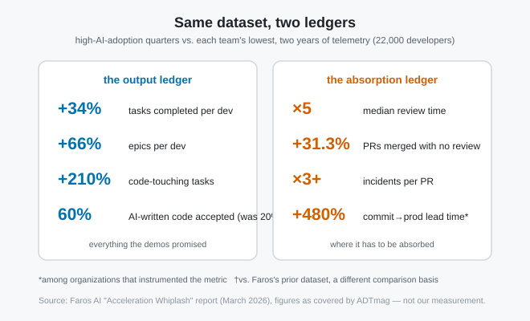

# The productivity is real. It's parked in front of the merge button.

*2026-08-29 · the RunAI Coder team · [run.ceo/coder](https://run.ceo/coder/?utm_source=github_Official_Page)*

Two numbers from the same telemetry dataset, and they only make sense together. In Faros AI's March 2026 report ([two years of data, 22,000 developers, 4,000+ teams](https://www.faros.ai/research), figures as covered by [ADTmag](https://adtmag.com/articles/2026/04/22/more-code-more-bugs.aspx)): median code review time increased *fivefold* in high-AI-adoption quarters, and 31.3% more pull requests were merged with no review at all. A queue that quintuples while more people climb over the turnstile is the signature of one specific thing: a bottleneck that moved, not one that dissolved.

The output side of that dataset is everything the demos promised. Task completion per developer up 34%, epics up 66%, code-touching tasks up 210%. The absorption side is where it curdles: bugs per developer up 54%, the incidents-to-PR ratio more than tripled, time-in-progress up 225%, and commit-to-production lead time up 480% where organizations measured it. Their phrasing for the overall pattern is "Acceleration Whiplash"; the mechanism underneath is plainer. Starting work got easier. Finishing it didn't.

## This is arithmetic before it's culture

Our read: the review crisis gets discussed as a process problem or a trust problem, and it's mostly an arithmetic problem. Generation now has near-zero marginal cost: a PR is one sentence of intent away. Acceptance still costs what it always cost: a human attending to a diff, at human reading speed, with human working memory. When one side of a pipeline drops its marginal cost by orders of magnitude and the other side doesn't move, the constraint doesn't need a sociological explanation for why it relocated to the expensive side. It had nowhere else to go. [We made this argument about verification being the expensive half](https://github.com/RunAI-Coder/aicoder-showcase/blob/main/posts/019-you-are-the-test-suite/README.md) for individual tasks; the Faros numbers are what it looks like at the org level.

And the code itself moved against the reviewer: average PR size up 51.3%, files touched per PR up 59.7%. Bigger diffs are slower per line to review, not just longer — context saturates. So review demand rose on three axes at once: more PRs (task throughput up 34–210% has to land somewhere), bigger PRs, and (per [LeadDev's 2026 release-quality report](https://leaddev.com/ai/ai-generated-code-sparks-production-confidence-crisis)) roughly 1.7× the issues per PR inside them. The axes overlap — a bigger PR holds more issues by volume alone — so don't multiply them; each alone moves the same direction. Review supply rose on none.

The most uncomfortable number in the genre isn't from telemetry at all. In [METR's randomized trial](https://metr.org/blog/2025-07-10-early-2025-ai-experienced-os-dev-study/) (16 experienced open-source maintainers, 246 tasks on repos they knew deeply, early-2025 tools), developers forecast AI would make them 24% faster, felt 20% faster afterward, and measured 19% *slower*. Small n, mature codebases, tools two generations old now, and METR has since [said 2026-era developers are likely faster and is redesigning its follow-up experiment](https://metr.org/blog/2026-02-24-uplift-update/). Treat it as one careful data point rather than a law. But the perception gap is the part that generalizes: the waiting, reviewing, and redirecting time is exactly the time our attention discounts. Which is how an organization can feel faster while its lead time quadruples.

## Every fix is one of two moves

Sort any proposed remedy into two buckets and the debate gets shorter. (There's a third move — just hire more reviewers — but it reinstates the linear cost the whole trade was supposed to beat, which is why nobody proposes it out loud.)

**Compressing acceptance** — merging with lighter or no review. The 31.3% no-review merges are this bucket, and at that volume it reads more like exhaustion than policy, though the telemetry can't distinguish the two. The endgame is visible in [Flux's survey of 309 engineering leaders and practitioners](https://leaddev.com/ai/ai-generated-code-sparks-production-confidence-crisis): 35% of teams now generate code they won't ship for lack of confidence, and 3.6% claim AI-written issues never reach production. Compression converts the acceptance cost into incident cost, payable later with interest. The tripled incidents-to-PR ratio is consistent with that invoice arriving — Faros only claims correlation, but the direction is hard to read any other way.

**Leveraging acceptance** — making a unit of human judgment go further. This bucket is where the real options live, and they're unglamorous. Ship smaller PRs: size is the axis in the Faros data most directly under the author's control, and it moved the wrong way by half. Make the artifact carry its own evidence: test output, the exact command to re-run, [the receipts we've argued subagent reports should hand in](https://github.com/RunAI-Coder/aicoder-showcase/blob/main/posts/020-subagent-reports/README.md). Review then shifts from reconstructing intent to checking claims. Layer the reading: machine passes for the mechanical (a quarter of PRs already get an AI reviewer, per the Faros data), human attention reserved for architecture and blast radius. Review stays a cost under all of it; what changes is what a minute of reviewer attention buys.

Our own workflow bet sits in the second bucket, stated with its hedge: we require dispatched work to arrive with verbatim evidence attached, and our experience is that checking a claim with its receipt is grep-fast while checking one without is an investigation. That is experience rather than controlled measurement; we have the same missing-baseline problem as everyone in this post.

Which is the honest note to end on. Nearly every number here is creation-side telemetry from vendors with dashboards to sell (we sell an agent, so discount us the same way), or surveys of how people feel; the acceptance-side metrics that would settle things (revert rates, time-to-incident by review depth, defect escape by PR size) are mostly still unpublished, and Faros's own caveat that under 1% of PRs are autonomously agent-opened means all of this describes the human-in-the-loop era rather than the next one. The bottleneck arithmetic doesn't need better data to be believed, though. A printing press never made anyone read faster; what it did create was the editor — the second bucket, wearing older clothes. When generating costs pennies and judging still costs a person, the queue forms in front of judgment, and the only choice left is whether you pay there, or downstream.

