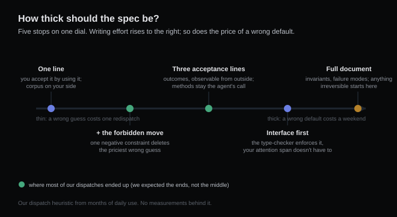

# Your one-line prompt ships with a spec you didn't write

*2026-08-28 · the RunAI Coder team · [run.ceo/coder](https://run.ceo/coder/?utm_source=github_Official_Page)*

"Fix the login timeout." Read that line the way an agent has to. It can mean raise the constant. It can mean add a retry loop. It can mean move session refresh into a background job, or decide the timeout is a symptom and go digging in the connection pool. Four defensible readings, four different diffs, and the sentence endorses every one of them.

That's the thing the vibe-coding argument and the spec-driven argument keep talking past each other about. One camp says a sentence is enough, look how fast. The other camp says write the requirements first, look how correct. (The tooling industry has been voting with the second camp: [spec-driven development](https://www.developersdigest.tech/blog/spec-driven-agent-workflows-github-spec-kit-gstack) went from one GitHub toolkit to a whole product category inside a year, and as of August 2026 most major coding tools ship some flavor of it.)

Our position, after months of daily dispatching: both camps are answering the wrong question. The choice was never spec or no spec. Every prompt has a spec. The only question is who wrote it.

## The default-value machine

A one-line prompt doesn't leave the unstated parts undecided. The agent fills the blanks with defaults, confidently, and the defaults come from its training corpus: the average project, the average convention, the average intent behind similar sentences in the average repo. We've written about [where that average lives](https://github.com/RunAI-Coder/aicoder-showcase/blob/main/posts/014-agents-home-field/README.md) — where your codebase matches it, the fill-ins are invisible because they happen to be right. Where it doesn't, you get a diff that answers a question you never asked.

An intern who hits an ambiguity tends to show up at your desk. An agent, unless the harness forces the question, picks — and rarely flags the pick, because from where it sits there was nothing to flag: a constraint that never made it into the context might as well not exist. "Fix the login timeout" turns into "raise the constant" — the model isn't lazy, that's just the most common reading of the sentence in the training data.

So the real content of a one-line prompt is the sentence plus a few hundred defaults you've silently delegated. And delegating them is often correct — that's the part the spec camp undersells. The skill is knowing when the delegation is safe.

## The two dials that actually predict it

Task size is the intuitive knob, and it's the wrong one. We've watched one-line prompts succeed on large tasks and fail on small ones. Two dials predict it better.

The first dial is how long a wrong guess stays invisible. We've written about the task shapes where [checking the result is just using it](https://github.com/RunAI-Coder/aicoder-showcase/blob/main/posts/019-you-are-the-test-suite/README.md): games, pages, charts. For those, a thin prompt is fine even when the task is big, because you can accept the result by playing with it for a minute, and a wrong guess costs one more dispatch. The math flips when correctness is invisible from the outside: boundary conditions, concurrency, anything that touches money. There, a wrong default survives review-by-eyeball and lies in wait until someone steps on it. All of this also assumes a wrong guess dies in a diff you can throw away — anything the agent can make irreversible (live data, outbound requests, migrations) starts at the thick end of the menu no matter how fast the feedback.

The second dial is distance: how far your project sits from the average one. The defaults are corpus defaults. A CRUD endpoint in a mainstream framework: the corpus has seen ten thousand of those, and the fill-ins will match your intent embarrassingly well. Your in-house auth flow with the odd tenant hierarchy: every blank is a coin flip weighted toward somebody else's architecture.

Cross the two and you get the dispatch rule we actually use. Fast feedback, mainstream shape: one line, go. Slow feedback or odd shape: write more. Slow feedback *and* odd shape: write the full contract, and budget the writing time as part of the implementation, because it is.

## The five thicknesses

Spec isn't binary. The menu, in ascending order of effort:

1. **One line.** For tasks you can accept by using them, with the corpus on your side.
2. **One line plus the forbidden move.** "Fix the login timeout. Don't touch the session schema." The best effort-to-protection ratio on the menu: one negative constraint deletes the single most expensive class of wrong guess. This is the level we reach for most.
3. **Three acceptance lines.** What done looks like, observable from outside: logged-in users survive a ten-minute idle, no schema change, existing sessions stay valid. A contract about outcomes rather than methods — the agent keeps its implementation freedom, you keep the definition of done. It's the same move we made when we started [writing evidence requirements into subagent briefs](https://github.com/RunAI-Coder/aicoder-showcase/blob/main/posts/020-subagent-reports/README.md): the deliverable is defined before the work starts.
4. **Interface first.** Write the signature, the types, the error cases, and let the implementation be the agent's problem. The spec now lives in the type-checker, which means a machine enforces it instead of your attention span.
5. **The full document.** Data invariants, failure modes, migration order, the works. For tasks where one wrong default costs a weekend: concurrency, money math, in-place data rewrites.

Most of our dispatches live at levels 2 and 3. We did not expect that when we started — we assumed practice would push us toward 5 for safety or 1 for speed. It pushed us toward the middle instead, because that's where a minute of writing corrects the most defaults per sentence.

## What the thick end costs

A full spec is not free insurance. Writing level 5 for a level 2 task can cost more than three wrong dispatches would have. And a spec long enough to cover everything starts to fight itself: somewhere past a page, we notice compliance getting spotty, with instructions from the middle quietly dropped. We have a strong hunch about where that cliff sits and no number for it — we haven't measured it, and we'd side-eye any universal figure. The whole framework in this post is dispatch experience, not a controlled study. It has survived months of daily contact, which is worth something and proves nothing.

The thin end has a quieter failure mode that deserves its own sentence: the one-line prompt that works teaches you the wrong lesson. The defaults happened to match your intent this time. The next task carries no such promise.

## The question to ask before you hit enter

The framework compresses into one habit. Before dispatching, read your prompt back and ask: what would this sentence grow into in somebody else's codebase? If the answer is unique, send it. If the answers fork and the forks are harmless, send it and check the diff. If any fork is expensive, stop and write the one constraint that kills it — that's usually a single sentence. It was always going to be part of the spec. Write it, or inherit it.

---

*Notes: the spec-driven tooling snapshot is as of August 2026. Everything else in this post is our own dispatch experience — a working framework rather than a controlled measurement. Related earlier posts: [task shapes](https://github.com/RunAI-Coder/aicoder-showcase/blob/main/posts/019-you-are-the-test-suite/README.md), [corpus frequency](https://github.com/RunAI-Coder/aicoder-showcase/blob/main/posts/014-agents-home-field/README.md), [subagent briefs](https://github.com/RunAI-Coder/aicoder-showcase/blob/main/posts/020-subagent-reports/README.md).*
