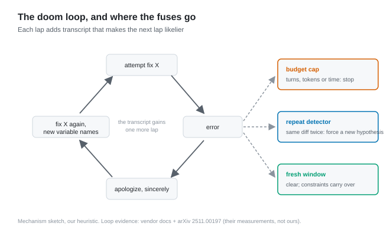

# Why your agent apologizes and then does it again

*2026-08-31 · the RunAI Coder team · [run.ceo/coder](https://run.ceo/coder/?utm_source=github_Official_Page)*

On a thread we were reading last week, a commenter described their agent opening the same file eleven times and then apologizing about it. Anyone who runs coding agents will recognize the shape. The agent tries a fix, the fix fails, the agent apologizes with real conviction, and then produces the same fix again with the variable names shuffled. Somewhere around the fourth loop you stop being annoyed and start being curious: it *saw* the failure. It apologized for the failure. How is it mid-way through attempt five?

The tempting answer is that the model is stupid, and the tempting fix is a sterner prompt. Both miss what's actually happening, which is structural, and which no amount of "please try a DIFFERENT approach this time" reliably fixes.

## The transcript is a gravity well

Start from the mechanics we've [written about before](https://github.com/RunAI-Coder/aicoder-showcase/blob/main/posts/016-what-the-model-sees/README.md): the model is stateless, and every turn it re-reads a freshly assembled transcript of the session. That transcript works nothing like a human memory: it's the entire world the model can see, and the next action gets sampled in the light of everything in it.

Now count what's in that world after four failed attempts. The dominant text pattern, by sheer volume, is: an attempt at fix X, an error, an apology, another attempt shaped like X. To a human, that history reads as mounting evidence that X is wrong. To a next-token predictor, it reads as what this session does. All that history paves the failed path rather than fencing it off, because traffic is exactly what the model uses to decide where the roads are. The pull is probabilistic — sessions do escape it — but each lap makes escape less likely.

The apology deepens the groove instead of escaping it, because apologize-then-retry is itself a pattern the model has seen thousands of times and is now faithfully continuing. In the transcript, contrition is just set dressing on the same road.

A human debugger walks away from a failed hypothesis carrying a belief: *not that, then.* Between turns, the model carries only text, and the text is mostly that.

## The rerun lives above the tokens

It helps to separate the loop samplers can fix from the one they can't reach.

Token-level repetition — the model literally re-emitting the same phrases — is an old, mostly solved problem; repetition penalties exist for it, and temperature helps. The doom loop is not that. It's plan-level repetition: attempt five has fresh wording, new variable names, another apology, and the same underlying hypothesis as attempts one through four. Every line is novel. The structure is a rerun. No decoding parameter operates at the level where the rerun lives; even the fancier anti-repeat samplers key on surface strings, not hypotheses.

There's now trajectory research that catches this on camera. An [empirical study of code-agent trajectories](https://arxiv.org/abs/2511.00197) on SWE-bench (three agents, mostly 2024–2025 era models) describes an agent whose fixes triggered recursion errors, which it patched with more logic, and which "was not able to re-evaluate its hypothesis even though it entered multiple loops." The aggregate numbers point the same direction: failed trajectories run consistently longer with higher variance than successful ones (for one agent, the standard deviation of failure lengths was nearly triple that of successes), and in failed runs, agents spent about as much time exploring wrong file paths as right ones. Most telling: even in failed runs, the agents had found the correct file 72–81% of the time. They could find the file. They couldn't leave the hypothesis.

## Where the exits are

If the loop is structural, the exits are structural too, and they live in the harness rather than in the prompt.

The bluntest breaker is a budget: a cap on turns, tokens, or wall-clock, after which the run stops instead of politely burning money. At least one production harness already ships these fuses. Claude Code's stop-hook mechanism, which lets a script block the agent from finishing until a check passes, force-ends the turn after eight consecutive blocks: the vendor building a fuse into its own enforcement loop. Its `/goal` mechanism similarly gives up and stops the run if the agent stalls with the goal unmet. We read both as the same design judgment: "keep going until it works" needs a circuit breaker to be a safe instruction.

A sharper breaker is repetition detection: fingerprint each attempted diff or command, and treat close-enough recurrence as a tripwire. The tripwire exists to trigger the strongest intervention available without leaving the session: a forced hypothesis switch. "State three explanations you have not yet tested, then pursue the most likely one" does more than "try something different," because it makes the untried paths *exist in the transcript*, where they can compete for probability with the well-worn one.

And the breaker of last resort is the one the vendor's own manual recommends: leave. Anthropic's best-practices guide is blunt about it: "If you've corrected Claude more than twice on the same issue in one session, the context is cluttered with failed approaches," and the fix is to start clean, because "a clean session with a better prompt almost always outperforms a long session with accumulated corrections." The fresh window carries no extra intelligence, just an empty gravity well. And the two corrections' worth of things you learned travel forward as [constraints in the opening prompt](https://github.com/RunAI-Coder/aicoder-showcase/blob/main/posts/024-spec-you-didnt-write/README.md) — "don't add another retry; the bug is not in the parser" — where they weigh a few dozen tokens instead of four failed attempts' worth of gravity. We've argued before that [a disposable context window is a feature](https://github.com/RunAI-Coder/aicoder-showcase/blob/main/posts/012-why-agents-spawn-clones/README.md); this is the failure-mode face of the same coin. Same executor, clean transcript, different distribution.

## When you shouldn't pull the plug

The counterweight: a reset is lossy, and the loss isn't only the failures. A long session also holds true discoveries (the odd config file, the test that only fails on CI, the reason the obvious fix was rejected), and clearing the window shreds those along with the bad attempts unless you deliberately carry them across. The same vendor guide that recommends clearing also says that sometimes you *should* let context accumulate, "because you're deep in one complex problem and the history is valuable." Two corrections is their threshold, not a law of nature; we don't have a measured number of our own for where the loop becomes unrecoverable, and we'd distrust any universal one, since it plainly depends on how much true signal is mixed into the rubble. What we have is the direction: the longer the transcript spends orbiting one wrong idea, the less each additional orbit teaches, and the better a restart looks by comparison.

The trajectory numbers above come with their own expiry date, too: three agents, one benchmark family, models a generation or more behind today's. The ratios will drift. The mechanism — text as gravity — is the part we'd bet on surviving, because it follows from how the loop is built, not from how good this year's models are.

## The fuse is part of the circuit

None of this makes agents look bad, exactly. A system that treats its own history as evidence is doing the only thing it can do; the pathology is that failed history masquerades as evidence *for* the failure. Human institutions solved this with term limits and the phrase "fresh eyes." Harnesses are converging on the same design, one fuse at a time.

An agent that can't forget is condemned to rehearse. Scheduling the forgetting is the harness's job.

---

*Sources: [Claude Code best-practices guide](https://code.claude.com/docs/en/best-practices) (quotes verbatim, retrieved August 2026); [Understanding Code Agent Behaviour: An Empirical Study of Success and Failure Trajectories](https://arxiv.org/abs/2511.00197) (trajectory findings are that study's measurements, not ours); the eleven-file anecdote is a commenter's self-report on a public Reddit thread, paraphrased and anonymized. Our own claims here are mechanism reasoning and dispatch experience, with no controlled measurements behind them.*
