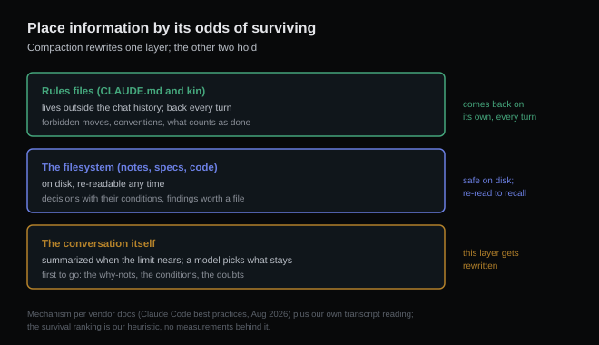

# What survives the summary

*2026-09-01 · the RunAI Coder team · [run.ceo/coder](https://run.ceo/coder/?utm_source=github_Official_Page)*

Say you're three hours into a session, and the agent stops honoring a decision you both settled early: it starts touching the config format you agreed to leave alone. You scroll up. The agreement is right there in the chat history, plain as day. So why is the agent acting like it never happened?

Because the agent isn't reading your chat history. Somewhere in the middle of the session, the conversation got rewritten, and nobody asked you first.

The mechanism is called compaction. When a long session approaches the context limit, the harness has a model summarize the transcript so far and swaps that summary in for the real thing; Claude Code's docs describe it plainly: it "automatically compacts conversation history when you approach context limits," and the operation "preserves important code and decisions while freeing space." From that point on, the model's entire knowledge of the last three hours is whatever made it into the summary. Your scrollback still shows the full conversation. The model's does not. We've written about [the two records diverging](https://github.com/RunAI-Coder/aicoder-showcase/blob/main/posts/016-what-the-model-sees/README.md) before; compaction is the sharpest single moment of divergence a session has.

Two things about that sentence from the docs deserve a slow read. A model decides what "important" means. And the operation runs when a threshold trips; the timing belongs to the threshold, and it doesn't consult you. (You *can* choose the moment yourself — the docs offer `/compact <instructions>` for exactly that — but the automatic pass waits for nobody.)

## The losses have a shape

Summarization is lossy by definition, and that would be tolerable if the losses were random. They aren't. Compress an account of work (in everything we've watched get compressed, by models or by people) and the same kinds of things go first.

Conclusions survive; the reasoning that produced them gets thinner. "We chose approach B" makes the cut. The three dead ends that made B the right call usually don't, and with them goes the *why not*. An agent that later rediscovers approach A sees no warning sign anywhere in its world.

Decisions survive; their conditions get shaved. "Use the legacy parser" makes it through intact. "Use the legacy parser *until the migration lands, then switch*" tends to come out of compression with everything after the comma gone.

And firm statements outlive hedged ones. We noticed this pattern when we studied [what survives a subagent's report](https://github.com/RunAI-Coder/aicoder-showcase/blob/main/posts/020-subagent-reports/README.md): summaries keep the confident claim and shed the doubt attached to it. Compaction is the same physics pointed at your own history. The agent's "this test is probably unrelated, but I didn't verify" re-enters the session as "the test is unrelated." Nobody lied. Something got shorter.

The pattern behind all three: a summary keeps what was said and loses what was *almost* said. The negative space of a session (the rejected options, the conditions, the doubts) compresses to nothing first. Which is precisely the material you'd want on hand three hours later, when the rejected option starts looking attractive again to a model that no longer knows it was rejected.

## Why it feels like a personality change

This is why the post-compaction agent reads as subtly different. Nothing about its competence changed, and it didn't lose the plot entirely; the code patterns, file states, and key decisions mostly made it across — that's the docs' own list of what the summary keeps. The trouble is what's on no list at all: the conditions attached to those decisions, the constraints you negotiated, the reasons things were rejected. Those live in the part of the record that got rewritten, and a constraint that didn't make the summary doesn't exist anymore — while in *your* scrollback, it's still right there, three screens up, looking binding.

You're holding a contract. The other party is holding a summary of the contract, produced by a subcontractor, and nobody flagged which terms fell out.

## Placing information by its odds of surviving

The defense isn't to prevent compaction: on long sessions you can't, and shouldn't want to. It's to stop storing binding information in the one place that gets rewritten. Sort by durability:

| Where it lives | Does compaction touch it? | What belongs there |
|---|---|---|
| Rules files (CLAUDE.md and kin) | No — loaded fresh every session per the docs, and [re-sent each turn](https://github.com/RunAI-Coder/aicoder-showcase/blob/main/posts/016-what-the-model-sees/README.md) in the harnesses we've read | The constraints that must never degrade: forbidden moves, conventions, definitions of done |
| The filesystem (notes, specs, code) | The disk copy is safe; the copy that was read into the chat still gets summarized, so recovery is one re-read away | Decisions with their conditions, findings, anything worth its own file |
| The conversation | Yes — this is what gets summarized | Everything else, and nothing you can't afford to lose |

Note the difference between the first two rows: the rules layer comes back on its own; the file layer comes back when something goes and reads it. The vendor guidance agrees on the top row and adds a lever for the bottom one: you can shape the summarizer's priorities from CLAUDE.md — their example is telling it to "always preserve the full list of modified files and any test commands." That's worth doing, as a mitigation. Instructions to a summarizer are requests about what the next context will contain; a rules file's presence is the harness's own bookkeeping, riding outside the summarizer's reach.

Two habits close the loop. After a compaction lands, restate the constraints that matter in one message: they re-enter the context at full strength, in your words, insurance at the price of a paragraph. We do this as a standing rule. And when the session history is more debris than record, don't summarize it at all: [start clean and carry the constraints forward](https://github.com/RunAI-Coder/aicoder-showcase/blob/main/posts/025-doom-loop/README.md) in the opening prompt. A summary of a mess is a shorter mess.

What we can put numbers on here is nothing, to be clear: we haven't measured survival rates through compaction, the compaction prompts themselves are not public, and "what compresses away first" is a direction we've extrapolated from the subagent-report study and daily use; nobody has measured the ranking, including us. The mechanism, though (a model choosing what your next three hours of context will remember) is documented behavior; the vendor's page says so in as many words. As of August 2026, that's how Claude Code documents handling the limit, and the harnesses we've read handle it the same way.

So, one habit to take away. Next time the compaction notice scrolls past, ask the agent to restate the constraints it's operating under. Whatever is missing from that answer is what the summary ate, and it's a lot easier to re-feed it now than to discover the gap three files into the damage.

---

*Sources: [Claude Code best-practices guide](https://code.claude.com/docs/en/best-practices) (compaction behavior and the CLAUDE.md customization example; quotes verbatim, retrieved August 2026). The "what compresses away first" ranking is our extrapolation, not a measurement. Related earlier posts: [what the model sees each turn](https://github.com/RunAI-Coder/aicoder-showcase/blob/main/posts/016-what-the-model-sees/README.md), [subagent reports](https://github.com/RunAI-Coder/aicoder-showcase/blob/main/posts/020-subagent-reports/README.md), [the doom loop](https://github.com/RunAI-Coder/aicoder-showcase/blob/main/posts/025-doom-loop/README.md).*
