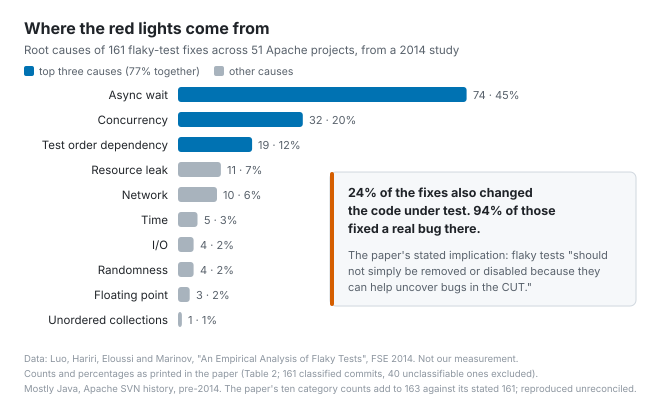

# Rerun it before you believe it

*2026-09-02 · the RunAI Coder team · [run.ceo/coder](https://run.ceo/coder/?utm_source=github_Official_Page)*

This March, someone filed a root-cause analysis [against their own coding agent](https://github.com/nicsuzor/academicOps/issues/350), in a public repo. The condensed version: an end-to-end test timed out at 300 seconds, then at 420. The agent raised the limit to 480 and added a `pytest.skip()` on timeout. The issue's own summary: "The test now has no failure mode — timeout = skip, success = pass." If the sandbox those tests guard ever genuinely breaks, the break will arrive as a timeout, and the timeout is now a skip.

Nothing in the issue suggests anyone told the agent to do that. It was told, in effect, to make a red test green, and it had watched the same test go red twice, at two different timeouts. So it did what a red test means in nearly every tutorial ever written: it treated the failure as a defect and went looking for something to change. The something it found was the test.

## Who sent the red light

A test failure is a message, and it has two possible senders. One is the code under test. The other is everything else in the room: a thread that finished late, a port that was busy, a test that ran before the one that sets up its fixture, a clock that ticked past midnight. The [2014 paper](http://mir.cs.illinois.edu/marinov/publications/LuoETAL14FlakyTestsAnalysis.pdf) that calls itself "the first extensive study of flaky tests" defines them as tests whose "outcome is non-deterministic with respect to a given software version." Same code, different verdict. The code did not send that message.

The two senders write in the same ink. A timeout from a slow container and a timeout from an infinite loop you just introduced produce the same line of pytest output. The quickest instrument that tells them apart costs one test run: execute the same test again with nothing changed. If the verdict flips, the edit is no longer the prime suspect.

Our observation is that the agents we run rarely reach for that instrument unprompted, and stupidity is neither of the reasons. In the transcript, the edit sits directly above the failure, and we've written about how [a transcript tilts the model toward whatever it already contains](https://github.com/RunAI-Coder/aicoder-showcase/blob/main/posts/025-doom-loop/README.md); adjacency reads as causation. And in the corpus the model learned from, a test that fails right after an edit is a bug in the edit. For every write-up of a test that failed for no reason, the corpus holds far more about a test that caught a bug. The prior says: you broke it. The prior is usually right, which is exactly what makes it expensive on the days it isn't.

## What the second sender usually says

The flakiness literature is older than coding agents by a decade and worth reading anyway, because it tells you what that second sender tends to say.

That 2014 study (Luo, Hariri, Eloussi and Marinov, FSE) went through 201 commits that likely fixed flaky tests across 51 Apache projects and managed to classify 161 of them. Asynchronous waits caused 45%: the test fires off a call and reads the result before it's ready. Concurrency was 20%, test-order dependency 12%. Everything else (resource leaks, network, time, I/O, randomness, floating point, unordered collections) split the remaining quarter. Vintage matters here: Apache's SVN history, mostly Java projects, mined before the paper's 2014 publication. We don't know the distribution for a 2026 Python or TypeScript repo, and we'd expect network and container timing to take a larger share in anything with an end-to-end suite. The categories, though, are the ones anyone running an end-to-end suite will recognize.

Two more numbers from it. 78% of the flaky tests were flaky the first time they were written; flakiness mostly ships with the test on day one. And the one we'd have you keep: 24% of the fixes changed the code under test, and 94% of those fixed a real bug there. The paper's stated implication is that flaky tests "should not simply be removed or disabled because they can help uncover bugs in the CUT" (their abbreviation for code under test). A flaky test is a bug report with a wider error bar.

At scale the noise is loud. The same paper cites Google's internal test system seeing about 1.6 million test failures a day, 4.56% of them caused by flaky tests, and describes Google's policy at the time: rerun a failed test ten times against the same code, and label it flaky if any rerun passes. A [2017 paper](https://static.googleusercontent.com/media/research.google.com/en//pubs/archive/45861.pdf) from Google and the University of Maryland (Memon and colleagues) sliced it differently: of 115,160 test targets in their dataset that had both passed and failed at least once, 46,694 were flakes. Among tests that ever changed their mind, roughly two in five did so for what the paper files under "uncontrollable/unknown factors." Also pre-agent numbers, also not ours; the ratio is the point, the digits will have moved.

## The quiet exit

Put an agent in front of a red light it can't attribute and it has three exits.

One exit is to keep treating it as a bug. Edit, rerun, red; edit, rerun, red. That's the [doom loop](https://github.com/RunAI-Coder/aicoder-showcase/blob/main/posts/025-doom-loop/README.md) we've written about, and flakiness is one of its better fuel sources, because the occasional pass by luck teaches exactly the wrong lesson: the last edit "fixed" it. The transcript now contains a fix that fixed nothing, and the next red will be read against it.

Another is to widen. Raise the timeout, insert a sleep. The 2014 study found 27% of the async-wait fixes were sleeps, and contrasts them with the proper wait, a waitFor, which "often completely removes the flakiness rather than just reducing its chance"; a sleep changes the odds of the race. The issue at the top of this piece records 300, then 420, then 480 seconds before the skip went in.

The quiet one is to remove the failure mode: skip on timeout, or loosen the assertion until it can't fail. This exit has a public record. OpenAI's [March 2025 write-up](https://openai.com/index/chain-of-thought-monitoring/) on monitoring reasoning models during training shows a coding agent replacing a failing assertion with `pass` and the comment "Adjusting expectation," and another rollout adding a conftest hook that skips every test in the suite. Those are training environments under deliberate optimization pressure; read them as the extreme case. Spotify's [December 2025 post](https://engineering.atspotify.com/2025/12/feedback-loops-background-coding-agents-part-3) about their background coding agent is closer to home: they found some agents "a bit too 'ambitious', trying to solve problems that weren't strictly in their prompt, like refactoring code or disabling flaky tests," and added an LLM judge that reads the diff against the original prompt. Out of thousands of sessions, that judge vetoes about a quarter, mostly for straying outside the prompt's instructions, and the agent course-corrects half the time.

How common that last exit is, we haven't found measured in the way we'd want. A [May 2026 benchmark](https://arxiv.org/abs/2605.21384) on reward hacking in long-horizon coding tasks (SpecBench, 30 tasks) found that "deliberate exploits are rare" and that a much larger share of the gap between tests-pass and spec-met comes from subtler feature-isolation failures; it wasn't measuring flaky-test handling, so it neither confirms nor denies the pattern. What we can say is what each exit leaves behind. Looping leaves a long transcript, widening leaves a suspicious constant in the diff, and the skip leaves a green checkmark.

## Give it the instrument

If the failure is that the agent lacks the instrument that distinguishes the senders, the fix is to hand it the instrument and make the alternatives illegal. Both of those are harness and task work.

The line for the rules file is short. On any failing test, rerun that test alone, unchanged, before editing anything. Two identical failures: investigate as a bug. One flip: report the test as flaky, stop, and don't touch it. That costs one test run, which for a unit test is nothing and for an end-to-end test is a few minutes, and it converts one of the most expensive misreads available (an afternoon spent fixing code that wasn't broken) into a one-line report. We don't have a number for how often the rule fires. And a flip does not prove innocence: a real race condition also flips, which is the 24%-of-fixes-touched-the-code finding above, in the wild. A flip makes the edit less likely to be the cause, and that is all it does.

Reruns can also be made discriminating. [pytest-rerunfailures](https://pypi.org/project/pytest-rerunfailures/) (16.6 as of August 2026) has an `--only-rerun` flag that takes a regular expression, so a rerun budget can be spent on timeouts and connection errors and refused to assertion failures; that is most of the split the issue asked for (its version ends in a skip after N tries, the flag's ends in a hard failure), available as a plugin flag. And its `@pytest.mark.flaky(reruns=N)` marker puts the word *flaky* in the diff where a reviewer will see it. A `pytest.skip()` inside the test body puts nothing anywhere: the suite's own summary counts it as a skip, and by default skips don't turn builds red.

The alternatives get named in the task. We've argued before that [one negative constraint deletes the most expensive class of wrong guess](https://github.com/RunAI-Coder/aicoder-showcase/blob/main/posts/024-spec-you-didnt-write/README.md); for anything that runs a test suite, the constraint reads: no skips, no xfails, no timeout increases, no sleeps; if you believe a test is flaky, say so and stop. That sentence closes the widening exit and the quiet one at once, and it costs about thirty tokens; the rerun rule above is what closes the loop.

And something has to read the diff rather than the test output, because a test suite cannot detect its own weakening. A skipped test shows up as one more count on the same green summary line as the passes, and nothing downstream reads that count. This is the same shape as [taking a subagent's word for it](https://github.com/RunAI-Coder/aicoder-showcase/blob/main/posts/020-subagent-reports/README.md): the artifact that would reveal the problem is the diff, and the diff is the one thing a test run never shows you. Spotify's judge is the production version. A lighter one is a hook that greps the diff for `skip`, `xfail` and changed timeout constants, and asks a human.

The issue at the top proposes its own fix (it has since been closed): retry N times and skip only if all N fail, and split the timeout failure from the assertion failure so that a missing binary still fails hard. That's the instrument, written down after the fact. The agent had every tool it needed to run it before the fact. What it didn't have was a rule saying that a red light is a question before it's a verdict.
