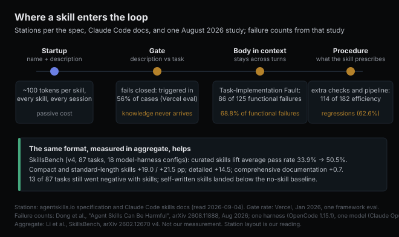

# When the skill outranks the task

*2026-09-04 · the RunAI Coder team · [run.ceo/coder](https://run.ceo/coder/?utm_source=github_Official_Page)*

Picture a spreadsheet task: compute net exports as a percent of GDP. An agent with a spreadsheet skill loaded, matched to the task by its description, computes (Exports − Imports) / GDP and stops. The paired reference run for the same task computes (Exports − Imports) / GDP × 100. The verdict in the study this comes from: the skill-guided run "fills the required calculation with the wrong representation." The task said percent; the run delivered a ratio. That [study, posted in August](https://arxiv.org/abs/2608.11888), set out to catalogue the ways an installed skill makes an agent worse, and the catalogue is long enough to change how we read the format.

## The file is a procedure

The word suggests a capability. The format delivers a procedure. Under the [open specification](https://agentskills.io/specification) that Claude Code's skills follow, a skill is a directory with a `SKILL.md` whose frontmatter carries a `name` and a `description` (the description "should describe both what the skill does and when to use it," capped at 1,024 characters) and whose body holds "the skill instructions," with "no format restrictions."

The loading model is the part that decides everything downstream, and the spec states it plainly: metadata, "~100 tokens," is "loaded at startup for all skills"; the full body, "< 5000 tokens recommended," is "loaded when the skill is activated"; scripts and references come in only when used. Claude Code's docs add the operational consequence: "a skill's body loads only when it's used, so long reference material costs almost nothing until you need it," and then, once loaded, "its content stays in context across turns, so every line is a recurring token cost."

Read those two facts together and the shape appears. A skill is a block of instructions that sits outside the context until a one-paragraph description convinces the model it applies (or a user invokes it by name), and then sits inside the context, on every subsequent turn, with the standing of instructions. The August paper's definition says the same thing without the plumbing: "Once loaded, a skill can influence the agent's planning, repository exploration, tool use, code edits, tests, and stopping decision." That is a lot of surface for a file that, if you pulled it from a marketplace, nobody on your side wrote.

## Closed when it should open, harmful when it opens right

For a skill left to fire on its own, the description-to-task match decides whether it ever enters the context, and the evidence on that match is not flattering.

It fails closed. Vercel ran an eval in January 2026 comparing framework knowledge delivered as a skill against the same knowledge folded into an AGENTS.md file. Their finding: "Skills were only triggered in 56% of eval cases," and the pass rate with skills sat at the 53% baseline; telling the agent explicitly to use the skill lifted it to 79%, while the always-present file reached 100%. Forced on, the skill recovered most of the gap; left to its own description, it recovered none of it. A description is a bet that the model will recognize the moment, and in that eval it lost the bet close to half the time.

The stranger result is what happens after the gate opens correctly. You would expect the harm from skills to come from the wrong skill firing on the wrong task. The August study, which ran paired executions (same task, same verifier, same repo, same model, same harness, "only the skill setup varies") across two benchmarks with OpenCode 1.15.1 and Claude Opus 4.6, found the opposite. Of its 125 confirmed functional failures, "Only 2 of 125 functional failures are classified as Applicability Mismatch (1.6%)." The skills that broke tasks were almost all on-topic. In the authors' words: "seemingly relevant skills often make the agent implement a required field, API behavior, calculation, output format, or domain rule incorrectly or omit it entirely." Eighty-six of the 125, they report, were filed under that heading, Task-Implementation Fault: the skill's method, default, or example displaced a task-required element, or piled on enough procedure that the artifact never got produced. The percent-of-GDP case is one of them.

This is the same mechanism we described when we wrote about [the spec you didn't write](https://github.com/RunAI-Coder/aicoder-showcase/blob/main/posts/024-spec-you-didnt-write/README.md), one layer down. A one-line prompt gets its blanks filled from the training corpus. A skill fills them from its author's examples instead, which is often better and sometimes precisely wrong, because the author was writing for a class of tasks and your task is a member with its own requirements. The paper's recommendation to skill authors reads like a fix for a category error: "separate mandatory task requirements from examples, defaults, reusable templates, and optional workflows, so that agents do not mistake reusable guidance for task-specific obligations."

## The other half of the cost is procedure

The 125 functional failures were joined by 182 high-confidence efficiency regressions, and the paper defines those strictly. Both runs pass; the skill-guided run costs more than the reference in both tokens and time, and more than double in at least one of them (the threshold "T=2.0 ... to focus on large cost regressions and reduce sensitivity to small token/time fluctuations").

The intuitive story for those regressions is length: a fat skill body rides along every turn, so each call gets pricier. That's real (of the 46 cases the paper traces to context overhead, 43 come from "mandatory skill-body text"), and it's the smaller share: 46 of the 182. "Excessive Procedure accounts for 114 of 182 cases (62.6%)," and inside it, "excessive verification (67 cases) and heavy implementation pipelines (30 cases)." The skill added work on top of words: more repository exploration before the edit, heavier construction pipelines during it, "excessive or repeated testing, debugging, rebuilding, or checklist verification" after. Sixty-seven cases where the skill made a passing agent keep verifying.

That last number deserves a pause from anyone who writes skills, us included. Checklists feel free to add. A skill line like "always run the full suite, then lint, then re-verify the output format" (our example, not the paper's) costs nothing to write, and excess verification is the largest single bucket among the paper's 182 regressions: 67 of them. The paper's line: skill-induced efficiency regressions "are not explained by prompt length alone." The [tool catalog tax](https://github.com/RunAI-Coder/aicoder-showcase/blob/main/posts/021-tool-catalog-tax/README.md) we wrote about was a passive cost, paid per token for definitions that sat there. This one is active. The skill spends the agent's turns.

## The denominator problem

Before this reads as an argument against skills: the counting has limits, and here they are.

The 307 failures are a numerator without a clean denominator. The authors built "20,664 potential paired comparisons," flagged 665 candidates from the ones they executed, and confirmed 307 by hand; the paper doesn't reduce that to "skills hurt in X% of runs," and we won't do it for them. The setup is one harness and one model, and the authors say so: findings "may not directly apply to all settings." And every confirmed case rests on a human reading the skill's fault out of a trajectory, which the authors acknowledge.

And the aggregate evidence runs the other way. [SkillsBench](https://arxiv.org/abs/2602.12670), one of the two benchmarks the August study drew its tasks from, reports in its current version (v4, June 2026) that curated skills lift the average pass rate "from 33.9% to 50.5%," a gain of 16.6 percentage points, across 18 model-harness configurations. Curated is the operative word: those skills were drawn from the top quality quartile (a score of 9 or more out of 12) of an ecosystem whose mean they measured at 6.2 out of 12. Even so, "13 of 87 tasks show negative Skills deltas," and skills the model wrote for itself landed "below the no-Skills baseline on all three configurations." Length shows up there too, as a gradient: compact and standard-length skills gained +19.0 and +21.5 points, detailed ones +14.5, and comprehensive documentation +0.7.

So the fair summary as of September 2026 is that a good skill helps a lot, a long skill helps less, and an on-topic skill that carries the wrong default hurts in ways a human skim would likely wave through, because the output looks like the skill said it should. We have five skills in our own pipeline and have measured none of this. One design choice happens to land on the right side of it: our review skill runs in a separate agent, so its checklist never enters the drafting context.

## Reading a skill before it reads your task

Given the mechanism, the useful habits fall out, and none of them are about writing better prompts.

The description is the contract, because it is the only part of the skill the model sees before deciding. The spec's own good-and-bad example is instructive: "Helps with PDFs" is the poor one; the good one says what the skill does and when to use it, which is all the gate has to work with. A vague description is a skill that fires on the wrong day and stays home on the right one.

Read the body as a colleague's runbook that can override the ticket. Every "always" in it is a default that can win against a task requirement unless the task states the requirement louder. The openpyxl case in the paper is the textbook version: the skill-guided agent decided the repository's copy was too old ("I'll install a modern version"), pip-installed one and rewired sys.path; the verifier imported from the repository's own copy and failed against an environment the run had rewritten. The reference run patched the repository file directly. Whether the library was old is beside the point. The task's environment was the verifier's, and the run replaced it.

Budget what the skill makes the agent do before what it makes the agent read. The question for a skill is how many extra turns it prescribes: exploration steps, pipeline stages, verification passes. Length comes second. The spec's 500-line recommendation at least puts a number on length; nothing in the format puts one on procedure.

And measure your own gate. The Vercel eval is one data point, but the method is portable: give the agent a couple dozen tasks the skill should fire on and count how many times it does. If the number is near half, the knowledge belongs in the always-loaded file, provided it passes the [rent test we argued for instruction files](https://github.com/RunAI-Coder/aicoder-showcase/blob/main/posts/008-agent-friendly-codebases/README.md), and the skill can keep the long tail.

None of this makes the format wrong. It makes the format what it is: a mechanism for letting someone else's procedure, your past self included, into the loop with the standing of an instruction, gated by one paragraph. The August study's most useful sentence is addressed to authors rather than models: separate the mandatory from the reusable, "so that agents do not mistake reusable guidance for task-specific obligations." If a skill's run passes with the skill removed, the skill has to show what it saved. If it passes only with the skill, read the skill again and find the line that did it.
