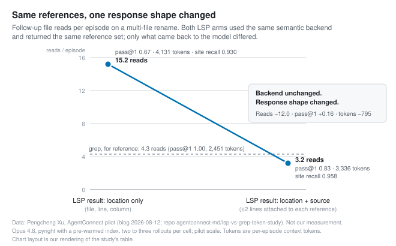

# To the model, a tool is its return value

*2026-09-07 · the RunAI Coder team · [run.ceo/coder](https://run.ceo/coder/?utm_source=github_Official_Page)*

Two tools answer the same question about the same codebase. One comes back with `src/auth.ts:42: return validateToken(token)`. The other comes back with `{ "uri": "file:///src/auth.ts", "range": { "start": { "line": 41, "character": 11 } } }`. The second answer is the more precise one: it came from a language server that knows the difference between a call to `validateToken` and the word `validateToken` in a comment. Now ask which answer an agent can act on without another tool call. The first already contains the line it would edit. The second is an address, and the next thing that happens to an address is that somebody goes there.

A [small pilot study](https://agentconnect.md/blog/grep-beat-lsp-harness/) by Pengcheng Xu (six localization tasks, three rollouts each, three Claude models), written up in August and the subject of a long Hacker News thread on September 4, put both tools in front of the models and let them choose. On code-location tasks the models picked the semantic tool 0%, 4%, and 6% of the time (Opus 4.8, Sonnet 4.6, Haiku 4.5). Forcing the semantic path first dropped success in that arm from 100% to 89%. Precision was available and went unused. The pilot's own phrase for this is the one we'd underline: "Availability is not adoption."

## The model never sees the backend

From where the model sits, a tool has two visible surfaces: the description that enters the context before the task, and the result that comes back after the call. Everything between those surfaces, the index, the type checker, the protocol, is invisible. Anthropic's engineering note on tool design ([September 2025](https://www.anthropic.com/engineering/writing-tools-for-agents)) describes tools as "a contract between deterministic systems and non-deterministic agents," and two of its five principles are about the return side of that contract: "eschew low-level technical identifiers," prefer fields that "directly inform agents' downstream actions," and, from their own retrieval evals, "merely resolving arbitrary alphanumeric UUIDs to more semantically meaningful and interpretable language" improved precision. The description is a bet that the model recognizes the moment ([we spent part of a post on that bet](https://github.com/RunAI-Coder/aicoder-showcase/blob/main/posts/028-when-the-skill-outranks-the-task/README.md)). The result is what the model has to think with once the bet pays.

A language server's result was shaped for a different reader. Under the [LSP 3.17 specification](https://microsoft.github.io/language-server-protocol/specifications/lsp/3.17/specification/), a references request returns `Location[] | null`, where a `Location` is a `uri` and a `range`, and a range is two positions made of `line` and `character`. No source text. That is the right design when the client is an editor: the editor has the file, a location is a jump, and the line is on screen a frame later. The protocol handed the second half of the job, showing the human the code, to a client that could do it for free, and nobody ever had to write that half down as work.

An agent's harness is that client now, and it has nothing on screen. A location handed to the model is a promise that a `Read` will follow. In the pilot's locations-only arm, the LSP tools "initially returned only a location: a file path, line, and column," while grep "usually returned the matching line immediately." That one asymmetry, before any argument about training data, would explain a lot of the routing on its own.

## Same backend, two more lines

The experiment we find most useful in the pilot is the one that changed nothing about retrieval. On a multi-file rename task (Opus 4.8, pyright with a pre-warmed index), the author kept "the semantic backend and the set of references" identical and changed only the response: every reference came back with ±2 lines of source attached. Pass@1 rose from 0.67 to 0.83. Follow-up file reads per episode fell from 15.2 to 3.2, below grep's own 4.3. Tokens per episode went from 4,131 to 3,336; grep sat at 2,451 and passed the rename every time, with site recall of 1.000 against the inline arm's 0.958 and the locations-only arm's 0.930.

Taken as a mechanism, the table says one thing. The backend returned the same reference set in both LSP arms; what differed is how many of those sites the agent's edits actually reached, and whether the tests then passed. Fifteen reads to resolve a list of addresses is fifteen chances to skip one, and a rename that misses a call site fails the test. Attaching the line took most of the reads away, and about half the failures went with them.

Xu is careful about what this proves: "The output change does not prove that post-training data caused the improvement. It may also have helped simply because each response contained more useful information." Both readings point the same way for anyone mounting a tool. The return value is where the tool's usefulness gets decided, whatever reason the model has for preferring it. What the pilot doesn't report is the routing share after the change: the free-choice numbers are given once, and nothing ties them to one response shape. The measured result is that the better shape made the tool work. Whether it also gets the tool used is the inference, and it's ours.

The scale is a pilot, and the pilot says so: "small task sets, a few repositories, three Claude models, and two to three rollouts per cell." The [repository](https://github.com/agentconnect-md/lsp-vs-grep-token-study) shows localization at 6 SWE-bench-Lite `requests` tasks × 3 rollouts × 4 arms, and reference-completeness at 5 cross-file functions × 3 rollouts × 4 arms, run on a custom Python loop that drives language servers over stdio (`pyright` for the Python results here, after the author found `python-lsp-server`'s reference set too incomplete; `typescript-language-server` for TypeScript), with no shipping coding CLI involved. Every number above is a signal with wide error bars, pointing in a direction we recognize from our own sessions, for what an uncounted impression is worth.

## Where the precise tool earns its place

The language server stays a real tool in this story. It becomes a conditional one, and the pilot is explicit about the condition.

The routing is task-shaped. The same models that picked the semantic tool 0–6% of the time for localization picked it 45%, 50%, and 57% of the time when asked to find every caller of a function, unprompted. On that task the LSP arm reached precision 1.00 against grep's 0.76, because it doesn't return the word in a comment. Recall stayed near 0.66 in both arms, which the author attributes to how thoroughly the agent worked rather than to retrieval, and on the stronger models the precision came with a token premium rather than a saving (+19% on `requests`).

The codebase decides the rest. Across two TypeScript repositories the verdict flipped: on `remeda`, where grep's precision was already 1.00, the LSP added +0.000 F1 and cost 16% more tokens; on `hono`, where grep's precision was 0.51, the LSP added +0.246 F1 and used 12% fewer tokens. On Python `requests` (grep precision 0.76): +0.072 F1 for +19% tokens. The useful predictor, in the author's words, "was lexical noise," and static typing did not predict the gain. If your symbol names collide with your comments and your config keys, the semantic tool pays for itself. If they don't, it's a pricier grep with a colder start.

And there is a structural reason grep keeps a seat that better training would never remove. A semantic reference is one kind of text match. A rename also has to touch the docstring, the config key, and the string in the log message, and `find_references` "will not return those by design, while grep can." The pilot writes it as a set relation, semantic references ⊂ textual occurrences. For text-wide edits, the imprecise tool is the complete one.

## A rule is read; a hook is run

The second half of this story arrived on Hacker News the same week, from a different direction. Spotify's Dimitri Mazmanov [published](https://engineering.atspotify.com/2026/9/portal-by-spotify-cut-my-claude-code-token-usage-by-90) a Claude Code plugin that routes bulk file reading away from the frontier model to a smaller worker (Gemini 2.5 Flash in his setup) running on Spotify's internal platform. The headline number is "Mean bulk-read savings were around a whopping 90%," the mean over the bulk-read scenarios, out of four tested on one Java monorepo; it counts the tokens Claude would have spent reading, leaves the worker model's own tokens outside the count, and comes with no accuracy figure. The paragraph before the benchmark is the one we came for:

"The first version of this was a block of routing rules in CLAUDE.md. It sort of worked: Claude would read the instructions and self-route to Portal. But it had problems. The rules were advisory, not enforced. Claude could ignore them."

Of course it could. Our reading of why: a rule in the rules file is one more paragraph in the context, competing at sampling time with everything the model already knows about reading files, and the model has read a great many files. [We saw the same gap for skills](https://github.com/RunAI-Coder/aicoder-showcase/blob/main/posts/028-when-the-skill-outranks-the-task/README.md): in Vercel's eval a skill fired in 56% of the cases it was meant for, while the same knowledge in the always-loaded file reached a 100% pass rate, because there was no gate left to lose. A rule in the file asks; nothing in the file makes the answer yes.

The version that worked moved the rule out of the context entirely. Claude Code [hooks](https://code.claude.com/docs/en/hooks) (as documented in September 2026) are handlers the harness runs on events, a shell command in this plugin's case; a `PreToolUse` hook fires "before a tool call executes" and "can block it," either by exit code 2 or by returning a JSON `permissionDecision` of `"deny"` with a reason, after which Claude Code "blocks the tool call, and shows Claude the reason." Mazmanov's plugin registers two. One fires on every `Read` and blocks it if the file exceeds a line threshold (default 350), with a message pointing to the bulk-reader skill; targeted reads with an offset and limit pass through. The other catches `cat`, `head`, `tail`, `less`, and `more` on large files and lets piped commands through as targeted reads. His summary of the layering: "Even if Claude doesn't read the skill description, the hook still blocks the expensive read."

That sentence is the whole difference between the two versions. The rule lived where the model decides; the hook lives where the harness executes. A hook never has to win the argument, because the argument is over by the time it runs. It's the same place we keep arriving at from other directions: [an agent's behaviour is a property of the model and its loop together](https://github.com/RunAI-Coder/aicoder-showcase/blob/main/posts/015-harness-half-your-agent/README.md), and the parts of the loop you can make deterministic are the parts that stay put.

The cost is that hooks are blunt. A 350-line threshold has no idea whether line 351 matters. Mazmanov's own list of what the routing can't do is longer than the headline suggests: "You can't delegate editing," because the worker's summaries "don't include reliable line numbers"; "You can't delegate reasoning," because in his testing the worker "missed a subtle thread-safety bug" that the frontier model "spotted in seconds once given the right context"; and "Latency adds up," at 10–30 seconds per round trip with a 30-second cap. He excludes debugging, architectural decisions, and safety-critical code from routing outright, and the line threshold exists because below it "the overhead of delegation exceeds the savings." A hook that fires too eagerly adds the round trip without removing any reading.

## One result, then the next call

Before we mount a new tool now, three things happen, in this order.

Print one real result from it and ask what the next call would be with only that in the window. If the answer is "open the file it points at," the tool is handing the agent an errand, and a `path:line:content` shape would hand it the answer instead. There's a cap on the other side: Anthropic's note says Claude Code truncated tool results at 25,000 tokens by default at the time of writing, so "return more" runs out too. The target is the line the agent acts on plus enough around it to act, which in the pilot was two lines either way. And the native tool stays mounted next to it: the pilot's cleanest failures came from the forced-semantic arm, and the structural argument about comments, strings, and config doesn't go away with a better model.

Then count. Mount the tool, run the same couple-dozen-task count we suggested for skill gates, one layer down, and record how often the agent called it when it could have. We run a handful of tools and five skills in our own pipeline and have never taken this count, which is the seat most teams are in and the reason we're writing the sentence down. [Since 021 we've known what an unused tool costs to keep mounted](https://github.com/RunAI-Coder/aicoder-showcase/blob/main/posts/021-tool-catalog-tax/README.md); we still don't know how many of ours are unused.

Sort your rules by what they need to do. A preference ("try the semantic tool first on reference tasks") belongs in the file, where it can lose gracefully. A prohibition ("never read a 2,000-line file whole") belongs in a hook, where it can't be talked out of. Spotify's two versions are the same policy written in the two places, and only one of them was still working by the time he wrote it up. Two posts ago we put the no-skips rule for test suites in the rules file and the task brief. His two versions are the case for moving the rules that have to hold every time into a hook. We haven't moved ours yet.

The first item on Xu's checklist is the line we'd borrow for any tool review: "Test real tasks at equal accuracy. Do not celebrate lower token use if success also fell." On localization the LSP path cost more tokens at equal success (+6% on Opus 4.8, +118% on Sonnet 4.6, per the repository's summary) and the forced-first arm gave up 11 points. On the rename, the inline arm still cost more than grep and closed about half the gap to it in pass rate. Only one of those is progress, and the token column alone can't tell you which.

In the transcript of a localization task, none of this ever looks like a decision. The grep line sits there with the code already in it, the edit follows from it, and the more precise tool, which would have told the agent the same thing one call later, was never asked.
