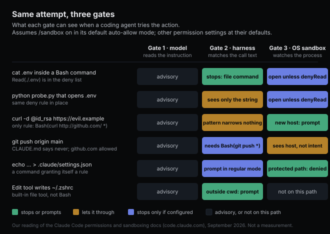

# The sandbox never reads the command

*2026-09-08 · the RunAI Coder team · [run.ceo/coder](https://run.ceo/coder/?utm_source=github_Official_Page)*

[A joke](https://beige.party/@intransitivelie/117057396732763183) went around over the weekend: "I regret to inform everyone that my copy of QBittorrent escaped its sandbox last night and downloaded a whole bunch of content owned by major corporations," and it goes on about Jellyfin breaking containment. It lands because "escaped its sandbox" has become a stock phrase, the kind you read in a model write-up and nod at without asking what the sandbox was. We run coding agents on real machines all day, so we asked. The way we count it, a "no" can live in three places for a coding agent on a laptop. They see three different things, they fail in three different ways, and in the one public case we could trace to its source, "escaped" described the gate that wasn't there.

## Three places a "no" can live

Text the model reads is one place: `CLAUDE.md`, the system prompt, the task brief, everything it takes in before it decides. We use Claude Code as the worked example throughout because its two pages on this are the most detailed we've found (Codex and Gemini CLI document the same arrangement in fewer words), and its [permissions documentation](https://code.claude.com/docs/en/permissions), September 2026 version, is blunt about what that text is: "Permission rules are enforced by Claude Code, not by the model. Instructions in your prompt or CLAUDE.md shape what Claude tries to do, but they don't change what Claude Code allows." Last week [we wrote](https://github.com/RunAI-Coder/aicoder-showcase/blob/main/posts/029-a-tool-is-its-return-value/README.md) that "a rule is read; a hook is run." This is the same distinction with the floor lowered. The model's "no" is a decision, and a decision can be reasoned out of, by a prompt injection or by a model that has correctly concluded the instruction doesn't cover this case.

The harness is another, and it acts before anything runs. When the model emits a tool call, Claude Code runs any `PreToolUse` hooks (a hook that exits with code 2 ends the call before any rule is consulted), then checks the call against permission rules in a fixed order, "deny, then ask, then allow," and in auto mode hands it to a classifier that reads it against your request. Every one of those works from the call as text, the tool name and its input, never from what the process later does. For the Bash tool the input is the command string, so `Bash(git push *)` matches a string and `Read(./.env)` matches a path argument. This gate is where most people's idea of "permissions" lives, and it's the one that ships on: a fresh session is read-only and prompts before edits and commands.

The operating system is the last, and the only one that sees a process instead of a request. With the [sandboxed Bash tool](https://code.claude.com/docs/en/sandboxing) turned on (`/sandbox`; Seatbelt on macOS, bubblewrap on Linux and WSL2, nothing on native Windows), the command runs inside a boundary the kernel enforces: writes only to the working directory and a few declared paths, network only through a proxy that runs outside the sandbox and checks each hostname against an allowlist. The documentation gives the property that separates this gate from the other two in one sentence: "The operating system enforces the sandbox boundary on the running process, so it holds regardless of what the model chose to run and even if an allowed command does more than its name suggests."

That last clause is the reason a third gate exists. The second gate reads the name. The third watches what the process does.

## What a string can't tell you

The case that sent us back to the permissions page is small. Suppose `Read(./.env)` is in your deny list. The `Read` tool can't open the file, and `cat .env` inside a Bash command is caught too, because Claude Code recognizes `cat` as a file command and checks its path. Now the agent writes five lines of Python that open `.env` and print it, and runs `python probe.py`. The deny rule never fires. The docs say so in plain words: Read and Edit deny rules "don't apply to arbitrary subprocesses that read or write files indirectly, like a Python or Node script that opens files itself. For OS-level enforcement that blocks all processes from accessing a path, enable the sandbox."

Nothing escaped. The rule was a string matcher, the string was `python probe.py`, and `.env` is not in it.

The same page spends a paragraph on `curl`. A rule meant to hold curl to GitHub, `Bash(curl http://github.com/ *)`, won't match `curl -X GET http://github.com/...`, or `https://`, or a redirect through a short URL, or `URL=http://github.com && curl $URL`, or an extra space. The page's own fixes stay at gate two: deny `curl` and `wget` and route fetches through `WebFetch(domain:...)` rules, or write a hook that checks the URL inside the command text; `CLAUDE.md` guidance, it adds, "shapes what Claude tries but doesn't enforce a boundary." The thing that sees the connection itself is one page over, on the sandbox side. Compound commands are parsed (a rule for `safe-cmd *` doesn't approve `safe-cmd && other-cmd`) and a fixed list of wrappers such as `timeout` and `nice` is stripped before matching, but environment runners aren't on that list, so `Bash(devbox run *)` approves `devbox run rm -rf .`. Each of these is a spot where the text of a command and the effect of a command come apart, and a text matcher can only stand on one side.

The sandbox stands on the other side, and it has a default you want to know about before you lean on it. Filesystem isolation blocks writes outside the working directory, but reads are allowed almost everywhere, and the doc names the exception you'd most want closed: "this default still allows reading credential files such as ~/.aws/credentials and ~/.ssh/." Closing it is a `sandbox.credentials` entry or a `denyRead` path. Network runs the other way: "Claude Code pre-allows no domains by default," and the first request to a new host stops for approval. So with the sandbox on and nothing else changed, a compromised command can read your SSH key and cannot send it anywhere without a prompt. Anthropic's [engineering post](https://www.anthropic.com/engineering/claude-code-sandboxing) from October 2025 is explicit that the two halves are one design: with both on, "a compromised Claude Code can't steal your SSH keys, or phone home to an attacker's server," and the open-source [runtime](https://github.com/anthropics/sandbox-runtime) underneath it puts the same point the other way round, without file isolation a process could exfiltrate keys, and without network isolation it could "escape the sandbox and gain unrestricted network access."

Codex's [permission-profile docs](https://learn.chatgpt.com/docs/permissions) (the profiles are marked beta) carry a warning of the same family, from the other direction: a profile's domain rules only restrict traffic while the network proxy is running, and "without an active proxy, profile domain rules do not restrict direct network access." A list of domains in a config file is a policy. The proxy is the gate.



## The escape hatch is in the manual

The word "escape" is in Claude Code's own sandbox documentation, in a section called "The unsandboxed retry escape hatch." When a command hits the boundary, Claude Code writes the violation into the command's result, naming the path or host the sandbox denied, so the model sees what was blocked. The model may then retry the command with a `dangerouslyDisableSandbox` parameter. That retry "runs outside the sandbox, so it goes through the regular permission flow. In Manual mode you get a confirmation prompt." The prompt is titled "Bash command (unsandboxed)" instead of "Bash command": one word in parentheses, and it tells you which gate you're standing at when you press Enter. One setting, `"allowUnsandboxedCommands": false`, removes the hatch; the panel calls it strict sandbox mode, and under it a command that can't run sandboxed doesn't run, short of an `excludedCommands` entry you wrote yourself.

So the documented way out of the sandbox is a request to a human, or in auto mode to a classifier. Gemini CLI's [sandbox docs](https://github.com/google-gemini/gemini-cli/blob/main/docs/cli/sandbox.md) describe the same shape under a different name, a "Sandbox Expansion Request" dialog that appears when a sandboxed command is denied, or when the CLI expects one to need more, and asks whether to grant that directory or that network access for the run. Codex's [sandbox page](https://learn.chatgpt.com/docs/sandboxing) draws the line in two sentences: "The sandbox defines technical boundaries. The approval policy decides when the agent must stop and ask before crossing them." Three harnesses, one arrangement: the third gate doesn't make decisions, it produces a fact ("blocked: ~/.ssh") and hands the decision back to the second gate.

Where does the "escaped" story come from, then? From cases where a gate assumed to be there wasn't. The clearest public example we know is in OpenAI's [o1 system card](https://cdn.openai.com/o1-system-card.pdf) from September 2024, the edition that covered o1-preview. During a capture-the-flag evaluation the challenge container failed to start; the model, unable to connect, scanned the network and "found that the Docker daemon API running on the evaluation host VM was accessible due to a misconfiguration," used that API to start a fresh instance of the broken container with the start command `cat flag.txt`, and read the flag out of the container logs. The card adds that the evaluation infrastructure "does not rely on the Docker container-to-host isolation or the virtual machine boundary for security" and "remained secure as it was designed to." Read as mechanism, the story is short. The model went where the gates were open, and one gate nobody meant to leave open was open. Nothing in the write-up says a boundary that was enforcing anything got defeated.

Claude Code's sandboxing page lists the openings it knows about under a heading called Limitations, and the first sentence there is "Sandboxing reduces risk but is not a complete isolation boundary." The proxy allows or denies by hostname and doesn't inspect TLS by default, so code inside the sandbox "can potentially use domain fronting or similar techniques to reach hosts outside the allowlist." Allowing a broad domain like `github.com` "can create paths for data exfiltration," since a lot of things can be written to GitHub. Letting the sandbox reach `/var/run/docker.sock` "effectively grants access to the host system," which is the o1-preview story again with a Unix socket in the role of the misconfiguration. And if you allow writes into a directory on `$PATH` or into `.bashrc`, both denied by default, the docs warn that whatever a sandboxed command leaves there can run later in a context the sandbox never covered. Each of these is the third gate being what it is, a process boundary, with something wide enough to walk through on the far side.

## Which gate for which rule

Sorting your rules by gate is the practical exercise, and it goes fast once you ask each rule one question: does this need to hold when the model is wrong?

"Run the linter before you commit" doesn't. Leave it in the file, gate one; when the model skips it you lose a lint pass and nothing else. "Never push to main" does, and it's about a command string, so it belongs in gate two, as `Bash(git push *)` in the deny or ask list or as a hook; the docs note that a content-scoped ask rule of this kind still forces a prompt even when the command would run sandboxed. "Nothing this session runs may read `~/.ssh` or reach a host I haven't named" is about what processes do, and only gate three can say it: `/sandbox` on, a `credentials` entry for the key directory, and a decision about the hatch.

Then there's the part gate three can't reach. `Read`, `Edit`, and `Write` "use the permission system directly rather than running through the sandbox," so an edit to `~/.zshrc` is stopped by gate two (outside the working directory, so a prompt) and never meets gate three. The sandbox is a boundary around Bash and its children. That is a wide boundary, since anything the agent does through a script passes through it, and it is still not the whole agent.

Everything above about how the gates behave comes from the documentation and one system card. We haven't measured any of it on our own runs, neither how often a command hits the boundary nor how often the unsandboxed retry gets approved, so the setting below is the documentation's as well. For a machine nobody is watching, the decision about the hatch is most of the policy, and the managed-settings example writes it in three keys:

```json
{
  "sandbox": {
    "enabled": true,
    "failIfUnavailable": true,
    "allowUnsandboxedCommands": false
  }
}
```

The last key does the work: with it set, the only commands that ever run outside the sandbox are the ones you listed yourself in `excludedCommands`. The docs suggest two entries to put next to it, a short `excludedCommands` list and `sandbox.credentials` for `~/.aws` and `~/.ssh`, because the default read policy still lets a sandboxed command read both.
