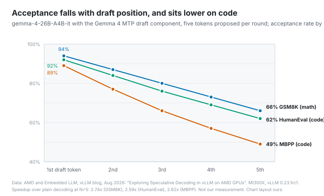
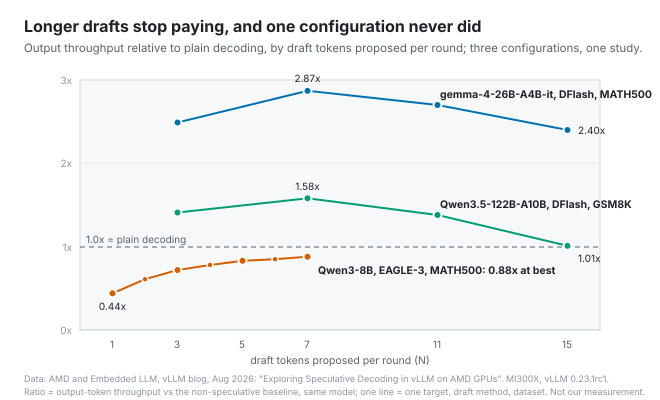

# The fast turns are the guessable ones

*2026-09-08 · the RunAI Coder team · [run.ceo/coder](https://run.ceo/coder/?utm_source=github_Official_Page)*

Two turns, same model, same afternoon, the kind any week of agent work produces. In the first, the agent rewrites a 400-line test file and the text comes out in a steady pour. In the second, it changes one line in a config file and nothing appears for eleven seconds. Then the line arrives, all at once. If you have run a coding agent for more than a week you have watched both, and probably said "the model is slow today" about the second one. The model was one of several things you were waiting on in that turn, and the only one of them that had not changed since the turn before.

A [write-up on the vLLM blog](https://vllm.ai/blog/2026-08-23-speculative-decoding-amd-gpus) by AMD and Embedded LLM on speculative decoding, posted in August, has the cleanest public numbers we have seen for one part of this: why the same model, on the same hardware, types faster on some text than on other text. The rest of the turn has clocks of its own, and they are documented too, mostly in the latency pages of the two API vendors we use. This post walks a single turn from the moment you press Enter and says which clock is running at each point.

## The pause before the first character

A turn begins with the model reading everything: the system prompt, the tool definitions, the transcript so far, every file that was pasted in along the way. That reading step processes input tokens in parallel and is the efficient half of inference, an asymmetry the 2022 paper on serving PaLM 540B ([Pope et al.](https://arxiv.org/abs/2211.05102)) measures on a single system. Reading is bulk work the hardware is good at. Writing is one token at a time.

Which is why OpenAI's [latency guide](https://developers.openai.com/api/docs/guides/latency-optimization) can say, for ordinary applications, that "cutting 50% of your prompt may only result in a 1–5% latency improvement," and then add the exception in the same breath: "Unless you're working with truly massive context sizes." A coding agent is the exception. Its context is long on turn one and longer on each turn after, because the transcript is part of the prompt, and all of it is read again before the first output token.

What keeps that from costing eleven seconds on each turn is the prompt cache. If this turn's prompt opens with the same bytes as last turn's, the provider resumes from the stored state instead of re-reading. Anthropic's [caching documentation](https://platform.claude.com/docs/en/build-with-claude/prompt-caching) puts the latency effect plainly: "You will generally see improved time-to-first-token for long documents," and it now offers cache pre-warming, a request with `max_tokens: 0` whose only job is to load the prefix so the first real request does not pay the miss. [Back in 016](https://github.com/RunAI-Coder/aicoder-showcase/blob/main/posts/016-what-the-model-sees/README.md) we wrote that caching only pays when this turn's document opens exactly like last turn's. The latency version of that sentence is the eleven-second pause. A compaction, an edited system prompt, a changed tool list, a pause longer than the cache's TTL (five minutes by default on Anthropic's API, an hour with the longer option), a switch between speed tiers (Anthropic's fast-mode page notes that "requests at different speeds do not share cached prefixes"): each one means the next turn is read from the top.

The other thing that can sit between Enter and the first character is thinking. On models with extended reasoning, the visible output waits for the invisible one, and Claude Code's documentation lists effort level as the knob: "Less thinking time, faster responses, potentially lower quality on complex tasks." A one-line config change that took eleven seconds may have spent ten of them on a cold prefix and one on deciding, or the other way around. The response's usage block tells you part of it: how many input tokens came from the cache, and on OpenAI's API a separate count of reasoning tokens.

## One token per pass

Once the first token is out, the clock changes character. Generation is serial. The [speculative decoding paper](https://arxiv.org/abs/2211.17192) states the constraint in the first sentence of its abstract: "decoding K tokens takes K serial runs of the model." Every output token is a full forward pass of the model, which is why OpenAI's guide calls generation "almost always the highest latency step" and offers the heuristic that "cutting 50% of your output tokens may cut ~50% of your latency." A 400-line rewrite is expensive because of its length, not its difficulty.

How fast those passes go depends on the machine and on who else is using it. Both vendors now price a faster lane (Anthropic's is a research preview behind a waitlist), and the wording on both pages is instructive. Anthropic's [fast mode](https://platform.claude.com/docs/en/build-with-claude/fast-mode) "runs the same model with a faster inference configuration," gives "up to 2.5x higher output tokens per second," and is explicit that the benefits "are focused on output tokens per second (OTPS), not time to first token (TTFT)," at $10 and $50 per million tokens with a rate limit of its own. OpenAI's [fast mode](https://developers.openai.com/api/docs/guides/fast-mode), renamed from priority processing in July, promises "up to 2.5× faster speeds and more consistent latency" at a per-token premium (twice the standard rate for the model the page prices). That phrase, more consistent latency, is the admission about the standard lane. Its speed is a function of load, and load, in our experience, has a time of day.

Neither page says what the faster configuration is. We don't know whether it is dedicated capacity, a different batching policy, speculative decoding, or all three, and we are not going to guess in print. What we can say is that every serving stack in the vLLM post does the thing described next, that whether the hosted lanes do it is undisclosed, and that it is one of the ways output speed becomes variable in a direction you can feel.

## Why the rewrite came out faster than the fix

Speculative decoding keeps the original model in charge of every token and adds a guesser in front of it. A small draft component proposes the next several tokens; the target model checks all of them in one pass; the accepted prefix is committed, the first rejection is replaced with the target's own token, and everything after it is thrown away. The paper's guarantee is that the output distribution is unchanged. What changes is how many tokens each expensive pass produces: several when the draft was right, one when it wasn't.

So the speed of the same model depends on how guessable the text is. The vLLM post measures this per position. On the gemma-4-26B-A4B-it model with Google's paired MTP draft component and five tokens proposed per round, the first proposed token was accepted 94% of the time on grade-school math problems and the fifth 66% of the time; on MBPP, a Python coding benchmark, the same positions came in at 89% and 49%. The authors' explanation for the code gap is one most people who review agent output will recognize: "Code contains predictable local structure, but formatting, identifiers, and implementation choices can cause an otherwise plausible continuation to diverge."

The throughput numbers follow the acceptance numbers. The best configurations in the post ran at 2.87× and 2.83× the plain decoding rate; another configuration in the same study, a different draft method on a smaller target and the same MATH500 set (Qwen3-8B with EAGLE-3), ran at 0.44× to 0.88×, slower than not speculating at all, with the first draft token accepted 86–89% of the time. The post's own reading: "a high acceptance rate does not necessarily correspond to higher throughput when the draft component adds additional overhead." The guesses landed; drafting still cost more than it saved. Longer proposals helped up to a point and then flattened or regressed, as later positions stopped being accepted. All of these are measurements on AMD Instinct hardware with open-weight models under vLLM, which is to say not measurements of anything we call from a hosted API. They are the clearest public picture of the mechanism, and we treat them as that.

Put the mechanism next to the two turns we opened with. A 400-line test file is mostly text that already exists in the context: imports, fixtures, the shape of every assertion. A draft component guesses that well, and the target commits several tokens per pass. A one-line change buried in a config file is short, so decode barely matters, and the eleven seconds were spent before the first character, on the prefix or on thinking, and nothing on screen tells you which. The rewrite felt fast and the fix felt slow for reasons that had nothing to do with which was harder.

OpenAI exposes the same idea as a feature. [Predicted Outputs](https://developers.openai.com/api/docs/guides/predicted-outputs) let you send the current file as a `prediction` alongside an edit request, and the response reports how much of it was used: in their example, 14 accepted prediction tokens and 2 rejected. Rejected tokens are charged at output rates, and there is a limitation that matters for anyone building an agent rather than an editor: "Function calling is not currently supported with Predicted Outputs." The feature fits the apply-this-edit step of a pipeline; the tool-calling loop around it stays on ordinary decoding, and the page limits it to the GPT-4o and GPT-4.1 families in Chat Completions. It is also the closest a hosted API comes to showing the accept-and-reject step in the open: the draft is yours, and the usage block reports what survived. The post's authors point the same way in their future-work list, naming "n-gram speculation and suffix decoding" for "workloads with repeated token patterns such as code editing and agentic loops." Code that repeats itself is the case speculation was made for, and agents produce a lot of it.

## The seconds that aren't the model's

Some of the longest waits in an agent session have no model in them. The test suite is running. The build is linking. A `git fetch` is talking to a server on another continent. From the outside these look identical to a slow model, a blinking cursor and nothing else, and they are the one clock the harness could report on and usually doesn't.

Then there is the round trip. OpenAI's guide: "Each time you make a request, you incur some round-trip latency," and it adds up. An agent task is not one request. A forty-turn task carries forty round trips, forty prefills (cached, ideally), and forty tool executions, and a second of overhead on each is most of a minute spent on nothing anyone can see. The guide's advice to parallelize ("Two shirts take just as long to dry as one") is the same logic behind harnesses issuing independent tool calls in one turn, and streaming, which the guide calls the single most effective approach, is the reason you see text at all before the turn is done: it "cuts the waiting time to a second or less," which changes the experience and leaves the model's clock where it was.

We have not timed our own sessions by phase. We have the impression, like everyone, that some afternoons are slow, and we have never separated a slow afternoon into cache misses, load, tool time, and length. The response object has the fields to do it: cached and uncached input tokens, output tokens, reasoning tokens where the API reports them, and on Anthropic's API a `speed` field that says which lane served the request. Until we log those per turn, our "slow day" is a feeling with a timestamp.

## Where the seconds went

A wait before the first character points at the context and the cache: a slow first turn after a compaction, or after you touched the system prompt or the tool list, is a prefix being read from the top, and the fix is upstream of the model. Slow typing points at the lane, and the response will say which one served you (`usage.speed` on one API, `service_tier` on the other). Boilerplate at one speed and new logic at another has, as its likeliest reading, a guesser being right and then being wrong; neither vendor's page will confirm it, and if that is what it is, the paper's guarantee says the tokens come out the same either way. A cursor that does not move at all points at the last tool call before it points at the model.

Claude Code has a small piece of UI for one of these. Turn fast mode on and a ↯ mark sits by the prompt. Hit the fast lane's rate limit and, per the documentation, "the ↯ icon turns gray to indicate cooldown," and you keep working at standard speed until it clears. Same model, same session, same transcript. The typing slows, and the only record of why is one gray mark next to the prompt.
