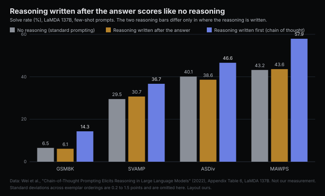

# Answer-first needs somewhere else to put the thinking

*2026-09-09 · the RunAI Coder team · [run.ceo/coder](https://run.ceo/coder/?utm_source=github_Official_Page)*

**TL;DR:** The wind-up before a coding agent's answer has two sources. Openers and closers read as padding that graders once rewarded; a rule deletes them for free. The reasoning paragraph is where a model without hidden thinking computes the answer, and in the chain-of-thought ablation, reasoning written after the answer scored like none. Lead with the answer for a lookup or when thinking runs off the page, and keep the rule in the system prompt, where it survives to turn forty.

Rule 10 of a skill published this week forbids "Great question," "Let me...", "Hope this helps," and "Feel free to ask." The skill is called [i-have-adhd](https://github.com/ayghri/i-have-adhd), and its README shows one answer twice. Before: "Great question! Let me think about this. Your auth flow has a few moving pieces: the middleware, the token verification, and the cookie handling. Looking at `src/auth.ts`, the `verifyToken` function (around lines 42-58) seems to be using an older `jsonwebtoken` API. One approach would be to update the package and rewrite that function..." After: "Run `npm install jsonwebtoken@latest`, then edit `src/auth.ts:42`." [Ten rules](https://github.com/ayghri/i-have-adhd/blob/main/skills/i-have-adhd/SKILL.md) get you from the first to the second. Eight of them shape a reply for a reader with ADHD (numbered steps, restated state, time estimates) and are not our subject; rules 1 and 10, the two about where the answer sits, are.

The before-text reads like a personality, and the skill treats it as one, a habit to suppress. We read it as two habits with different origins. Part of the wind-up is the order text gets generated in, and part is what the graders rewarded, and the two respond to different levers. Sorting them tells you when "lead with the answer" costs nothing and when it costs the answer.

## The reasoning has to be written before the answer can use it

A language model produces one token at a time, and each token conditions only on the tokens before it. That is the whole mechanism behind chain-of-thought prompting, and it carries a corollary the buried-answer complaint keeps missing: if the model is going to reason in text, the reasoning has to be on the page before the conclusion, because a conclusion written first cannot depend on reasoning written second.

The [2022 chain-of-thought paper](https://arxiv.org/abs/2201.11903) tested exactly this. One ablation prompts LaMDA 137B to give the answer and then the reasoning, "isolating whether the model actually depends on the produced chain of thought to give the final answer." With reasoning after the answer, the GSM8K solve rate was 6.1%, against 6.5% with no reasoning at all and 14.3% with the reasoning first. On the other three arithmetic sets in the paper's Table 6 the after-the-answer variant lands within 1.5 points of the baseline, above it on two and below on two, while reasoning-first is 6 to 15 points clear. The authors' conclusion: "the sequential reasoning embodied in the chain of thought is useful for reasons beyond just activating knowledge." The same year [a second paper](https://arxiv.org/abs/2205.11916) took text-davinci-002, zero-shot, from 17.7% to 78.7% on MultiArith by inserting "Let's think step by step" before the answer. So the paragraph that walks through the middleware, the token check and the cookie handling before naming a fix is, on a model with no hidden channel, the only place the fix can be computed in text, and the ablation says the text matters. Strike it with a rule and you have asked the model to write its conclusion first and then think. The ablation is the closest published test we know of for what that produces, on a 2022 model and arithmetic word problems; we know of no rerun on a coding model.

One more row of that table matters here. Chain of thought written in an "intentionally concise style" scored 11.1% on GSM8K, under the full version's 14.3% and far above the 6.5% baseline, and on the other three sets the concise version came out a point or two ahead of the full one. Terse reasoning kept the value; absent reasoning kept none. The skill's rules do not draw that distinction, and the rest of this post is about where it falls.

What changed since 2022 is where the reasoning is allowed to live. Reasoning models and extended thinking move the chain of thought into a channel the reader does not see, a reasoning item on OpenAI's API, a thinking block on Anthropic's, and once the computation has somewhere else to go, the visible reply can open with the answer at no cost to the answer; the cost moves to the hidden tokens. That follows from how those channels work, and we know of no ablation that has measured it. It is also why an answer-first rule feels free on one configuration and costly on another: it depends on whether the thinking has a place to happen off the page. One line in OpenAI's [reasoning guide](https://developers.openai.com/api/docs/guides/reasoning) treats the visible preamble as a latency device ("For faster time to first visible token in latency-sensitive applications, ask the model to generate a short preamble before continuing with deeper reasoning"), and for long-running, tool-heavy flows the Responses API labels the two kinds of text, `phase: "commentary"` for "intermediate assistant updates, such as preambles before tool calls" and `phase: "final_answer"` for the completed answer, warning that a dropped label "can cause preambles to be treated as final answers." On that side of the fence the preamble is a first-class object with its own tag.

## Longer looked better to whoever was grading

The second lever has nothing to do with computation. "Great question," "Hope this helps," "By the way, you might also want to look at your dependency versions overall": none of it reasons toward anything, and no ablation is needed to see it does no work. Our reading is that it is there because something like it scored.

One [study of what RLHF optimizes](https://arxiv.org/abs/2310.03716) took the reward apart across three settings and found "improvements in reward to largely be driven by increasing response length, instead of other features." A reward computed from length alone "reproduces most downstream RLHF improvements over supervised fine-tuned models," and the bias traces to reward models that are "non-robust and easily influenced by length biases in preference data." The judges had the same tilt. The [AlpacaEval team](https://arxiv.org/abs/2404.04475) built a length-controlled version because the LLM annotator was "known to favor models that generate longer outputs," and controlling for length raised the benchmark's correlation with Chatbot Arena from 0.94 to 0.98. When LMSYS added [style control](https://lmsys.org/blog/2024-08-28-style-control/) to the Arena itself in August 2024, regressing out answer length and the counts of markdown headers, bold spans and list items, "the ranking changed," with some models rising substantially and two smaller ones dropping below most of the frontier.

Read rule 10's blacklist against that record and it becomes a list of ways a response gets longer without getting better: an opener that restates the question, a recap of what was just done, a closer offering more. Each is a few tokens of the kind a length bias would have paid for. This is the half of the buried answer a rule can remove for free, because nothing downstream depends on it. The difficulty is that the wind-up before a reasoning-heavy answer and the wind-up before a lookup look identical on the page, and only one of them is holding anything up.

## Commands and conclusions

Look at what the skill's own examples lead with: an install command, a file path with a line number, a test invocation, "Login now works with magic links." Each is a lookup or a report. The answer existed before the sentence began, in the repository or in the previous step's tool output, and putting it first takes nothing away, because nothing had to be computed on the page to produce it. That is the region where an answer-first rule is pure gain, and in our sessions, by eye, it is a large one: a good share of turns are paths, commands and status.

The other region is a conclusion the model has not reached when the reply begins. Which of three hypotheses explains the flaky test is not sitting in the repo. On a configuration with hidden thinking, the reasoning happens off the page and the reply can still open with the verdict. Without it, or with thinking turned down to save time, rule 1 asks for the verdict first, and the 2022 ablation is the nearest measurement of what that costs. The skill half-acknowledges the line. Exception 3 says that in a "debug spiral" the model should stop iterating and "name the assumption that might be wrong"; exception 5 concedes that when "what are my options" is the question, "the options are the answer." Both are cases where the reasoning is the deliverable and brevity would delete it.

Cursor's experience with GPT-5, as OpenAI's [prompting guide](https://cookbook.openai.com/examples/gpt-5/gpt-5_prompting_guide) tells it, is the same boundary from the artifact side. The prose ran long and the code inside tool calls ran terse, "with single-letter variable names dominant," at the same time, so one setting could not serve both: they set the `verbosity` parameter low for the text and wrote the exception into the prompt, "Use high verbosity for writing code and code tools." Brevity had to be scoped, and the part that needed room exempted by hand. Our reading that the buried answer has two sources, generation order and reward, comes from the papers and the docs above, and it is a reading. The line we would defend is the one we draw from them: an answer-first rule is safe when the answer is a retrieval, or when the reasoning has somewhere else to happen, and it is a cut into the answer when it is neither.

## The rule on turn forty

The skill has a section titled Persistence: "These rules apply to every response for the rest of the session, not only this one... If you are unsure whether they still apply, they do." One [reader](https://news.ycombinator.com/item?id=49611957) on its discussion thread reported the conciseness holding "for a few turns at most" before the model reverted, and that was with a global CLAUDE.md telling the model to use the skill and the instruction repeated by hand during sessions. The paragraph and the report describe the same thing from two sides: a format rule is text the model reads, and text the model reads is advisory, the point we made about [rules and hooks](https://github.com/RunAI-Coder/aicoder-showcase/blob/main/posts/029-a-tool-is-its-return-value/README.md) and about [the three gates](https://github.com/RunAI-Coder/aicoder-showcase/blob/main/posts/030-the-sandbox-never-reads-the-command/README.md). Where the text lives still matters, for a smaller reason. In Claude Code a skill's body enters the conversation when the skill is invoked; the docs' selling point is that, unlike CLAUDE.md, "a skill's body loads only when it's used." Loaded once, it sits in the transcript, competes with everything after it, and is handed to the summarizer when the context fills, which is [what we argued](https://github.com/RunAI-Coder/aicoder-showcase/blob/main/posts/026-what-survives-the-summary/README.md) compaction does to anything off a persistent surface. The skill's author knows which layer is on top; exception 6 in the file says "Inside an agent harness, the system prompt outranks this skill."

The same instruction one layer down is a product feature. Claude Code's [output styles](https://code.claude.com/docs/en/output-styles) (September 2026 documentation) "modify the system prompt to set role, tone, and output format," and the built-in Concise style is rule 1 and rule 10 as a system-prompt clause: Claude "leads with the result, skips preamble and narration, and keeps responses short by default, while doing the engineering work as thoroughly as in the Default style," with an explicit carve-out that it "always keeps the complete content of error reports, security warnings, and confirmations for destructive actions." A system prompt is re-sent every turn and is not the part compaction rewrites. On OpenAI's side the knob is the `verbosity` parameter from the Cursor story, and the same guide says GPT-5 "is trained to provide clear upfront plans and consistent progress updates via 'tool preamble' messages," steerable in the prompt from detailed narration down to a brief plan. One vendor trained the preamble in on purpose and lets you dial it; the other ships a style that strips it.

Every one of those, the parameter included, is still a request. Few controls act on an output without asking. A token cap does, and it truncates a reply without shaping it. A Stop hook does, in the sense that it can inspect the finished reply and send the model back for another turn with a reason attached, at the price of that turn; the reader quoted above considered exactly that and balked at the latency. And a schema does. Anthropic's [structured outputs](https://platform.claude.com/docs/en/build-with-claude/structured-outputs) constrain a response to a JSON format through `output_config.format` and validate tool inputs with `strict: true` under grammar-constrained sampling, and the docs say properties "maintain their defined ordering from your schema," required ones first. A `reasoning` field placed ahead of an `answer` field is therefore the enforcement-side version of "Let's think step by step": the order is guaranteed, and what fills the field is still the model's to decide. A schema says nothing about prose.

Take the README's own After text. `npm install jsonwebtoken@latest` and `src/auth.ts:42` were in the registry and in the file before the reply began, so rule 1 costs the answer nothing there, and the wind-up it deletes is reward residue. Change the request to "why does login fail one time in ten" and the first line has to be a verdict the model has not reached. Either thinking is on and the verdict can lead, or it is off and the concise paragraph above the verdict is where the verdict comes from, the version the 2022 table showed keeps the value. The placement point stands either way: a system-prompt surface is in front of the model on turn forty, a skill body is what the summarizer folds, and both are requests.

The skill's last rule ends with two sentences we would keep as written: "Start with the answer. End when the answer is done." Both hold once the answer exists. The whole question is whether, at the moment the reply begins, it does.
