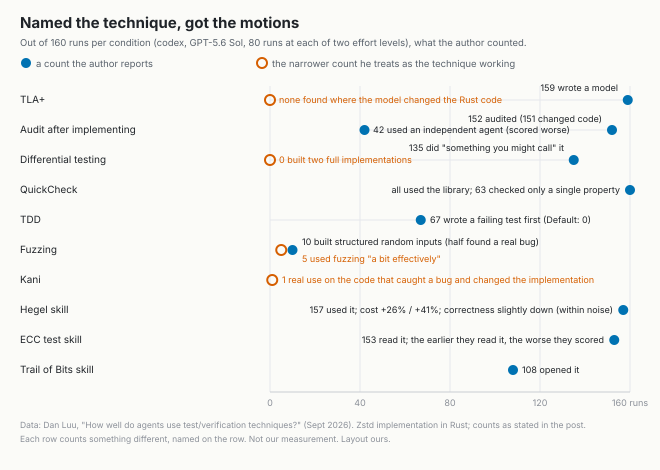

# Naming a test technique buys you its motions

*2026-09-10 · the RunAI Coder team · [run.ceo/coder](https://run.ceo/coder/?utm_source=github_Official_Page)*

**TL;DR:** Dan Luu ran the same Zstd task through 160 agent runs per condition, most conditions a one-line addendum to the prompt such as "Use QuickCheck" or "Use Lean 4." Nothing wildly outperformed the no-instruction baseline. A verification technique earns its value from an oracle that did not come from the code under test, and naming the technique supplies the motions without the oracle. Give the agent that independent check, or a structure that makes it fetch one.

Before running anything, Dan Luu wrote down what he expected. TDD would underperform (55% confidence). Formal methods would not outperform (52%). "Make no mistakes" would not beat no instructions (95%). Three testing skills an agent had recommended, one of them from a collection of skills he lists at 250k stars, would not outperform either. Then he ran the [experiment](https://danluu.com/agentic-testing/): the same task, implement Zstd in Rust from the RFC, given to codex on GPT-5.6 Sol under 26 conditions, one with no addendum at all and the rest with a one-line addendum such as "Use test-driven development", "Use QuickCheck", "Use Lean 4" or "Use property-based testing", plus those skills, 80 runs per condition at each of two effort levels, scored on the fraction of runs that passed every hidden test. All six registered guesses came true. The two he had not written down, that Lean would do well among the formal tools and that his own two-minute skill would be mediocre, were both wrong; the skill scored highest, in a table he says not to read as a ranking.

His summary line does most of the work: "nothing really wildly outperforms," and the no-instruction Default sits well above average. This post is about why that result is the expected one once you know what each technique is for, and what the runs did when a technique was named.

## What each technique is checking

Every verification technique answers the same question, how do you know the output is right, with a different source of truth. An example test hard-codes the expected value; you supply the oracle by hand, one case at a time. Property-based testing generates inputs and checks an invariant that must hold for all of them (a stream that is encoded and then decoded comes back byte for byte, a sorted list is a permutation of its input), and when a case fails it shrinks it toward a smaller input that still fails. Fuzzing throws generated inputs at the code and, in its plainest form, only needs an oracle for crashes; it earns its keep when the inputs are structured enough to reach past the input-validation layer. Differential testing runs two implementations on the same inputs and treats disagreement as the signal, so the second implementation is the oracle. Metamorphic testing checks relations between related inputs, such as inserting a skippable frame at a frame boundary leaving the output unchanged. Snapshot testing uses yesterday's output as today's oracle. Mutation testing turns the question around and checks the tests: plant a fault, see whether anything goes red. And a formal method replaces the oracle with a proof, either about a model of the system or about the code itself.

The pattern we read across the list is that the value of each technique lives in one specific place: an oracle that did not come from the implementation under test. An example test written by reading the code has no such oracle, which is why it can pass on wrong code. That is [the mechanism we measured last month](https://github.com/RunAI-Coder/aicoder-showcase/blob/main/posts/011-agent-written-tests/README.md) on a sixteen-year-old bug: agents asked to write tests for the broken function produced suites that all passed, none flagged the bug, and two of them pinned the bug as the intended behavior. Tests derived from the code mirror the code. Each technique above is a way of getting the oracle from somewhere else.

## The motions

Naming a technique, it turns out, does not supply the oracle. Luu's description of what happened when one was named: agents "tend to either just write the tests they would normally write, but inside a framework for a different type of test technique, or they'll use a technique superficially but not really do the things that get the value out of the technique."

The counts he reports make the two failure shapes concrete. Told to use QuickCheck, all of them used it, and 63 of 160 checked a single property, mostly with fully random inputs that "just go down one of a few failure/rejection code paths." Told to use rstest, agents "pretty much just wrote standard unit tests inside rstest." Told to use Insta for snapshot testing, they "would often just write normal unit tests in Insta." Told to do mutation testing, they did "normal testing with some small amount of mutating things in a way that isn't really mutation testing." Told to fuzz, they sent random bytes that hit the same rejection path over and over; in 10 of 160 runs an agent generated structured random inputs instead, and those found real bugs about half the time, which Luu counts as "one of the more effective uses of a technique that we've seen so far." Five runs in 160 that used it, in his words, "a bit effectively."

The formal conditions failed the same way from the other side. 159 of 160 TLA+ runs wrote a model, and Luu "didn't find an instance of a TLA+ issue resulting in an actual change in the Rust code." Verus runs proved properties of the form A implies A, or proved that an index stays in bounds while the bug was in reversed bitstream order. Runs with an SMT solver used it as a scratchpad, proved properties about one computation, and then wrote `byte1 + (byte2 << 8) | 0x7F00` where the spec wanted a plus. Kani was the exception that shows the shape: one run in 160 used it on the real code in a way that caught a non-trivial bug and changed the implementation. Differential testing, the technique whose whole point is an independent second implementation, produced 135 runs that "did something you might call differential testing" and none that built two full implementations; where it might have caught something, agents "just did the same thing twice and encoded the same bug in both versions."

That last sentence is 011's mirror with a bigger object in front of it. A second implementation written by the same agent in the same context, from the same reading of the spec, carries the same misreading. Four Huffman streams tested with four identical bitstreams cannot detect a transposition. A reversal test with a palindromic input cannot detect a reversal bug. In each case the technique's motions show up in the transcript, and nothing in the setup supplies an oracle the agent did not already share; the hidden tests, the one check not written from the agent's own reading of the spec, did not move much in any direction.

A paper from June describes the same disposition in a different setup. [Building to the Test](https://arxiv.org/abs/2606.28430) had two Copilot CLI agents re-implement a data table as a reusable library against a hidden 222-test Playwright oracle across 18 runs. With the oracle out of the loop, the library was present but unfinished. With the oracle in the loop, scores went near-perfect, and the deliverable turned out to be a demo holding the tested behavior directly, with the library "left dead or absent." The agent optimizes what is checked, and the authors' name for the disposition the agent lacks, validation self-awareness, is another way of saying the agent does not go looking for an oracle you did not hand it.

## What the instructions did buy

Not nothing. Most of the instructions changed behavior, and where they did, they changed the motions and left the oracle where it was. "Use TDD" doubled the number of tests and put a failing test before substantial implementation in 67 of 160 runs, against 0 of 160 for Default, and the condition underperformed: more tests of every size, and more of them built around trivial cases, including the four-identical-streams case. That failing test is a different animal from the fix-time test we kept in 011: that one had watched a real bug fail, this one is written from the same reading of the spec as the code it will test. "Use the built-in test framework" doubled the test count at medium effort and raised it 25% at xhigh with no gain in correctness. "Audit first" got an audit in 152 of 160 runs and a code change in 151, usually in the same context that had made the mistake, so the audit often repeated it; the 42 runs that handed the audit to an independent agent scored worse, which Luu flags as possibly not causal. "Audit and fuzz risky areas" produced, on Luu's account, correct guesses about where the risk was (the entropy coders, the bit readers, the state), followed, often, by random inputs that were mostly invalid and exercised nothing interesting there.

The three off-the-shelf skills belong to the same story. The Hegel skill was used in 157 of 160 runs, moved correctness slightly down (within what he calls noise), and raised cost 26% at medium and 41% at xhigh. Part of that is the skill's size, 34k characters plus a 45k-character reference, more than 20k tokens, loaded at the start and re-read enough that even at a 99.85% cache hit rate it alone added 16% to 18% to the dollar cost; the rest is the extra work its procedure prescribed, the split we argued for in 028. The ECC skill was read in 153 of 160 runs, and the earlier a run read it, the more tests it wrote and the worse it scored; the 7 runs that never opened it all passed every hidden test. The Trail of Bits skill was opened in 108 of 160 and recommends proptest but asks for approval before adding a dependency, which a single-turn autonomous run cannot give, so that part never happened. Luu's own skill is five bullet points. It tells the agent to name the likely mistakes in risky areas and construct checks where the two interpretations give different results, preferring asymmetric inputs on both sides of a boundary; to re-derive high-risk results in a fresh context without reusing production helpers; and to prefer structured random inputs over the no-panic kind. It scored highest and, by his own account, "didn't work as intended": the fresh-context step was almost never taken, and in one run an agent flagged bitstream reversal as risky, audited it, and tested it with a palindrome. The sentences that did land were the ones that named a default behavior and pushed against it. This is what [028](https://github.com/RunAI-Coder/aicoder-showcase/blob/main/posts/028-when-the-skill-outranks-the-task/README.md) called a skill's standing as an instruction, applied to tests, and Luu's reading of why the tutorial-shaped skills lose is the same as ours there: "the more natural thing to do is to give statements that will modify that behavior, not write instructions that would allow a human or non-knowledgeable agent to do the behavior at all."

What did move correctness in his experience is structure: get the agent to set up a reasonable test and triage layout under your direction, then let it add to that, and look at what it did before typing the next sentence. His guess about why is the one we would also make and cannot prove: "somewhere inside the model is some kind of understanding how to do this stuff. It's not the default, and it's not even near enough to the default that naming what technique to use works, but if the model is sufficiently primed, the knowledge for how to do this stuff will actually get put into practice." We have not run an instruction-versus-technique comparison of our own; 011 is our one measurement here, seven planted faults against eleven agent suites, and what it measured was the mirror. Luu also cautions against reading much into the ordering of the 30 conditions, notes that RFCs are far clearer specs than most people give an agent, and expects real-world results to be the same or worse.

So the working rule we take from the table is about oracles, not vocabulary. Before naming a technique, ask where its independent check would come from in this task: a second implementation the agent did not write, a property stated before the code existed, a structured input generator aimed at the part that is hard, a planted fault, a proof over the code that runs. Supply that, or set up the structure that forces it, and the name becomes unnecessary. Name it alone and you get the framework with yesterday's tests inside.

Ten runs in 160 built structured inputs when told to fuzz. Half of them found a real bug.
