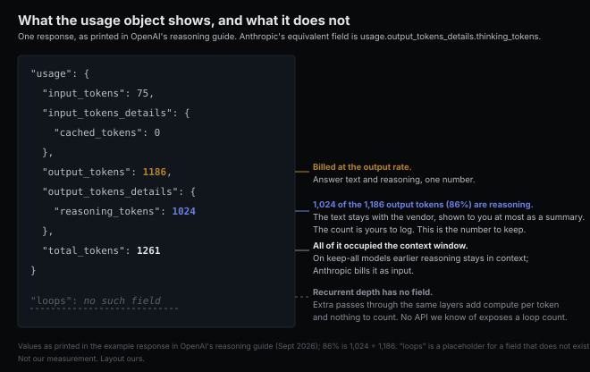

# The reasoning you pay for and the reasoning you can read

*2026-09-11 · the RunAI Coder team · [run.ceo/coder](https://run.ceo/coder/?utm_source=github_Official_Page)*

**TL;DR:** We sort a model's reasoning into three places: on the page as text, off the page as tokens you are charged for and shown only as a summary, or inside the network as extra passes through the same layers that produce no tokens. Each move changes what you pay, what you can steer, and what anyone can audit. The usage count survives the second move and is the number to learn; the third move would take the count away too.

OpenAI's [reasoning guide](https://developers.openai.com/api/docs/guides/reasoning), as read in September 2026, prints the usage object from one response: 1,186 output tokens, of which 1,024 are `reasoning_tokens`. You are charged for all 1,186. The 1,024 are text nobody outside the vendor will read; the guide's sentence is, "While reasoning tokens are not visible via the API, they still occupy space in the model's context window and are billed as output tokens." Anthropic's [thinking docs](https://platform.claude.com/docs/en/build-with-claude/thinking) show the same object from the other side: a thinking block whose `thinking` field is an empty string, a `signature`, and then the text block, "The answer is 12,231." Under it: "You're still charged for the full thinking tokens. Omitting reduces latency, not cost."

That is the second of the three places we sort a model's reasoning into, and until this month it was the newest. Last week a report that GPT-6 Astra uses "recurrent depth," passing activations through the same transformer layers more than once before each token, put the third on the table. Sebastian Raschka's [explainer](https://magazine.sebastianraschka.com/p/gpt-6-astra-looped-transformers-and) this week calls it "still just a rumor or scoop, with no official confirmation," thinks a loop is likely anyway, and quotes OpenAI's chief scientist Jakub Pachocki: "The depth of the computation graph for our present frontier models, including Astra, is within a factor of two of GPT-4." Whether or not Astra loops, the architecture exists in the open, in Nanbeige, in ByteDance's Ouro, in a 3.5B research model from 2025, and it is a different place for reasoning to happen from either of the first two. We read the vendor docs and the papers with the same three questions for each place: what it costs, what you can steer, and what anyone can read afterwards. This post is that table, written out.

## Written on the page

On the page, the reasoning is the reply itself. A chain of thought is output text: the model writes the steps, then the answer, and the steps are billed at the output rate, decoded one token at a time, and streamed to you like anything else. Everything about it is ordinary, which is the point. You can read it, you can quote it in a bug report, and you can steer it with the same instrument you steer the rest of the reply, the prompt. [Earlier this week](https://github.com/RunAI-Coder/aicoder-showcase/blob/main/posts/032-answer-first-needs-somewhere-to-think/README.md) we went through the 2022 ablation on where that text has to sit: on a model with no other place to think, the steps have to precede the conclusion, and a concise version kept most of the value.

Two things are less ordinary than they look. One is that the page is a partial record even when it is all you have. Anthropic's [faithfulness study](https://arxiv.org/abs/2505.05410) planted hints in prompts and checked whether the model's chain of thought mentioned using them; for most models and settings the reveal rate was "often below 20%." The text is the reasoning the model chose to write, which is related to the reasoning it did.

In agent loops the page also has a cost beyond its token count. The [overthinking study](https://arxiv.org/abs/2502.08235) scored 4,018 SWE-bench Verified trajectories for how much a model preferred extending its internal chain over interacting with the environment, and found that higher scores went with lower resolution rates. Its cheapest fix is the telling one: o1 at high reasoning effort resolved 29.1% of issues for $1,400, the low-effort variant 21.0% for $400, and generating two low-effort solutions and keeping the one with the lower overthinking score resolved 27.3% for $800, close to the high-effort result at 43% less compute. On the page, more reasoning is more output, and past a point it is also worse action.

## Off the page, still counted

Off the page is where the reasoning of the models you are using this month happens. The steps are still tokens. The model still generates them one at a time, they still sit in the context window, and both vendors still charge for them as output. What changed is that the text stops at the vendor. OpenAI exposes a `summary` parameter and says plainly, "we don't expose the raw reasoning tokens emitted by the model." Anthropic's `display` setting has two general-availability values, `summarized` and `omitted`, plus a beta `updates` that returns only progress notes, and the docs say the same thing twice: "No display setting returns the raw chain of thought," and "You're charged for the full thinking tokens generated by the original request, not the summary tokens. The billed output token count does not match the count of tokens you see in the response."

So the page shrank to a summary and the count stayed. That is the property to hold onto: in this place the count is public and the text is not. OpenAI's guide says a response may generate "anywhere from a few hundred to tens of thousands of reasoning tokens" depending on the problem, and the exact number is in `output_tokens_details`. Anthropic's is in `usage.output_tokens_details.thinking_tokens`. The hidden channel is what, [we argued earlier this week](https://github.com/RunAI-Coder/aicoder-showcase/blob/main/posts/032-answer-first-needs-somewhere-to-think/README.md), makes answer-first free for the answer, and this field is where the cost went.

The count has a second life you may not be watching. Hidden reasoning occupies the context window while it is generated, and on the newer models it stays there. Anthropic's [thinking overview](https://platform.claude.com/docs/en/build-with-claude/thinking) says that on keep-all models (Opus 4.5 and later, Sonnet 4.6 and later, and the Fable and Mythos models; Haiku through 4.5 keeps only the last turn) prior turns' thinking blocks remain in context and "count as input like any other conversation history," billed at the input rate and cached like the rest of the prefix. OpenAI's GPT-5.6 models "default to rendering available reasoning from earlier turns," with `reasoning.context` to opt out. Text you cannot read is spending your context budget on every subsequent turn, and it is one of the things [compaction](https://github.com/RunAI-Coder/aicoder-showcase/blob/main/posts/026-what-survives-the-summary/README.md) will eventually fold.

Steering is coarser here than on the page. You get an effort level rather than a prompt: `reasoning.effort` on one side, and on GPT-5.6 a `reasoning.mode` of `pro` that buys "more model work" and bills it as more tokens; adaptive thinking with an `effort` parameter on the other, with the fixed `budget_tokens` budget deprecated on the 4.6 models and rejected from 4.7 on. The bottom setting is being withdrawn as well; GPT-6 Astra returns a 400 for `reasoning.effort: none`, and its [system card](https://deploymentsafety.openai.com/gpt-6-astra) says "we do not currently have plans to make reasoning=None available." And someone can read the text: the vendor. The same system card says OpenAI has "added misalignment monitoring to all tool-using inference involved in our external deployment of Astra, with significant compute cost." The trace exists as text. Who holds it is the difference between the first place and this one.

## Never written down

Never written down means there is no text to hold. A looped transformer, in Raschka's summary, passes "the intermediate representations through the same transformer blocks multiple times (instead of just once)," with the weights shared across passes. Nanbeige runs a 22-block stack twice; Ouro runs 48 blocks four times, 192 block applications from 48 blocks' worth of weights. The [recurrent-depth paper](https://arxiv.org/abs/2502.05171) from 2025 trained a 3.5B model on 800B tokens whose loop count is chosen at inference, 8 or 32 or 64, and reports that it "can improve its performance on reasoning benchmarks, sometimes dramatically, up to a computation load equivalent to 50 billion parameters." Its abstract also says what the approach is for: it "can capture types of reasoning that are not easily represented in words." [Coconut](https://arxiv.org/abs/2412.06769), the other line of work, feeds the model's last hidden state back in as the next input embedding instead of decoding it, so the reasoning state never becomes a token either.

Run the three questions. Cost: the work is real and the count does not see it. Raschka's arithmetic for Nanbeige is that two passes over 22 blocks are "similarly expensive as having 44 distinct blocks," and, per [his earlier note](https://sebastianraschka.com/blog/2026/openai-astra-looped-transformers.html) on the Nanbeige report, two passes kept about three quarters of a standard model's token efficiency, so each token carries more compute and the token count that both vendors charge by tells you less about what was done. We know of no API that exposes a loop count or prices one; our guess is that a vendor absorbing recurrence would fold it into the per-token rate, or bill the extra work as extra tokens the way pro mode already does. Steering: the recurrent-depth paper's loop budget is set, in Raschka's summary, "by whoever runs the model," with an adaptive per-token stop on top, and nothing in either vendor's request schema maps to a loop count today; the nearest thing, OpenAI's pro mode, expresses extra model work as extra tokens. Reading: the [monitorability paper](https://arxiv.org/abs/2507.11473) that forty-odd researchers signed last year says it in one sentence: "Such latent reasoning models might not need to verbalize any of their thoughts and would thus lose the safety advantages that CoT confers." In the second place the vendor could read what you could not. In the third there is no text for the vendor to read either; what remains is activations, which the system card names as the alternative it is investigating.

Which brings us back to Astra, and to the boundary of what can be read from outside. The system card reports "a substantial decrease in chain-of-thought monitorability compared to previous models," and gives a number for controllability: among chains of 750 to 1,250 tokens, Astra follows instructions about what its chain of thought should contain 60.9% of the time, against 16.1% for GPT-5.6 Sol and 1.7% for GPT-5.5 Thinking. Read next to the recurrence report, that looks like a mechanism meeting its evidence. The same card says the opposite: OpenAI is "quite confident that changes in CoT controllability are not differentially due to any architectural changes," and ties them to the model's growing ability to act "without any verbalized reasoning required." Raschka supplies the counterexample that keeps us from choosing: on the index numbers he reproduces, GPT-5.6 Luna, a smaller model in the same family, uses 80% more tokens than Sol at similar task performance, and nobody calls Sol's shorter traces hidden. "Shorter reasoning traces are a side effect of more 'intelligent' or capable models," in his reading, whether the capacity comes from more parameters or more passes. From the caller's seat the two explanations are indistinguishable: a shorter trace, the same field in the usage object, a lower number in it. Nothing in a response tells you which place the reasoning came from, and that is the property the third place shares with the first two: the count is of tokens, and only tokens.

## The count you can still read

The practical consequence for anyone running a coding agent is that the middle place is where to put your attention now, because it is the only one that hands you the count without the text, and the count is what you pay for. Log `reasoning_tokens` or `thinking_tokens` per turn alongside the tool calls; the overthinking result is our reason to look at the turns where that number spikes, for reasons beyond cost. Treat the visible trace as what the docs call it, a summary, and stop quoting it as a transcript of the decision. Remember that on keep-all models the hidden text from earlier turns is in your window at the input rate, which is a compaction question as much as a cost question. And set effort by the shape of the turn: the planning and debugging turns where extra thinking pays, and the mechanical edits where it does not, sit close to the split we drew in [031](https://github.com/RunAI-Coder/aicoder-showcase/blob/main/posts/031-the-fast-turns-are-the-guessable-ones/README.md) between guessable text and new logic.

If the third place arrives in a model you use, the token count goes flat while the work behind it does not, and the only signals left on your side are latency and the per-token rate. Pachocki's factor of two is the closest thing to a depth figure anyone outside OpenAI has been given, and it fits twice as many ordinary blocks as well as it fits a loop. Of the three places, then, learn the middle one now. Its text is a summary, its count is exact, and the count is the part you are paying for.
