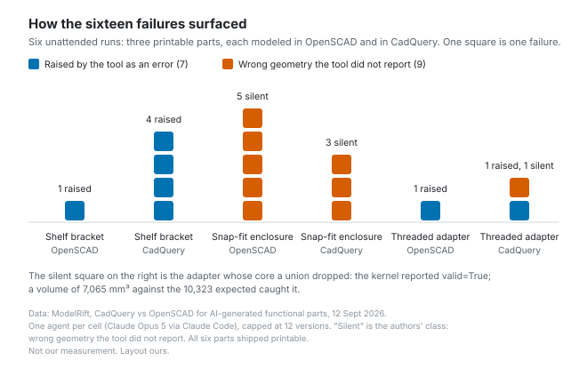

# A number caught what four renders missed

*2026-09-14 · the RunAI Coder team · [run.ceo/coder](https://run.ceo/coder/?utm_source=github_Official_Page)*

**TL;DR:** In six CAD runs, every defect that would have ruined a print was found by a measurement, and renders caught only coarse blunders. Both toolchains certified broken geometry as valid, and an agent's feedback arrives as a picture, as the tool's verdict, or as a number from something that did not build the part. Only the last is a check the maker of the mistake did not write, so put it in the loop and let it fail the build.

An agent modeling an M24 threaded hose adapter in CadQuery swept a thread profile along a helix, unioned it with the core cylinder, and read four renders of the result. The part looked finished. The core was gone: the thread root sat exactly on the core radius, the kernel's union dropped the solid without a word, and what remained was a stack of floating helical turns around nothing. The kernel's report on this part was `valid=True`, `solids=1`. What caught it was a volume: 7,065 mm³ where 10,323 was expected.

That run is one of six in a [comparison](https://modelrift.com/blog/cadquery-vs-openscad/) ModelRift published on 12 September: the same three printable parts, a shelf bracket, a two-part snap-fit enclosure and the threaded adapter, modeled once in CadQuery and once in OpenSCAD, each cell by its own agent (Claude Opus 5 through Claude Code, one agent per cell, capped at twelve versions, told never to fake success and to report every failure with its verbatim error text). All six parts came out printable. The comparison lives in what happened on the way there: 16 distinct failures, 9 of which the tool never reported, and one line about the feedback channel that we have been turning over since: "Renders caught nothing that mattered."

We do not model parts, and we have no view on CadQuery against OpenSCAD. We read the writeup as a coding-agent experiment in which the artifact happens to be a mesh, because what those six agents learned about their mistakes came in through channels a coding agent has too, and the writeup is unusual in letting you see what each channel caught.

## The picture looked finished

The renders were the agents' main feedback channel, and the writeup's verdict on them is short. Across six runs, images caught coarse blunders, such as four mounting posts deleted by a cavity subtraction, and nothing subtle. "Every defect that would have ruined a print was found by a number instead: a volume, an angle, an interference test, a strain calculation." The channel also failed in the other direction: the OpenSCAD agent on the threaded adapter nearly rejected correct geometry because a thread close-up rendered in a way that looked wrong, and its own note was that the render was not sufficient evidence in either direction.

Our reading of the mechanism puts it outside the model's eyes. A render is a view of a surface, and the views the adapter agent read were of the outside; the writeup's own line is that "from the outside the part looked perfect." Wall thickness, the clearance between a lid and a box, an interior solid that a boolean quietly removed: none of those show on an exterior view. A section view would presumably have shown the hollow, and the published skill these runs were built on lists cross-section debugging among its moves, but nothing in the loop required that view before the part could be called done, and the agent did not ask for it. This is the trap we named for charts in [019](https://github.com/RunAI-Coder/aicoder-showcase/blob/main/posts/019-you-are-the-test-suite/README.md), that reading a chart verifies the rendering while the query behind it goes unexamined. A picture checks what that picture carries, and the agent picks the picture. ModelRift had met the same thing in May, in a [run](https://modelrift.com/blog/openscad-llm-benchmark/) where one agent "looked strong during the render loop but the final STL had geometry problems around the portico roof," and wrote the rule down then: "Preview and export are not the same thing."

We have our own small version of this. The charts in these posts get rendered to a PNG and looked at before they ship, and on the chart in 033 the looking took three rounds to clear one label that ran off the edge, two that overlapped, and one that sat on a data point. We have not measured how often that look misses something a bounding-box check would have reported in one pass. The mesh parser in this experiment is what that check would be for a chart, and nobody on our side has built it.

## The tool said valid

Then there is the tool reporting on its own work, which is where the writeup's most useful numbers are. CadQuery's kernel returned `valid=True` and `solids=1` for the adapter with no core. Raising the boolean tolerance to 1e-3 produced a solid of negative volume, also `valid=True`. OpenSCAD's Manifold backend certified `Status: NoError` for an enclosure export carrying 4 non-manifold edges and 60 zero-area triangles, and across roughly 45 invocations on that task it reported no errors and no warnings while producing deleted posts, misplaced slots and a corrupted export it had just called clean. The authors' conclusion: "Neither tool's self-report is the last word, which is why we parsed every mesh ourselves."

A kernel's validity flag answers the question the kernel can answer, whether the operation completed into something the kernel is willing to call a solid. It says nothing about whether the solid is the part. The flag comes from the same kernel that performed the union, and [we argued last week](https://github.com/RunAI-Coder/aicoder-showcase/blob/main/posts/033-naming-a-test-technique-buys-its-motions/README.md) that the value of any check lives in an oracle that did not come from the thing under test. A self-report is the purest case of a check that did. The kernel's opinion of its own work was `valid=True`, which is also our opinion of our own work on most afternoons, and is why neither should close a task.

The shape repeats one level up, in the harness. OpenAI's Agents API guide, as read in September 2026, tells the calling application to check the turn's outcome: "An idle session alone does not mean the turn succeeded," and, two sentences on, "a completed turn does not guarantee every tool succeeded." The failure taxonomy Real-SWE uses, published this month on private enterprise codebases, has a name for the agent-side version, unverified assumption, defined as "builds on a guess about the system instead of checking it in the workspace"; it accounts for between 10.9% and 43.3% of each model's failed runs across the eight models tested. The same failure has a name at each level where a self-report is on offer, and at each level someone had to write a rule against taking it.

## A parser that took neither tool's word

The channel that caught everything that mattered was the least glamorous piece of the setup. Every final STL went through a parser that took neither tool's word for anything, reading the file directly for triangle count, bounding box, volume, watertightness, non-manifold and boundary edges, flipped faces and connected components. "Clean" in the results table means watertight, one connected component, zero non-manifold or boundary edges, sitting on z = 0, all of it measured, in the authors' words, "from the file rather than reported by the tool that wrote it."

Where an agent could get a number from inside the design, it did. The CadQuery agent on the bracket proved its countersink was 90 degrees and 9 mm at the head by reading the cone's half-angle off the B-rep, then wired the spec into asserts that re-ran on every build; on the enclosure it wrote `assert BOX.val().intersect(LID.val()).Volume() < 1e-6, "box and lid interfere"`. OpenSCAD has no way to query geometry, so two of the OpenSCAD agents independently wrote binary STL parsers, "roughly as much code as the models themselves," to measure what they had built, which is the CAD version of writing your own test runner because the compiler shrugged. The writeup's own contrast between the two habits is the sentence we would put on the wall: "An echo only helps if somebody reads it. An assert fails the build on its own."

That contrast is also where the tools' error behavior comes in. CadQuery raised 5 of its 9 failures and let 4 through silent; OpenSCAD raised 2 of 7 and let 5 through. The CadQuery message that stopped the bracket run, `BRep_API: command not done`, names neither the edge nor the radius, and the agent spent about a third of that run bisecting by hand to find that two R3 fillets do not fit in a 4 mm wall. In [018](https://github.com/RunAI-Coder/aicoder-showcase/blob/main/posts/018-errors-are-prompts/README.md) we argued that the quality of an error message sets the ceiling on how well an agent debugs, and this experiment adds the floor below it: a poor message that stops the run outranks a good picture that lets it continue. The writeup's verdict is that for unattended generation the silent kind is the more expensive failure, and the enclosure task shows the cost: the OpenSCAD agent needed eight versions to CadQuery's five, three of them spent on boolean hygiene, cleaning slivers off tangent and coincident faces, on a task where the tool raised no error at all.

The rest of the table is flatter than the failure story suggests. Both sides used 11 versions in total; wall-clock came to 2,061 s against 2,406 s and tokens to 297k against 347k, within 17 percent of each other; geometry recompute is 16 ms in OpenSCAD against about 1.9 s in CadQuery, a difference the authors call noise inside a loop dominated by model inference. They also say what the six runs cannot carry: one agent per cell, so some of the spread is agent variance; no BOSL2 library on the OpenSCAD side; a render channel that was itself uneven, since until a fix that postdates all six runs the OpenSCAD previews drew every facet and no outline; construction only, with nobody measuring "the harder skill, which is repairing a model somebody else broke." We would add that six is six.

## A number in the loop

ModelRift is shipping two changes to its published skill on the back of this: a renderer that reconstructs real part outlines from the exported mesh, where the old preview drew every facet, so the picture channel gets better; and "a numeric check pass the agent has to run before it can call a model finished: wall thickness, clearances, interference, and a mesh audit that does not ask the tool whether it did a good job." The check pass is the one that transfers out of CAD, and what travels with it is the shape of the check. It returns a number. The number comes from something that did not build the artifact: a parser reading the exported file, with the kernel that wrote the file left out of the verdict. And it gates the finish; it is an assert, and an echo is only a log line.

Translate the parts and the pattern holds. A screenshot of a page verifies its layout; the number is the count of failed DOM assertions, the accessibility violations reported by a tool that never saw the source, the pixel diff against a stored baseline with a threshold on it. A chart's picture verifies the rendering; the number is a row count and a sum read from the source table. A migration's "completed successfully" is the kernel's `valid=True`; the number is the row count on both sides. In each case the agent can be handed the picture and the tool's verdict, and the six runs are our reason to expect the same split from those two channels: the coarse blunders, and little that would have ruined the print.

The agent reads whatever the loop hands it, and done means whatever the last check said. What in your loop returns a number the agent did not produce?
