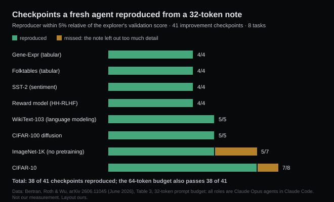

# Sixteen tokens was enough

*2026-09-15 · the RunAI Coder team · [run.ceo/coder](https://run.ceo/coder/?utm_source=github_Official_Page)*

**TL;DR:** A research agent's training recipe, found over hundreds of queries, was compressed to 16 tokens, and an agent with no memory of the search turned those tokens back into the same score. At 8 tokens the score fell off, and what fell out were the choices that differed from the defaults. A handoff note, compaction summaries included, only has to carry those deltas. Gains that cannot survive a note to a fresh agent were fitted to the run.

`QKn 12L768 Mu .1 R² b2M 4x`

Seven pieces of shorthand, written under a 16-token budget, and enough of a recipe for pre-training a language model: QK normalization, a 12-layer transformer 768 wide, the Muon optimizer at a learning rate of 0.1, squared-ReLU activations, a two-million-token batch, a fourfold feed-forward block. We needed the write-up's glossary to read it. An agent that had never seen how the recipe was found did not; given this line, the starter code and the training data, it trained a model that matched the one the recipe came from.

The line is from a paper out of Amazon's Responsible AI group with coauthors at Penn and CMU ([arXiv](https://arxiv.org/abs/2606.11045), June), which Amazon Science [wrote up](https://www.amazon.science/blog/why-dont-machine-learning-research-agents-overfit) on 10 September. Its question is an old one: climbing a benchmark for years should overfit it, and mostly does not. Its instrument is new. A human research community cannot be reset and rerun; a research agent can. Our interest is narrower than theirs. A coding agent writes a note to a version of itself with no memory every time its context gets summarized, and this is the first measurement we have seen of what such a note has to contain.

## Two agents and a note between them

The explorer is a Claude Opus instance running in Claude Code. It gets a problem description and starter training code, edits the code, trains on the training split, asks the validation split how it did, and repeats for up to several hundred iterations; every new best score is a checkpoint. A compressor reads the explorer's whole transcript and writes a prompt of at most 32 tokens, and a 64-token version of the same note; before either is final it gets up to four audit rounds, in which one agent checks the note against the explorer's code for missing details and another writes code from the note alone to catch misreadings. A reproducer, a fresh instance with a 100-turn limit, gets the finished note, the training data and the starter code. No validation set, no explorer code, no transcript.

Across 41 checkpoints on eight tasks (two tabular sets, SST-2 sentiment, CIFAR-10, ImageNet-1K trained from scratch, a diffusion task, a reward model on HH-RLHF, WikiText-103), the 32-token reproducer landed within 5% relative of the explorer's score on 38. The 64-token note also passed 38, with the same per-task counts. The three misses were two ImageNet checkpoints and one CIFAR-10 checkpoint, where the note left out enough detail that the fresh agent fell short. Control runs with the strategy field left blank came out at roughly the explorer's first-iteration score (1.190 against 1.182 bits per byte on WikiText, 0.911 against 0.905 accuracy on SST-2), so the gains the reproducer recovered came through the note; the model's priors alone stopped at round one.

Then they squeezed. The WikiText recipe above involved thirty choices that were not defaults. The compressor wrote it at budgets from 64 tokens down to 4, and five reproducers implemented each version. Held-out loss holds through 16 tokens. At 8 it falls off a cliff, and the paper names what fell out of the prompt at that budget: the batch size, the feed-forward ratio, QK normalization. The write-up's line on those three: "The missing pieces specified real training choices that were made as a function of the data and differ from the most obvious defaults."



## Defaults travel free

The mechanism the authors give is the one you already know from explaining anything to anyone: "The more your listener already knows, the shorter the message you need to send." Explaining a training pipeline to a bright high-school student is a long conversation; explaining it to an ML engineer takes a sentence, because gradient descent and PyTorch and the usual learning-rate schedule are common knowledge and cost nothing to leave out. Explaining it to a model that has read the ML literature takes, apparently, seven abbreviations. Everything in the recipe that matches the obvious choice regenerates on the far side for free. The prompt only has to pay for the parts that are not obvious.

The other half is a counting argument. There are few short strings, so a short description cannot have memorized the validation set; there is no room. If a strategy fits in 16 tokens and still performs, whatever it captured was structure. The blog says it in one line: "Short descriptions cannot cheat because there isn't room."

They tested the converse. Prompted to "maximize validation accuracy at all costs," handed the validation examples themselves, and on most tasks given a validation set cut to a few hundred or a few thousand examples or salted with label noise, the explorers overfit on cue: at 38 of 102 checkpoints the validation score ran more than 10% ahead of the held-out score. Each checkpoint was compressed to 128 tokens for a fresh reproducer, and the reproducer, which never saw the validation set, tracked the held-out score and lost the inflated part. All 38 overfit checkpoints failed to reproduce; 6 of the 64 legitimate ones failed too. Sensitivity 100%, specificity 91%. Whatever the explorer did to earn the extra 10% was something that could not be written down for an agent without the validation examples in front of it, and a gain you cannot hand over is a gain that lived in the examples.

A third experiment points the same way from the input side. Replacing the numerical validation score with a single bit per query, better than the running best or not, the explorer found strategies as good as before on all eight tasks. Much of the useful signal between the data and the final recipe is coarse, in both directions.

## The part that stays in the lab

Before any of this gets carried into a coding session, the boundaries. The paper's tasks each have one number and a validation split to compute it on, which is what makes a reproducer test quick to run: train, score, compare. A coding task has no such number. A reproducer test there needs an oracle, and the tests in the repository are usually the closest thing, with the caveats we have written about before regarding who wrote them. The authors draw their own lines: output compression certifies the reproducer's model and only implies things about the explorer's; and a model that memorized the validation set during pre-training would have a side channel around the whole bottleneck, which they argue against from two observations, the explorer's gradual climb and the collapse at short budgets, but do not rule out, and say datasets collected after the model's training cutoff would address more directly. We would add a line of our own: every role in this pipeline is the same model, so a decoder with different priors would need a different note.

One of their results should not be transferred at all. The one-bit finding says an agent choosing between training strategies did as well with "better or not" as with a score. It says nothing about an agent fixing code, where the failing line and the traceback are the whole instrument, and the paper never put that channel through a bottleneck: the explorer read its own crashes in full the entire time. And the three failed checkpoints are a counterexample that should stay in view: strategies with more non-defaults than a 32-token note can hold, and in these three cases a 64-token note did no better. Compression fails there without anyone having cheated. In a session, that is the handoff that omitted one real choice and cost the next agent a day of rediscovering it, and the fix is a longer note, not a suspicious one.

## Compaction runs the same pipeline

Anthropic's description of compaction is a description of the paper's pipeline with the three roles collapsed into one session: "taking a conversation nearing the context window limit, summarizing its contents, and reinitiating a new context window with the summary." In Claude Code, per the same page, the summarizer "preserves architectural decisions, unresolved bugs, and implementation details while discarding redundant tool outputs or messages," and the agent continues with the summary plus the five most recently touched files. Compressor and reproducer are the same model seconds apart, the transcript of the last three hours is the explorer's run, and two things from the paper are missing: the four audit rounds, and the shortage of room. A compaction summary has thousands of tokens to work with, so whatever it loses, it loses by priority; budget is not the constraint.

That makes the 8-token cliff a shape we have seen before. Two weeks ago we [argued from daily use](https://github.com/RunAI-Coder/aicoder-showcase/blob/main/posts/026-what-survives-the-summary/README.md) that summaries shave the conditions off decisions: "use the legacy parser until the migration lands, then switch" comes out the far side as "use the legacy parser." We called that an extrapolation at the time, and it still is one for coding sessions; this paper does not measure compaction. But it says why that particular loss is the expensive one. A condition is a non-default. "Use the legacy parser" is what a fresh agent would infer from the codebase anyway, and the clause after it is the part that was decided as a function of this project and differs from the obvious choice. It is the kind of thing the 8-token note had no room for, and exactly what a summarizer prioritizing "decisions" is under no instruction to keep.

So the content of a good handoff note has a definition now, and it is shorter than we expected. The note carries deltas from default. We would add their reasons and their expiry dates, which a training recipe never needed and a codebase does. It leaves out the decisions a fresh agent would make on its own from the repository, since those come back for free, and it leaves out the tool output, which never mattered. Claude Code's summarizer can be steered from the rules file; the vendor's own [example](https://code.claude.com/docs/en/best-practices) is telling it to always preserve the modified-file list and test commands. The line we would add is to preserve every choice that differs from what a clean checkout would suggest, and the reason for it. Restating constraints after a compaction, which we described as a standing rule in that earlier piece, is the manual version of the same note.

The test itself, which the authors call a certificate, transfers too, as a habit if not as a measurement. After a handoff, ask whether a fresh agent could reproduce the result from the note and the repository alone. If the diff does things the note never mentions, one of two things is true. The note is too short, which the three ImageNet and CIFAR misses show is an ordinary failure and costs a re-exploration. Or the result depended on something that cannot be written down for an agent that does not have this run in front of it, which is what the 38 overfit checkpoints looked like from the outside: a green score with no transferable recipe behind it.

## Written for an amnesiac

The write-up's own analogy is the film where a man leaves notes for a version of himself whose memory will be wiped before he reads them, and it observes that such notes can be very short "because the receiver will fill in anything you leave unsaid exactly as you would have." That is the property to write for. A handoff note of the shape the data supports, plus the reasons we would add, written for an imaginary repository, reads like this:

```
parser: keep legacy until the migration lands; the default here would pick the new one, which still drops nested keys
tests: e2e timeout stays at 300 s; 120 s flaked all summer on the shared runners, and a red run is rerun once before anything is edited
storage: sqlite in tests, postgres in prod; migrations are hand-written because the generated ones renamed a live column once
formatting: never on vendor/; upstream diffs have to stay reviewable
```

Four lines, each one a choice a clean checkout would not have suggested, each with its reason attached. The rest of the last three hours is either derivable from the repository or never mattered to the result, and the agent on the other side will regenerate the first kind the same way you would have.

---

*Sources: Bertran, Roth and Wu, "What Fits (Into Few Tokens) Doesn't Overfit: Compression and Generalization in ML Research Agents," [arXiv 2606.11045](https://arxiv.org/abs/2606.11045) (v1, June 2026; roles and audit procedure, datasets, Tables 3, 5, 6 and 7, Figure 1); the Amazon Science [write-up](https://www.amazon.science/blog/why-dont-machine-learning-research-agents-overfit) of 10 September 2026 (the 16- and 8-token prompts, the quoted lines and the film analogy); Anthropic, [Effective context engineering for AI agents](https://www.anthropic.com/engineering/effective-context-engineering-for-ai-agents) (compaction and note-taking passages) and the Claude Code [best-practices guide](https://code.claude.com/docs/en/best-practices) (the rules-file example for steering the summarizer), both retrieved September 2026. All numbers are the authors'; the transfer to coding sessions is our reading, and we have not run a reproducer test on our own sessions. Earlier posts referenced: [what survives the summary](https://github.com/RunAI-Coder/aicoder-showcase/blob/main/posts/026-what-survives-the-summary/README.md), [errors are prompts](https://github.com/RunAI-Coder/aicoder-showcase/blob/main/posts/018-errors-are-prompts/README.md), [naming a test technique](https://github.com/RunAI-Coder/aicoder-showcase/blob/main/posts/033-naming-a-test-technique-buys-its-motions/README.md).*
