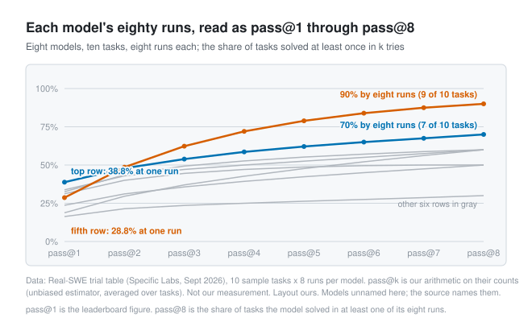

# A run is a sample of one

*2026-09-16 · the RunAI Coder team · [run.ceo/coder](https://run.ceo/coder/?utm_source=github_Official_Page)*

**TL;DR:** The same request to the same agent on the same commit comes back different because every token is a draw, the serving stack adds noise, and an agent loop lets one different token pick a different path. One vendor's newest models no longer accept a temperature setting, and temperature zero never made runs identical anyway. A single run, green or red, tells you what happened once. Count runs before forming an opinion about a model or a prompt.

You give a coding agent the same request twice, on the same repository, from the same commit, and get two different diffs. One adds a helper; the other inlines the same logic. One ran the test suite before declaring itself done; the other did not. Nothing changed between the two runs except the runs. The usual explanations are that the model got worse overnight, or that something in the context was different, or luck. The model and the context are sometimes to blame. Luck is in the room every time, and it has a mechanism.

A leaderboard published this month shows the mechanism at scale, because its authors did the thing almost nobody does: they printed every trial. [Real-SWE](https://withspecific.com/benchmarks/real-swe) put eight models, each in its own native harness, on a ten-task sample from private production codebases that it publishes trial by trial, and ran each eight times per task. That is eighty cells of eight runs. By our count of their table, six cells passed all eight times, thirty-three failed all eight times, and forty-one, more than half, came out mixed: three of eight, one of eight, six of eight. On one customer-migration task the eight rows read 3, 1, 6, 3, 4, 3, 4 and 0 out of 8. For more than half of these model-and-task pairs, the answer to "can it do this" was "sometimes."

We have written about coding agents for a while and had never put this in one place, so this is the basic version. Why two runs differ, why setting the temperature to zero does not make them stop, why a loop makes it worse than a chat, and what a count of runs tells you that one run cannot.

## A token is a draw

A language model does not emit a word. It emits a probability for every token in its vocabulary, and something has to pick one. Picking the most probable token every time is called greedy decoding. Picking at random in proportion to the probabilities is called sampling, and `temperature` is the knob on it: it flattens or sharpens the distribution before the draw, so a low value makes the favorite win more often and a high value gives the long tail a chance. `top_p` and `top_k` trim the tail before the draw. That is the entire knob, and it is the source of variation people mean when they say the model is "creative."

The API documentation describes the knob and, in the same breath, its limit. Anthropic's [reference](https://platform.claude.com/docs/en/api/messages) says temperature "Defaults to `1.0`. Ranges from `0.0` to `1.0`," and then: "Note that even with `temperature` of `0.0`, the results will not be fully deterministic." The same page carries a newer line. Models released after Claude Opus 4.6 "do not support setting temperature": "A value of 1.0 will be accepted for backwards compatibility, all other values will be rejected with a 400 error," and `top_p` and `top_k` go the same way. OpenAI's approach was a `seed` parameter and a `system_fingerprint` field, and its own [cookbook](https://developers.openai.com/cookbook/examples/reproducible_outputs_with_the_seed_parameter) sets the expectation at "mostly": if seed, parameters and fingerprint all match, "model outputs will mostly be identical," and the fingerprint changes when OpenAI "updates numerical configuration of the infrastructure serving our models (which may happen a few times a year)."

Coding agents sit on top of these APIs and expose less. We looked through both configuration references this month and found no temperature, seed or sampling setting in either Claude Code or Codex. The draw is on, at whatever value the product passes and does not show you, in every turn your agent takes, and as of September 2026 that is a fact about the product.

## Temperature zero, eighty answers

The "not fully deterministic" clause has its own mechanism, and last year a team at Thinking Machines [measured it](https://thinkingmachines.ai/blog/defeating-nondeterminism-in-llm-inference/). They sent the same prompt, "Tell me about Richard Feynman," to a 235-billion-parameter mixture-of-experts open model a thousand times at temperature zero, greedy decoding, no draw at all. They got 80 distinct completions; the most common appeared 78 times. All thousand agreed for 102 tokens. At the 103rd, 992 of them wrote "Queens, New York" and 8 wrote "New York City," and from there the texts went their separate ways.

The reason is not the sampler. A GPU adds floating-point numbers in a different order depending on how many requests are in the batch it is processing, and the batch is made of other people's traffic. Change the order of a long sum in floating point and the last bits change; change the last bits of a logit and, now and then, a near tie between two tokens flips. The post's authors rewrote three kernels to be batch-invariant and got a thousand identical completions; the thousand sequences that had taken 26 seconds to serve took 55, or 42 with a better attention kernel. The public APIs do not promise to serve models that way, which is what the documentation is telling you in one clause. Even with the draw switched off, the batch you land in is not the same batch twice.

So there are two sources, and they stack. One is by design, on by default and, on the newest models of one vendor, no longer adjustable. The other is an accident of the serving stack that the vendors do not undertake to fix. In a chat, the second source changes wording: eighty versions of the same biography, the first fork being whether to write Queens or New York City. In an agent, neither source stays small.

## One token becomes a fork

A chat is one completion. An agent run is dozens of completions in sequence, and between each pair the world answers back. The model picks a tool call; the harness runs it and returns the output; the model reads the output and picks the next call. A token flipped at position 103 in a chat changes whether the answer says Queens or New York City. The same flip in an agent changes which file gets grepped first, which changes which lines come back, which changes the plan the model writes in turn three, and by turn twenty the two runs are in different parts of the repository doing different things for the same reason. Each of them is a coherent story. Neither is the story.

That is why a run's outcome varies far more than a chat's wording does, and it is what the leaderboard's grid is showing. A model going 3 of 8 on one task has runs that fork early enough, and often enough, that three of the forks reach the tests and five do not; "37.5% capable" describes the forks at least as much as the task. We have one measurement of our own to put beside this, small and from a different angle. When we compared our context-compression path against a control on SWE-bench Lite and Pro instances, one instance disagreed with the rest; we reran it five times per arm and got [3 of 5 against 3 of 5](https://github.com/RunAI-Coder/aicoder-showcase/blob/main/posts/005-cost-engineering-for-coding-agents/README.md), the failures splitting evenly with the same failure pattern on both sides. The disagreement had been run-to-run variance, and with one run per arm we would have published a difference that was not there. Our other clean-room work ran [three times per prompt](https://github.com/RunAI-Coder/aicoder-showcase/blob/main/posts/010-blast-radius/README.md) and said so; three shows the fork; measuring it takes more.

## How many runs sit under a benchmark number

The people who measure models for a living settled this long ago and gave the answer a name. The 2021 paper that introduced the Codex model [reported](https://arxiv.org/abs/2107.03374) that its model solved 28.8% of a problem set with one sample per problem and 70.2% with a hundred samples per problem, and used the pass@k metric, the probability that at least one of k samples passes, to say so. Most leaderboard numbers since are a pass@k for some k, usually 1, and the k is the part that goes unsaid. Real-SWE's headline rates are pass@1 averaged over eight runs. Artificial Analysis reports its Terminal-Bench figures as pass@1 averaged over three repeats per task. When OpenAI audited SWE-bench Verified this year, it picked the 138 problems its model "did not consistently solve over 64 independent runs." Sixty-four is their number; our reading of why is that on fewer runs a hard task and an unlucky one look alike.

The k changes the number a great deal. Run the unbiased pass@k arithmetic on Real-SWE's own counts and the top row goes from 38.8% at one run to about 70% at eight, meaning it passed seven of the ten tasks at least once. A row further down goes from 28.8% to 90%: it passed nine of ten tasks at least once and none of them every time. On ten tasks that is a reading more than a finding, but the two rows have different shapes. One looks like a model you run once and trust more often; the other like a model you run several times and pick from. A single pass@1 cannot tell you which you are holding.

A benchmark row still means something. It also has an interval, and on eight runs the interval is wide. A green run and a red run are both samples of one. We said the red half of that earlier: [a red light is a question before it's a verdict](https://github.com/RunAI-Coder/aicoder-showcase/blob/main/posts/027-rerun-before-you-believe/README.md), and the first response is to rerun it. The green half is the same sentence with the colors swapped, and it is the half people skip.

## Three runs before an opinion

Most decisions about agents are made on one run. Someone tries a new model on a task, it does well or badly, and the verdict travels to the team channel by lunchtime. Someone changes a rules file, the next run goes better, and the change stays. We do this too; the counted comparisons above are the exceptions, and the rest of our daily opinions form the same way as everyone's, on a sample of one.

The fix is arithmetic, and it costs agent time, which is the kind you have most of. Pick the tasks you care about, three to ten of them, from your own repository's history. For anything you want to compare, one model against another or a prompt against its previous version, run each side three times per task inside one harness, five if the tasks are short, with both version numbers written down, and grade with the repository's tests. Write the results down as counts, seven of fifteen against nine of fifteen, and compare the counts. If the counts are close, the comparison is not done yet, and the answer might be that the two sides are the same. Retry inside the loop is the same principle at smaller scale: an agent that failed once has drawn once, and the second draw costs one more run, which is why "try again" works as often as it does and why it proves nothing about the fix.

The draw is not going away. The newest models from one vendor will not even take the setting, and the inference stacks under all of them were never deterministic to begin with. What you control is how many times you look before you decide, and the number should be more than one.

---

*Sources: Specific Labs, [Real-SWE](https://withspecific.com/benchmarks/real-swe) (September 2026; the per-task trial table, eight runs per model per task; cell counts, the customer-migration row and the pass@k figures are our arithmetic on their table); Anthropic, [Messages API reference](https://platform.claude.com/docs/en/api/messages) (temperature, top_p and top_k descriptions and deprecation notes, retrieved 16 September 2026); OpenAI Cookbook, [Reproducible outputs with the seed parameter](https://developers.openai.com/cookbook/examples/reproducible_outputs_with_the_seed_parameter); Thinking Machines, [Defeating Nondeterminism in LLM Inference](https://thinkingmachines.ai/blog/defeating-nondeterminism-in-llm-inference/) (10 September 2025; the thousand-completion experiment and batch invariance); Chen, Tworek, Jun and coauthors, "Evaluating Large Language Models Trained on Code," [arXiv 2107.03374](https://arxiv.org/abs/2107.03374) (pass@k and the 28.8% / 70.2% figures); OpenAI, [Why SWE-bench Verified no longer measures frontier coding capabilities](https://openai.com/index/why-we-no-longer-evaluate-swe-bench-verified/) (23 February 2026; the 64-run criterion); Artificial Analysis, [Terminal-Bench 2.1 evaluation page](https://artificialanalysis.ai/evaluations/terminalbench-v2-1) (pass@1 averaged over three repeats). The Claude Code and Codex configuration references were checked on 16 September 2026 for temperature, seed and sampling settings; we found none, and a setting could exist that we missed. Earlier posts referenced: [cost engineering](https://github.com/RunAI-Coder/aicoder-showcase/blob/main/posts/005-cost-engineering-for-coding-agents/README.md), [blast radius](https://github.com/RunAI-Coder/aicoder-showcase/blob/main/posts/010-blast-radius/README.md), [rerun it before you believe it](https://github.com/RunAI-Coder/aicoder-showcase/blob/main/posts/027-rerun-before-you-believe/README.md).*
