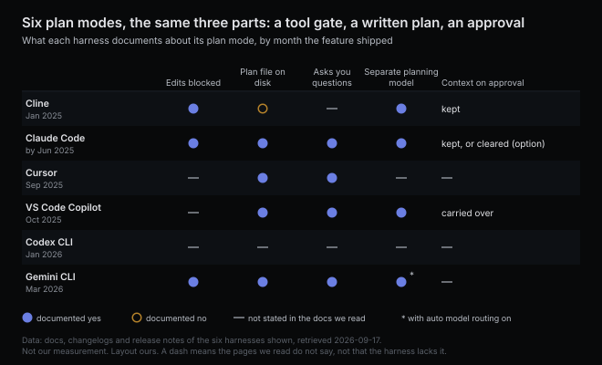
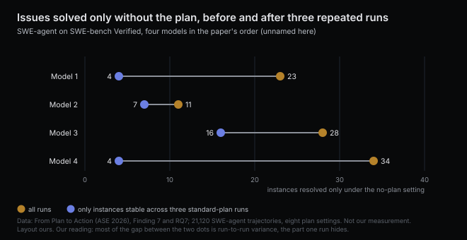

# Plan mode locks the editor and hands you a note

*2026-09-17 · the RunAI Coder team · [run.ceo/coder](https://run.ceo/coder/?utm_source=github_Official_Page)*

**TL;DR:** Plan mode is a permission state: edit tools off, read-only commands still on, and the plan written down first. Six harnesses shipped a version of that shape in fourteen months, differing in where the plan lands and whether the context follows it. In 21,120 agent runs a plan in the prompt raised success, faded as runs grew, and hurt more than no plan when a step was missing. A change you can describe in one sentence needs no plan.

On 16 July 2026 plan mode in Claude Code got a fix, logged in the [changelog](https://github.com/anthropics/claude-code/blob/main/CHANGELOG.md): the setting whose whole purpose is that the model changes nothing in your source had been running file-modifying shell commands such as `touch` and `rm` without asking. Six days later a second entry moved the remaining judgment calls to a classifier, for commands "the static analyzer can't prove read-only." Two lines of release notes, and they say more about plan mode than the feature page does. The mode is enforced on the text of the command. The model was never in a different frame of mind. It had the same tools as always, minus the ones that write, and a program in front of the shell decides whether `rm` counts as reading.

## A row in the permissions table

Open the [permission modes page](https://code.claude.com/docs/en/permission-modes) for that CLI and plan mode is a row in the same table as `acceptEdits` and `bypassPermissions`. Its column reads "Reads, plus classifier-approved commands when auto mode is available." Manual mode, at the top of the table, reads "Reads only." Both let the model read files, grep, and run a [built-in list](https://code.claude.com/docs/en/permissions#read-only-commands) of shell commands the harness treats as read-only: `ls`, `cat`, `head`, `grep`, `find`, `diff`, `stat`, `du`, read-only forms of `git`, and a few more. The difference between the two rows is what happens when the model wants to edit. Manual mode asks you. Plan mode refuses, and "edits stay blocked until you approve the plan" (the page carves out one exception: interactive sessions that have bypass permissions in their mode cycle).

So three things change when you press Shift+Tab. The write tools come off the table. The instructions gain a line, "research and propose changes without making them" in the doc's words, and write the proposal down. And a gate appears at the end, where the plan is shown to you and the session switches to whichever editing mode you pick. Everything else, the context window, the read tools, the loop, is the session you already had, and so is the model unless you have set a separate one for planning. Our reading is that most of the thinking in plan mode would have happened anyway, in the same order, with the same files open. Nobody has measured the difference, and the same changelog says the model asks more questions in this mode, so some of it is new. What the mode changes for certain is what the model may do with the first conclusion it reaches: write it down, or act on it.

## Six harnesses built the same thing

[Cline](https://docs.cline.bot/features/plan-and-act) shipped the toggle first, in January 2025, as Plan and Act. In Plan, the agent "can read your codebase, run searches, and discuss strategy, but cannot modify any files or execute commands." Claude Code's changelog is logging improvements to its plan mode by June 2025. [Cursor](https://cursor.com/blog/plan-mode) added Plan Mode in September 2025, with "new tools to create and update plans" and a Markdown plan file. [VS Code's Copilot](https://code.visualstudio.com/docs/copilot/agents/planning) gained a Plan agent in October 2025 that writes to `/memories/session/plan.md`. [Codex CLI](https://github.com/openai/codex/releases/tag/rust-v0.93.0) introduced "collaboration modes" in January 2026 and, ten days later, a feature-gated `/plan` shortcut. [Gemini CLI](https://github.com/google-gemini/gemini-cli/blob/main/docs/cli/plan-mode.md)'s arrived in March 2026 as "a read-only environment for architecting robust solutions before implementation," allowed to write only Markdown files inside its own plans directory. Fourteen months, six harnesses, one shape: read first, write the plan, wait to be approved. Three of the six also document that edits are blocked meanwhile; the other three do not say.

The parts they added around the shape match too. Most of the six give the planner a way to ask you a question instead of guessing: Cursor, VS Code, Gemini CLI's `ask_user` tool, and Claude Code, whose changelog notes in October 2025 that it "will now ask you questions more often in plan mode." Four let you run a different model for planning than for execution: Cline, VS Code, Claude Code, which in the same month started routing its small model's sessions to a larger one for the planning half, and Gemini CLI when its auto model routing is on. A [source-code survey](https://arxiv.org/abs/2604.03515) of thirteen open scaffolds from April 2026 lists plan-execute as one of five loop primitives and finds eleven of the thirteen composing several of them, so the plan phase is a building block bolted onto a loop that mostly still runs read, act, read.

One older cousin comes with a number. In September 2024 [Aider](https://aider.chat/2024/09/26/architect.html) split its single model into an architect that describes the change and an editor that formats the edits, on the observation that one model otherwise "has to split its attention between solving the coding problem and conforming to the edit format." On Aider's editing benchmark the reasoning model alone scored 79.7%; the same model as architect, with a second model as editor, scored 85.0%. That is a different cut from plan mode (the architect never stops to be approved), but it is the one measurement we know of where separating the deciding from the editing moved a benchmark, and it moved with a second model doing the editing, so the credit is shared.

## The note lands on disk, the context may not follow

The plan itself is text, and in four of the six it ends up on disk by default. Cursor writes it to your home directory unless you save it to the workspace, Gemini CLI to `~/.gemini/tmp/<project>/<session-id>/plans/`, VS Code to a session memory file, Claude Code to a configurable `plansDirectory`, and Ctrl+G opens it in your editor before anything runs. Cline keeps the plan in the conversation; Codex streams it into a plan view. The file is the part of plan mode with no equivalent in an ordinary session. Ordinarily the model's intentions live in the transcript, where they get summarized when the context fills and vanish when it is cleared. A plan file is a thing you can diff, keep, and hand to a session that never saw the exploration.

Whether that hand-off happens is where the six disagree. Cline is explicit that Act mode "retains the full context from your planning session." VS Code says "the plan and conversation context carry over." Gemini CLI approves inside the same session and says nothing more about it. Claude Code makes it a choice: with `showClearContextOnPlanAccept` on, the approval screen "gains a first option that approves the plan and clears the planning context," and the vendor's [best-practices guide](https://code.claude.com/docs/en/best-practices) recommends the same move for a written spec: "start a fresh session to execute it. The new session has clean context focused entirely on implementation."

The trade is the one we have described before from the side of [what the model sees each turn](https://github.com/RunAI-Coder/aicoder-showcase/blob/main/posts/016-what-the-model-sees/README.md). Every turn re-sends the whole context, so an exploration that read thirty files rides along on every edit that follows, and the same guide says "performance degrades as it fills." Clear it and the edit phase starts light, but it has to re-read the files it needs, and the plan has to carry everything the transcript knew that the repository does not: which parser to keep and why, which test is flaky, what is out of scope. That is the [note to a fresh agent](https://github.com/RunAI-Coder/aicoder-showcase/blob/main/posts/036-sixteen-tokens-was-enough/README.md) we took apart earlier this week, where the finding was that a good one only has to carry the choices a clean checkout would not make on its own. A plan that lists files to touch and steps to take is mostly the part a fresh agent would regenerate anyway. The lines to keep say what stays untouched and why. Neither design has published a number, and we have not measured it either; nothing in our notes counts a cleared plan against a carried one, which is its own small comment on note-taking.

## A plan in the system prompt, 21,120 times

The closest thing to a measurement of planning in coding agents comes from a [paper](https://arxiv.org/abs/2604.12147) accepted at ASE 2026 that asks a narrower question: when an agent is handed a plan, does it follow it, and does following help? The team ran SWE-agent with four models over SWE-bench Verified and the Python part of SWE-bench Pro, 21,120 trajectories in all, under eight plan settings. The standard plan is the four-phase workflow the scaffold ships in its system prompt: navigate, reproduce, patch, validate. The variations remove the plan, remove a phase, add one, swap the order of two, or re-inject the plan every five steps.

Removing the plan lowered the success rate for all four models. It also let each of them solve issues they had failed with the plan: 23, 11, 28 and 34 instances respectively, which after three repeated runs to strip out run-to-run variance came down to 4, 7, 16 and 4. Reading those trajectories, the authors found one cause. The plan says reproduce the bug before patching; the model wrote a wrong reproduction test, then looped on patching against a test that could not pass. Without the plan, the same model skipped reproduction and fixed the bug, which the authors say may also be contamination. A plan with a phase missing did worse than no plan. Adding phases from best practice, such as running the existing tests first, helped only when the model already worked that way and otherwise got in the way. Swapping the order of two phases, once run-to-run variance was accounted for, moved one model's success rate from 38.3% to 38% and lowered it moderately for two others.

Two findings land on the approval screen anyway, although the study's plans were handed to the agent and plan mode's are written by it. One factor the paper names for violations is context window pressure: "the initial plan becomes less influential as the trajectory length increases." Re-inserting the plan every five steps raised compliance for one of the four models, held it for the others, and gave "consistent improvements in success rates across models." And without any plan, the agents still followed a version of the four phases, more or less faithfully depending on the model, because the workflow was internalized in training, in the paper's words. The plan in the prompt is competing with a plan the model already has.

The boundary on all of this is that the study's standard plan was the workflow common to several scaffolds, its variants were the researchers', and all of them sat in the system prompt, at the top of the context, where the model complied or did not. Plan mode's plan is written by the model, in its own words, and approved by you; nobody has published the same analysis for that case, and a plan the model wrote is presumably closer to the strategy it would have used anyway. The mechanism carries over. A plan is instructions, instructions lose weight as the transcript grows, and the two things that held in the study, a plan without missing steps and a plan that gets re-read, are the two things a plan file gives you once it is on disk and the harness knows where it is.

## Skip it when the diff fits in a sentence

The vendors are the first to say when to skip their own feature. Claude Code's guide: "If you could describe the diff in one sentence, skip the plan." Cursor: for simpler tasks, "jumping straight to Agent mode is fine." The cost is a reading pass that would have happened anyway and a stop that would not, plus, if you clear the context, a second reading pass. Nobody prices it, and we have no count of our own.

Where the stop earns its keep is a case a [March study](https://www.sri.inf.ethz.ch/blog/fixedcode) of agents on already-fixed code made visible. Given 200 SWE-bench Verified instances whose issues were already resolved, most agents modified code anyway, in up to 70% of instances for one of them, and "attempting to 'fix' code without performing an issue reproduction first" was one of the failure patterns the authors name. A prompt addition that frames no change as a valid outcome moved one model from 65% to 80.5% correct outcomes and another from 60.5% to 88.5%. The authors' summary: "If you do not explicitly frame 'no change needed' as a valid and successful outcome, the model will not choose it." Plan mode leaves that line for you to write. What it adds is a person at the point where the model has read the code and has not yet touched it, the only point in the loop where "nothing to do here" costs nothing to say.

That is also the place to read the plan for what it leaves out. A plan that lists eight files and eleven steps is telling you what the model would have done anyway. The line to look for is the one that names what it will not touch, and the step that says how it will know it is done, because those are the two lines a fresh agent cannot regenerate from the repository. Ctrl+G opens the file. That is where we would add them.

*Sources: Claude Code documentation, [permission modes](https://code.claude.com/docs/en/permission-modes), [permissions and read-only commands](https://code.claude.com/docs/en/permissions#read-only-commands), [settings reference](https://code.claude.com/docs/en/settings-reference) and [best practices](https://code.claude.com/docs/en/best-practices), and the [changelog](https://github.com/anthropics/claude-code/blob/main/CHANGELOG.md) with release dates from the npm registry (1.0.33 on 2025-06-23; 2.0.17, 2.0.21 and 2.0.28 in October 2025; 2.1.212 on 2026-07-16; 2.1.218 on 2026-07-22); Cline [Plan & Act docs](https://docs.cline.bot/features/plan-and-act) and [changelog 3.2.0](https://github.com/cline/cline/blob/main/CHANGELOG.md); Cursor [Plan Mode announcement](https://cursor.com/blog/plan-mode) and [docs](https://cursor.com/docs/agent/plan-mode); VS Code [planning with agents](https://code.visualstudio.com/docs/copilot/agents/planning) and the GitHub [changelog of 2025-10-28](https://github.blog/changelog/2025-10-28-github-copilot-in-visual-studio-code-gets-upgraded/); Codex CLI releases [0.88.0](https://github.com/openai/codex/releases/tag/rust-v0.88.0) and [0.93.0](https://github.com/openai/codex/releases/tag/rust-v0.93.0); Gemini CLI [plan mode docs](https://github.com/google-gemini/gemini-cli/blob/main/docs/cli/plan-mode.md) and the [v0.33.0 announcement](https://github.com/google-gemini/gemini-cli/discussions/22078); Aider, [Separating code reasoning and editing](https://aider.chat/2024/09/26/architect.html); "Inside the Scaffold: A Source-Code Taxonomy of Coding Agent Architectures," [arXiv 2604.03515](https://arxiv.org/abs/2604.03515); "From Plan to Action: How Well Do Agents Follow the Plan?" [arXiv 2604.12147](https://arxiv.org/abs/2604.12147) (ASE 2026; 21,120 SWE-agent trajectories, four models, eight plan settings; Findings 6, 7, 8, 10 and 12 and RQ5.2); SRI Lab, ETH Zürich, [Coding Agents Are "Fixing" Correct Code](https://www.sri.inf.ethz.ch/blog/fixedcode), 23 March 2026. All documentation retrieved September 2026. All numbers are the sources'; the reading of plan mode as a tool gate plus a note plus an approval is ours, and we have not measured plan mode against direct execution in our own sessions. Earlier posts referenced: [what the model sees each turn](https://github.com/RunAI-Coder/aicoder-showcase/blob/main/posts/016-what-the-model-sees/README.md), [sixteen tokens was enough](https://github.com/RunAI-Coder/aicoder-showcase/blob/main/posts/036-sixteen-tokens-was-enough/README.md).*
