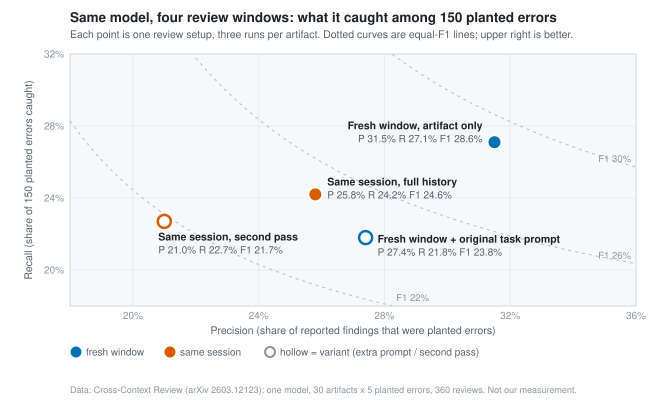

# The reviewer that never saw the reasoning

*2026-09-18 · the RunAI Coder team · [run.ceo/coder](https://run.ceo/coder/?utm_source=github_Official_Page)*

**TL;DR:** A model asked to review code in the session that wrote it is reading its own argument back. Give the same model a window holding only the change and the criteria and it catches more: in one small study F1 rose from 24.6% to 28.6%, while a second pass in the original window lowered precision. Two coding-agent vendors ship their reviewers that way. The fresh window only changes what the reviewer knows, so the tests still do the catching.

This week's argument about AI code review started as a price question and ended as a seating question. A code-review vendor had run two models over the same pull requests and asked whether the one its title priced at a dollar twenty was good enough; [the thread](https://news.ycombinator.com/item?id=49703003) ran long. Within hours the comments were about who should sit in the reviewer's chair: the agent that wrote the change, the same model in a fresh session, a larger model, or, as one commenter put it, "a different person's AI", whose memory "is going to have a slightly different perspective". Another described a stack of four models, one of them reserved for review, and mentioned in passing that the review ran in "fresh context".

We think that aside was the point. Our bet, and it rests on one small experiment and two vendors' designs, is that what is in the reviewer's window when it reads the change matters at least as much as which model is reading.

## The author, re-reading

A review in the same session is not a second reader. In that window sit the task, every file the model opened, the dead ends, the reasoning that produced the change, and the model's own sentence saying the change works. Ask that window to review the diff and you get the author re-reading with the author's notes. It knows why every line is there, which is exactly the knowledge a reviewer is supposed to lack.

Two measured effects sit under that picture. The first now has a name. [Self-Correction Bench](https://arxiv.org/abs/2507.02778), a benchmark published last summer and accepted at a conference this year, plants the same error in a conversation twice, once framed as the user's and once framed as the model's, with everything else identical. Across fourteen open-source, non-reasoning models the correction rate fell sharply when the error was framed as the model's own; the paper's headline blind-spot rate across them is 64.5%. The capability is there and the attribution switches it off. Appending a single "Wait" recovered most of it, which says something about how shallow the switch is and how reliably it is set. The tasks were reasoning problems, no code, so we carry the mechanism across, and none of the rates.

The second effect is self-preference. Models can tell their own text from other models' and from humans' (one frontier model, tested in 2024, managed 73.5% out of the box), and the better a model recognizes its own output the more it favors it in evaluation ([LLM evaluators recognize and favor their own generations](https://arxiv.org/abs/2404.13076)). Put the same model in a self-refinement loop and its estimate of how much it improved runs ahead of the measured improvement, and the gap widens over rounds ([Pride and Prejudice](https://arxiv.org/abs/2402.11436)); that study used translation, constrained generation and math, and no code task. We come back to how contested this second effect is. The first one is enough on its own: the same-session reviewer has read the argument for the change before it reads the change.

## Moving the review without changing the model

The cleanest test of the seating question we found is a [single-author preprint from March](https://arxiv.org/abs/2603.12123), and it is small, so hold the numbers loosely. Thirty artifacts, ten of them Python functions, ten technical documents, ten presentation scripts, each with five errors planted at known positions. One frontier model reviewed every artifact three times under each of four windows: the full session that produced it; the full session plus its own first review, to test whether a second look helps; a fresh window given the original task prompt and the artifact; and a fresh window given the artifact alone. Three hundred and sixty reviews, scored against the planted errors.

The artifact-only window won on every headline number. F1 28.6% against 24.6% for the full session; precision 31.5% against 25.8%; on the errors the author rated critical, 40% caught against 29%. On the ten code artifacts the gap was 40.7% to 36.0%. The condition that reviewed twice in the same session did not beat reviewing once (p = 0.107) and came in last on F1 at 21.7%, and the paper's explanation is the one we would have guessed: the second pass "generates more speculative findings rather than reconsidering the first assessment." The fresh window that was handed the original task prompt along with the artifact did no better than the full session. The paper does not resolve why; our reading is that the prompt is where the author's framing lives, and a reviewer given the framing reads the change through it.

The author's sentence for the mechanism is blunter than ours: in the same session the model "does not scrutinize; it rationalizes." The paper is one model, one author, thirty artifacts and planted errors, none natural, with absolute F1 under 30% in every condition and a confound the author reports: the artifacts were in Korean, the same-session reviews ran in Korean and the fresh-window reviews ran in English. We would not set a policy on it alone. We cite it because it is the only experiment we found that varies the window and holds the model still, and because its direction matches what the vendors had already built.

## Two vendors, one design

Open the [Claude Code best-practices guide](https://code.claude.com/docs/en/best-practices) and the sentence is there in plain text: "A fresh context improves code review since Claude won't be biased toward code it just wrote." The recommended shape is two sessions, one implementing a rate limiter and the other asked to review the file "for edge cases, race conditions, and consistency with our existing middleware patterns", with the review pasted back to the first. The same guide's adversarial review step spells out what the fresh window is for: a reviewer running as a subagent "sees only the diff and the criteria you give it", without the reasoning that produced the change, "so it evaluates the result on its own terms." The bundled code-review skill "reviews the current diff for bugs in a fresh subagent", and the [subagent documentation](https://code.claude.com/docs/en/sub-agents) is explicit about what fresh means: "It doesn't see your conversation history, the skills you've already invoked, or the files Claude has already read."

Codex made the same choice from the other direction. Its team's account of [verifying code at scale](https://alignment.openai.com/scaling-code-verification/) says it directly: "The Codex 'code generator' and 'code reviewer' are the same model. But the training methods used to teach these two skills differ." The reviewer runs against the pull request, outside the writing session, and the [launch post](https://openai.com/index/introducing-upgrades-to-codex/) describes what it does there: "matches the stated intent of a PR to the actual diff, reasons over the entire codebase and dependencies, and executes code and tests to validate behavior." The numbers they publish are acceptance numbers; catch rates are not among them. When the reviewer leaves a comment, the author changes code 52.7% of the time; on Codex-generated pull requests it commented on 36%, and 46% of those comments led to a change, against 53% on human-written ones. Their offline evaluation, they note, is bounded because "the test set only includes issues humans have already identified", and the acceptance numbers stand in for a catch rate they say has "no clean direct measurement". The launch post positions the reviewer as an addition to human review.

Neither vendor reaches for a different model family. Both separate the reviewer from the author by window, and one of them by training as well. Both answer "who reviews the model" with "the model, in another chair." And neither has published the comparison the preprint attempted, same model in the writing session against the same model in a fresh one, so as of September 2026 the vendors' design and one small experiment point the same way and that is the whole evidence base.

## A second window still has to run something

What the fresh window removes is knowledge of the author's reasons. It does not add a way to check the result, and the research on models repairing their own code is mostly about that second thing. The paper that asked whether [self-repair is a silver bullet](https://arxiv.org/abs/2306.09896) ran three 2023 models on two benchmarks and found the gains "often modest, vary a lot between subsets of the data, and are sometimes not present at all", and hypothesized that the bottleneck is "the model's ability to provide feedback on its own code": a stronger model writing the feedback lifted the gains substantially, and human feedback lifted the share of repaired programs that passed from 33.3% to 52.6%. A [survey of self-correction](https://arxiv.org/abs/2406.01297) reached the same wall from the other side: no prior work shows a prompted model correcting itself on its own feedback outside tasks unusually suited to it, while "self-correction works well in tasks that can use reliable external feedback." One self-debugging method with a clean positive result got its biggest gains, up to 12%, on the [benchmarks that had unit tests](https://arxiv.org/abs/2304.05128), and 2 to 3% overall on the one that had execution output but no tests to check it against.

So the reviewer that can run the tests beats the reviewer that can only read, whichever window it sits in, and the fresh window is the second lever. The first is the one the same guide's first section asks for: give the model "a check it can run: tests, a build, a screenshot to compare."

The fresh window also does not make the reviewer quiet. A reader prompted to find gaps will find some; the Claude Code guide says so of its own feature: "A reviewer prompted to find gaps will usually report some, even when the work is sound, because that is what it was asked to do." A [March benchmark](https://arxiv.org/abs/2603.11078) of code-review agents asked to surface every hidden issue in a pull request put numbers on the noise: recall between 18% and 33% at precision between 3.2% and 5.1%, meaning roughly twenty to thirty findings for each real one, and the iterative agent that raised recall pushed its usefulness score from 83.6% down to 66.1% for the larger of the two models tested (the smaller fell further). The OpenAI group that trained [critic models](https://arxiv.org/abs/2407.00215) to help humans find bugs in model-written code reported the same shape: critics catch more bugs than paid human reviewers and also hallucinate bugs, and a human working with a critic hallucinates less than the critic alone. A fresh reviewer is one more sample, and we have written before that [a single run is a sample of one](https://github.com/RunAI-Coder/aicoder-showcase/blob/main/posts/037-a-run-is-a-sample-of-one/README.md). One commenter in this week's thread runs a second model over the first reviewer's findings to strike false positives; a reader of ours runs two reviewers from different families and trusts only what both flag. We have no count on either practice, and neither did they.

We said we would come back to self-preference, because the case against the same-session reviewer is often made on it and the literature has moved under it. When the task has a checkable answer, much of what looked like a judge favoring itself turns out to be the stronger model correctly preferring its better output ([Do LLM evaluators prefer themselves for a reason?](https://arxiv.org/abs/2504.03846)). A January re-analysis found only about half of earlier self-preference results survived a baseline that accounts for the judge's own accuracy ([Are LLM evaluators really narcissists?](https://arxiv.org/abs/2601.22548)). And a June test of four mid-tier model families found authors accepted verified fixes to their own drafts at the same rate as fresh models did, a gap of five points with an interval that straddles zero ([Self-preference is weak or absent in verifiable instruction-following revision](https://arxiv.org/abs/2606.20093)). The argument for the fresh window that survives all three is the plain one from the first section: what the reviewer has already read.

## The block of sources did the work

Our own reviewer does not read code. Since early August, every article has gone through a reviewer that runs as a separate agent in a fresh window, before it is filed, and since mid-August that reviewer has also been handed, pasted in, the source data we pulled that day: sample sizes, the exact numbers, the original wording, the limitations the authors reported themselves. It has found at least one must-fix item on every post and as many as twenty-three; four to six is the usual count. Two posts ago, on the piece about a run being a sample of one, it found ten, including a mechanism we had attributed to hardware that the source pins on the kernels in the serving stack, two quantifiers we had written as universals, and a quotation we had reworded.

The block of sources is the part that made it work: the hard errors it has caught since then were caught against that block, and it cannot check what we did not give it. The reviewer has the blind spots any model reviewer has, but it has not spent the day being persuaded by us, and given the numbers it checks each one against the page. That is the fresh window the preprint describes, with one addition it did not test: ours is handed the sources. It is also prose, there is no control condition, and we have never run the same review inside the writing session to see how many of the ten it would have found. So our count says the fresh reviewer finds things. Whether the old chair would have found fewer, it cannot say.

The first item on that list was a percentage we had written as 28.7 when the source page said 28.8. We had computed it ourselves from the raw counts and truncated; the reviewer had the page, and nothing that had watched us do the arithmetic.

---

Sources: [Hacker News thread on cheap models for code review](https://news.ycombinator.com/item?id=49703003) · [Self-Correction Bench](https://arxiv.org/abs/2507.02778) · [LLM evaluators recognize and favor their own generations](https://arxiv.org/abs/2404.13076) · [Pride and Prejudice: LLM amplifies self-bias in self-refinement](https://arxiv.org/abs/2402.11436) · [Do LLM evaluators prefer themselves for a reason?](https://arxiv.org/abs/2504.03846) · [Are LLM evaluators really narcissists?](https://arxiv.org/abs/2601.22548) · [Self-preference is weak or absent in verifiable instruction-following revision](https://arxiv.org/abs/2606.20093) · [Cross-Context Review](https://arxiv.org/abs/2603.12123) · [Claude Code best practices](https://code.claude.com/docs/en/best-practices) · [Claude Code subagents](https://code.claude.com/docs/en/sub-agents) · [A practical approach to verifying code at scale](https://alignment.openai.com/scaling-code-verification/) · [Introducing upgrades to Codex](https://openai.com/index/introducing-upgrades-to-codex/) · [Is self-repair a silver bullet for code generation?](https://arxiv.org/abs/2306.09896) · [When can LLMs actually correct their own mistakes?](https://arxiv.org/abs/2406.01297) · [Teaching large language models to self-debug](https://arxiv.org/abs/2304.05128) · [CR-Bench](https://arxiv.org/abs/2603.11078) · [LLM critics help catch LLM bugs](https://arxiv.org/abs/2407.00215)

Documentation retrieved 18 September 2026. The findings-per-real-issue ratio is our arithmetic on CR-Bench's precision; the must-fix counts are from our own production notes.
