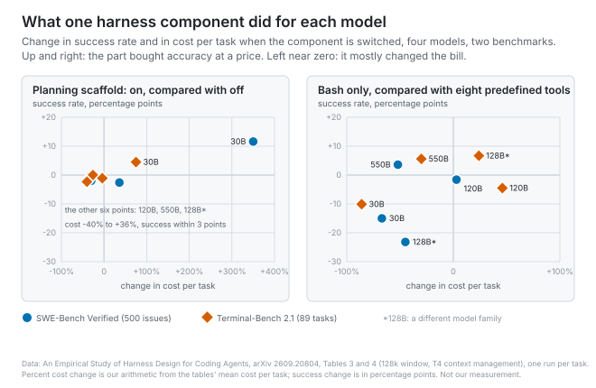
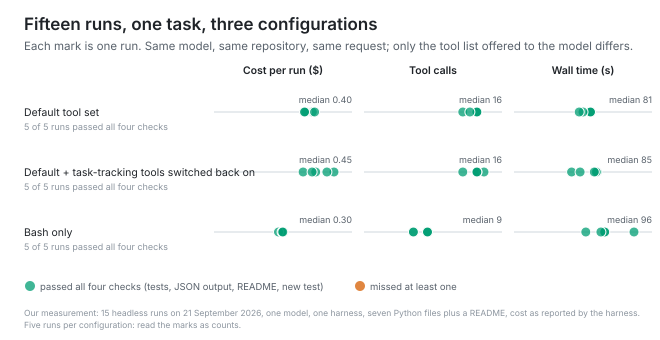

# The scaffold outlives the weakness it was built for

*2026-09-21 · the RunAI Coder team · [run.ceo/coder](https://run.ceo/coder/?utm_source=github_Official_Page)*

**TL;DR:** A harness component stands in for something the model could not do, billed whether it still needs it or not. In one study the same planning scaffold added 11.6 points for the smallest model on one benchmark and mostly saved the largest money; a predefined tool set helped the smallest and cost the largest more. One vendor switched a tool set off for its newest models. When your model changes, turn each part off and count.

We asked the coding agent we run every day to list the tools it could see. Thirty names came back. We set one environment variable, asked again, and got thirty-four. The four extra names were the task-tracking tools: the ones the agent uses to write itself a checklist and tick items off as it works, which it then consults with roughly the enthusiasm we bring to ours. On the model we use, the harness had stopped offering them.

The release note behind that is one line long. Version 2.1.233 of Claude Code, from 14 August, in its [changelog](https://code.claude.com/docs/en/changelog): "Todo/task-tracking tools (TaskCreate/Get/Update/List, TodoWrite) are no longer available on Opus 4.8, Sonnet 5, Fable 5, Mythos 5, and newer models; set CLAUDE_CODE_ENABLE_TODO_TOOLS=1 to bring them back." Four weeks later a second entry turned the block list into an allow list: the tools are offered "only on Claude 3.x, Opus 4.0–4.7, Sonnet 4.0–4.6, Haiku 4.5". Older models keep the checklist. Newer ones get it back on request. Neither entry says why, and we are not going to guess at a vendor's reasons; the shape of the decision is enough. A harness took one of its own parts away from its newest models and left it in place for the older ones.

A [component study of coding harnesses](https://arxiv.org/abs/2609.20804), posted on 17 September, is the closest thing we have found to the arithmetic behind a decision like that. It does not mention the changelog and it does not test the models in it. What it does is hold an agent loop fixed, swap one part at a time, and report what each part did for four models of different size on two benchmarks. The answer differs by model, in a way that is consistent with a decision like the one above.

## Planning did two different jobs

The study's harness is a plain ReAct loop with three swappable components: planning, the action space, and context management. Everything else (path guards, a read-before-write check, post-edit linting, a stuck detector) is held fixed. The models are three sizes from one family, 30B, 120B and 550B parameters, plus a 128B model from a different family as a cross-check. The benchmarks are SWE-Bench Verified, 500 Python issues, and Terminal-Bench 2.1, 89 command-line tasks. Five context-management strategies times four window budgets make 20 settings per model and benchmark, two targeted ablations make 22, and eight model-benchmark pairs make 176, each task run once per setting.

Planning here is a specific device, and the authors are careful to say so: a system instruction describing the protocol, a first-turn reminder to write a plan before acting, an `update_plan` tool, and the current plan appended to the model's input on every subsequent turn. Their result "estimate[s] the effect of this persistent planning scaffold rather than the effect of planning as a general reasoning strategy." Switching it off means removing the instruction, the reminder, the injection and the tool, and nothing else.

For the 30B model, planning is worth 11.6 points on SWE-Bench and 4.5 on Terminal-Bench, at higher cost. The trajectories explain how. Without the plan, the median SWE-Bench run for that model is five turns long, and 68.6% of runs end without the agent having edited anything; 58.4% end while it is still in the localization phase, looking for the file. With the plan, the median run is 40 turns and 27.8% end without an edit. The scaffold keeps the model in the task long enough to attempt a fix. The bill for that is turns: 293% more of them on SWE-Bench, 474% more tool calls.

For the 550B model and the cross-family 128B, the same scaffold does something else. Success barely moves, down 2.0 and 0.4 points on SWE-Bench, and cost falls by about 30% and 32%. The trajectories explain that too. Without the plan these models do not quit early; they keep going. The 550B model's median SWE-Bench run drops from 108 turns to 74 when planning is on, and the phase labels attribute most of the removed turns to verification after the edit, with little change in localization or fixing. The authors' summary: planning "sustains the trajectories of models that abandon tasks too early and trims repeated verification in models that verify too long."

One component. Two weaknesses, on opposite ends of the same axis. The component did not know which one it was compensating for; the model decided that.

The 120B model sits in the middle and the picture is mixed there: no consistent accuracy gain, cost up on one benchmark and down on the other. The authors' own limits apply to all of this. Model size is "only an imperfect proxy for capability"; each setting ran once per task; Terminal-Bench has 89 tasks, so many of its contrasts are not statistically significant; and the crossover points "should therefore be validated before being transferred to other model families, harness implementations, or task types outside software engineering." The four models were served locally by the authors, and none of them is a model in the changelog above.

## The shell was enough for the largest model

The second component is the action space. The full tool set is eight predefined tools: read, write, edit, list, glob, grep, web fetch, and bash. The bash-only condition removes the first seven and leaves the shell. The authors flag that this is a bundled change (the file tools also carry read-before-write checks, file-state tracking and automatic diagnostics after edits), so what it measures is the whole interface.

The 30B model needs the tool set. Predefined tools are worth 15.0 points on SWE-Bench and 10.1 on Terminal-Bench, and the failure mode without them is specific: the model emits calls to tools that do not exist in the bash-only registry, tool-call shapes it learned in training, and the harness cannot resolve them. On Terminal-Bench 66% of that model's bash-only runs end after such an emission; the average trajectory shrinks from 71 turns to 15. The tools are a vocabulary the model can speak.

The 550B model does better without them. Bash-only raises its success rate by 3.6 points on SWE-Bench and 5.6 on Terminal-Bench, cuts cost by 53% and 30%, and issues 32% and 24% fewer calls. The authors read the fewer calls as denser ones: "the shell lets capable models bundle several low-level operations into one command or script, whereas the structured interface spreads the same work across many smaller interactions." We used the same analysis for its edit-size column in [an earlier post on where a one-element request's boundary gets held](https://github.com/RunAI-Coder/aicoder-showcase/blob/main/posts/040-the-request-named-one-button/README.md); the point here is the other column. For this model, "the predefined tool set appears to add action-selection and interaction overhead rather than useful scaffolding."

The cross-family model is the reminder that the crossover is not only about size. With the full tool set it gains 23.2 points on SWE-Bench, a repository benchmark, and loses 6.7 on Terminal-Bench, a shell benchmark, where bash-only also costs it more. With all tools available it routes 71.9% of its Terminal-Bench workspace actions through bash anyway, against 40.4% on SWE-Bench. Where the task is shell-shaped, the competing tools got in its way; where the task is repository-shaped, the read and edit tools were still the ones it reached for. So the condition attached to a component is at least two-dimensional: what the model can do, and what the task asks for.

There is a third dimension the study cannot see, and one harness author has put a name to it. In [a July post](https://lucumr.pocoo.org/2026/7/4/better-models-worse-tools/), Armin Ronacher describes newer models of one family calling a third-party harness's edit tool with invented extra fields, "requireUnique", "oldText2", keys the schema never had, while older models of the same family did not, and the payloads that mattered were byte-correct. His hypothesis, and he labels it as one, is that post-training now happens inside a harness with a particular, forgiving tool shape, so "the better-trained model might actually fight you harder because its prior is stronger." If that is right, then part of what the study calls capability is familiarity with a specific interface, and a component that matches the interface the model was trained on will look like scaffolding for reasons that have nothing to do with the task. We cannot check that from outside. Neither, from the outside, can the study.

## The price stays after the job is gone

Here is our reading of what these results have in common. The study does not put it this way; we do.

Most parts of a harness were put there to cover for something the model did not do reliably when the part was written. (The guards are a different category, and we come back to one of them at the end.) Planning covers for a model that loses the thread, in one of two directions: quitting before an edit, or verifying past the point of use. A typed tool set covers for a model that cannot compose a shell command that does three things. Context management covers for a window that binds, and the study puts a number on how conditional that one is: on SWE-Bench the gap between managed and unmanaged runs is 35.7 points at a 32k window and 2.7 points at 128k, with the benefit tracking the overflow failures it prevents. The recoverable-storage variant, which lets a model read back an observation the harness elided, covers for a model that would need to re-read; in 36 of the 64 settings that offered it, the tool was never called once, and the authors describe it as "machinery that models rarely use." A stuck detector covers for a model that repeats itself, which [we have written about before](https://github.com/RunAI-Coder/aicoder-showcase/blob/main/posts/025-doom-loop/README.md) as a property of the transcript.

Each of those covers has a per-turn price. The plan is appended to the model's input every turn, so it is input tokens every turn. Tool schemas ride along in every request, [a tax we have counted before](https://github.com/RunAI-Coder/aicoder-showcase/blob/main/posts/021-tool-catalog-tax/README.md), and finer-grained tools mean more calls, which means more turns. Summarization is a model call of its own. The recall tool costs its schema even when nobody calls it. None of these prices depend on whether the model still has the weakness. The benefit is conditional on the model, the task, and the budget. The cost is charged regardless.

That asymmetry is the whole mechanism, and it is why a component that was correct when it shipped can be quietly wrong a model generation later without anyone changing a line of it. A whole-harness comparison, [twenty-one model and harness pairs across three production harnesses](https://harnesstax.github.io/), landed on the same shape from the outside: for the same model, harness choice moved success rates within about two points on one benchmark and five on the other, while cost varied by up to five times and the context sent on the first model call differed by more than ten times between the leanest harness and the heaviest. In their closing notes those authors write a sentence we would sign: "As models become more capable, coding agents may need less of today's scaffolding." What they measured was the price. What the component study measured is who still needs the scaffold.

## The checklist came back unused

The study's models are not ours and its harness is not ours, so we did the smallest version of the same thing on our own desk: one model, one harness, one task, three tool lists, five runs each. The harness is the one whose release note opened this post, at a version numbered between the two changelog entries above, run headless with edits auto-accepted from a clean configuration directory. The model is one of the newer ones the note applies to, so the task-tracking tools were off by default. The repository is a small Python command-line notebook, seven Python files plus a README, with four passing tests. The request was identical across all fifteen runs: add a `--json` flag to the `list` command, add a test for it, document it in the README, and run the test suite before finishing.

The three configurations were the default tool list; the default list with the four task-tracking tools switched back on through the environment variable in the release note; and Bash alone, with the file, search and edit tools removed, which is as close as this harness gets to the study's bash-only condition. (A documentation server from our account configuration stayed attached in that third list; its nine tools were never called.) We checked every run four ways: the test suite passes, the new flag prints a valid JSON array with the right fields on seeded data, the README mentions the flag, and a test in the tests directory exercises it.

All fifteen runs passed all four checks, and all fifteen touched the same four files. That is the first thing to say about the result. On a task this size, with this model, the tool list did not move the outcome. What it moved was the bill and the shape of the run.

With the default list the model took a median of 17 turns and 16 tool calls, at a median cost of $0.40 a run, the five runs spanning $0.40 to $0.44. With the checklist tools back on it took the same 17 turns and 16 calls, and in five runs out of five it never called any of the four. It could see them. It had no use for them. The median came in a nickel higher, at $0.45, but the ranges overlap ($0.39 to $0.53), and the first request was the same size to the token under both lists, so we cannot charge the difference to the four extra tools. What we can say is that they were offered in five runs out of five and called zero, which is the study's recall tool in miniature.

Bash alone took a median of 10 turns and 9 calls, and cost a median of $0.30, spanning $0.28 to $0.30, about a quarter below the default. The model wrote its edits as short Python scripts fed through the shell, each touching one or two files, then ran the suite, then exercised the new flag by hand with two seeded notes. Fewer laps, each one bigger, which is the shape the study reports for its largest model: the call gap here was wider than the study's (44% fewer against 32%) and the cost gap narrower (26% against 53%). Wall time went the other way, 96 seconds median against 81, and we did not instrument why. The first request tells the rest of the story. Under the default list the model's first call carried about 22,100 tokens of context; under Bash alone, about 5,400. Taking the model's visible tool list from thirty names to one shrank the opening request by three quarters, which is the per-request tax from the paragraph above, seen from the other direction. The remainder of the saving is laps: fewer turns, each re-reading a shorter context.

What we did not find was any difference in what came back. Fifteen identical file lists, fifteen green suites. Five runs per configuration is a count, and the task fits in one sentence, which is [the threshold one vendor gives for skipping a plan altogether](https://github.com/RunAI-Coder/aicoder-showcase/blob/main/posts/038-plan-mode-locks-the-editor/README.md); a checklist has nothing to do on a task with four steps the model can hold in its head, and whether it would earn its schema on a forty-step task we did not test. The study never defines "bash-capable", as a reader of it pointed out, and neither can we. What we can say is that this model, on this task, wrote its two source-file edits in a single script in three runs out of five and in two scripts in the other two, and wrote the README and the new test together in one script every time.

## The next model change on our desk

So the checklist stays off, which is where the harness had already put it. The file tools stay on, and the reason is one this post has not mentioned yet: the typed edit tool is also where the harness's permission rules attach. A path rule that denies edits to a file recognizes the edit tool and the shell commands the harness knows how to read; a Python script fed through the shell that rewrites two files is a single opaque command to that layer. The cheaper interface is the one the permission layer cannot see into. A dime a run is not what we would sell that for.

That is the part-off comparison, done once, on one afternoon, for two parts of one harness. The vendor made the same kind of call for one set of tools, by whatever route, and shipped it as a default with an environment variable to reverse it. A harness has more parts than that, and every one of them was built against a model that no longer exists in the form its author had in mind. The next time the model under this harness changes, the first afternoon goes to the same fifteen runs, with the parts switched the other way, and the checklist stays off until one of those runs shows us a task it would have shortened.
