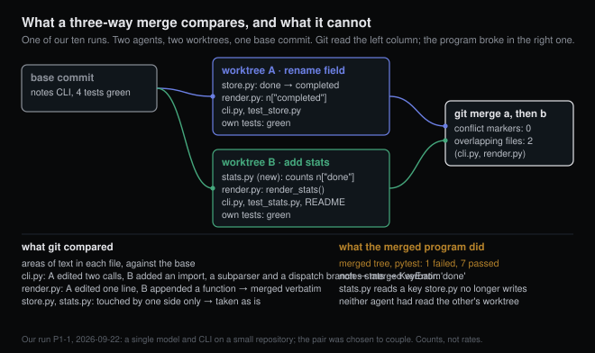
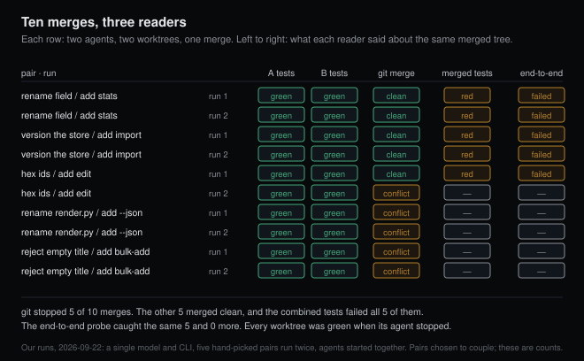

# Green in both worktrees, red after the merge

*2026-09-22 · the RunAI Coder team · [run.ceo/coder](https://run.ceo/coder/?utm_source=github_Official_Page)*

**TL;DR:** A git merge compares regions of text against a common ancestor and has no view of the program those regions add up to. Two agents in separate worktrees can each pass their own tests, merge without a single conflict marker, and leave a program that fails on the first command. The isolation that stops them colliding also hides the collision until the merge. Test the merged tree before either agent's report counts as done.

In 1989, three researchers published an algorithm for combining two edited versions of a program and gave a section to why the [existing tool was the wrong instrument](https://research.cs.wisc.edu/wpis/papers/toplas89.pdf). The tool was `diff3`, and the complaint was that "text operations do not take into account program semantics." Two consequences followed. If the two versions did interfere, "diff3 still goes ahead and produces an 'integrated' program." And even when they did not, the text-merged result "is not necessarily an acceptable integration." Their proposed fix compared program dependence graphs instead of lines, and they noted in the same paper that whether an edit changes a program's behavior is undecidable in general, so any such tool can only approximate.

Thirty-seven years later the tool that runs under every parallel-agent setup we know of is a line-oriented three-way merge. The documentation for the coding CLIs describes what the isolation buys. One says that running each session in its own worktree "means edits in one session never touch files in another." A second offers worktrees for when "you want to start several agents on the same repo without conflicts." A third says a worktree lets you "work in parallel … without disturbing your current Local setup." Every one of those sentences is true. The word "conflict" in them means the thing git reports, and the 1989 paper was about the other thing.

This post is about that other thing, and about why running agents in worktrees moves it to the one moment nobody is looking at.

## What the merge compares

Git's own description of a merge is short and specific. Among the changes each side made to the common ancestor, ["non-overlapping ones (that is, you changed an area of the file while the other side left that area intact, or vice versa) are incorporated in the final result verbatim."](https://git-scm.com/docs/git-merge) Only when "both sides made changes to the same area" does git stop and ask. The unit of comparison is an area of a file. A merge has no notion of a caller, a field name, a file format or a test. It cannot, because those belong to the program and git holds text.

So there are two kinds of disagreement between two branches, and git can see one of them. A 2011 study of nine open-source systems, [3.4 million lines and 550,000 development versions](https://www.cs.ubc.ca/~rtholmes/papers/fse_2011_brun.pdf), named them. A textual conflict is "inconsistent changes to the same part of the source code." A higher-order conflict "arises when the VCS can integrate the developers' textual changes, but the changes are semantically incompatible and can cause compilation errors, test failures, or other problems." For the three systems in the study with a runnable test suite, the authors replayed every historical merge: 76% merged cleanly and stayed clean, 16% produced a textual conflict, 1% merged cleanly and broke the build, and 6% merged cleanly and failed the tests. Of the 399 conflicts they found, 266 were the kind git reported and 133 were the kind git waved through.

Those numbers describe human developers on Git, Perl 5 and Voldemort fifteen years ago. What they establish is the pattern: a clean merge is a statement about lines, and a fraction of clean merges, in that study about one in eleven, were programs that did not work. The 1989 definition of interference is the crisp version: two variants interfere when there is some input for which the base and both variants each compute a different value. Nothing about lines or files in that definition.

## Isolation moves the collision to the merge

Here is the mechanism as we read it.

An agent's loop sees its own worktree, its own tool output and the task it was given. In a shared checkout, a second agent working nearby would at least read the modified file on its next turn, because an agent reads files fresh each time it touches them. That is the crude, accidental form of coordination that a worktree removes. Inside its worktree, agent B reads `store.py` exactly as it was at the base commit, however much agent A has changed it next door. The isolation is complete, which is the point, and it means the first moment the two changes meet is the merge.

Then there is what "run the tests" tests. Each agent runs the suite in its own worktree and reports green. That green is a fact about A's program and a fact about B's program. Nobody has run the merged program, because until the merge it does not exist. An agent that reports "all tests pass" is telling the truth about a tree that will never ship.

The advice everyone gives, us included, for keeping agents out of each other's way points the same direction. One CLI's guidance for its multi-session mode says it directly: ["Two teammates editing the same file leads to overwrites. Break the work so each teammate owns a different set of files."](https://code.claude.com/docs/en/agent-teams) Sound advice for the collision git can see. Owning different files is also, very nearly by definition, the configuration in which git has nothing to object to. Partition by file and you have removed the textual conflict and left the higher-order one untouched, with the alarm disconnected.

We have [argued before](https://github.com/RunAI-Coder/aicoder-showcase/blob/main/posts/012-why-agents-spawn-clones/README.md) that isolation for parallel agents comes from structure, and we still hold that. We also wrote, in the same post, that with worktrees the merge moves into git, "where conflicts are at least visible." Half of that sentence survives this post. The structure that keeps the agents apart during the work is the structure that guarantees git has nothing to say when the work comes back together.

## Ten merges on one small repository

We wanted to see this ourselves at the smallest scale that could show it, so we built one. The repository is the same 150-line notes CLI we used for an earlier run: a JSON-file store, a table renderer, an argparse front end, four tests. We wrote five pairs of tasks. In each pair, task A changes something task B will quietly depend on, and neither task mentions the other. Renaming the `done` field to `completed` while another task adds a `stats` command that counts notes by that field. Changing the store file from a bare list to a versioned object while another task adds an `import` command that reads store files. Switching integer ids to short hex strings while another task adds `edit ID --title`. Renaming `render.py` to `format.py` while another task adds a JSON renderer to `render.py`. Making empty titles raise while another task adds `bulk-add FILE`, one title per line.

For each pair we made a base commit, created two worktrees on two branches, and started two agents at the same moment, one per worktree, same model, same CLI, same instructions apart from the task text. Both were told to run the test suite before finishing. When both had stopped, we committed each worktree, merged branch A and then branch B onto main in a fresh clone, and recorded three things: whether git reported a conflict, whether the merged tree passed its own combined test suite, and whether a scripted end-to-end probe for that pair, running the pair's commands and checking exit codes and output, passed. We ran each pair twice: ten merges, twenty agent runs.

All twenty worktrees were green when their agents stopped. Every agent had run the suite at least once, most of them exactly once, and none had looked at the other branch: the only git commands in twenty transcripts were two `status` calls, one `log`, and two `git mv`. Then the ten merges split down the middle. Git stopped five of them with conflict markers, every one of them involving `cli.py`: the import line and the `list` dispatch in the rename pair, the `add` branch in the validation pair, and the `done` subparser in the second id run. Git passed the other five as clean, and every one of the five failed the combined test suite on the merged tree.

The five that got through are the ones this post is about. In both runs of the field rename, `stats` read `n["done"]` from a store that now wrote `completed`, and the one failing test was one of the three agent B had written in `test_stats.py`, unchanged, green minutes earlier in B's worktree. In both runs of the store format change, agent B had written an importer that checked its input strictly and refused the versioned object agent A now produced ("is not a notes store", as one run put it): eight failures in one run, four in the other, every one of them B's own. In the first run of the id change, `edit` still parsed its id as an integer and rejected the hex string the store now issued.

In all five clean merges, both agents had edited at least one common file. In one of them, four. Git merged all of it verbatim because the edits landed in different areas.

The id pair is the one to look at twice, because we ran it twice and got both answers. In the first run, agent B inserted its `edit` subparser above the `done` block, one line of the `done` parser away from the line agent A had changed, and git merged the two hunks as non-overlapping. In the second run B inserted it directly below that line, the hunks touched, and git raised a conflict in three files. Same pair of tasks, same coupling, same model. Whether the collision arrived as conflict markers or as a red test suite was decided by where the model happened to put a new block of lines.

The rename pair showed git at its most capable and it did not help. Agent A had renamed `render.py` to `format.py`; git detected the rename, carried agent B's additions to `render.py` across into `format.py`, and then reported a conflict in that file and in `cli.py`. The right file, the right lines, and the resolution was still a person's job.

Twenty agent runs cost $9.39 in total, a median of 16.5 turns and $0.43 each, and a pair finished in between 73 and 218 seconds of wall time.

We chose these pairs. Task B depends on task A in every one of them, and we did not sample them from anything, so the counts above are counts of what happened in a rigged room and say nothing about how often a real pair of agent tasks couples this way. What the room shows is which instrument fires when they do.

## The conflicts that get counted

The measurements of agent-authored code that exist so far count the kind git sees. A July study took [33,596 pull requests written by coding agents](https://arxiv.org/abs/2607.04697) across 2,807 repositories and looked for pairs whose open-to-close windows overlapped, then simulated a three-way merge of each pair's heads with `git merge-tree`. Pairs from the same agent product conflicted 19.8% of the time (119 of 601); pairs from two different agent products, 41.7% (48 of 115). A larger dataset from April ran a [deterministic merge simulation over 107,000 agent pull requests](https://arxiv.org/abs/2604.03551) and found conflicts in 27.67% of them.

Both are measurements of textual conflict, and the first paper says so about itself. It lists three layers at which a conflict can appear, textual, build and semantic, explains that it measured the first because textual detection "provides a higher degree of both reproducibility and scalability," and calls its figures a "conservative lower-bound." We would put it more bluntly. A fifth to two fifths of co-active pairs of agent pull requests trip the alarm git has. The 2011 study is the only one we know that also counted how often the ones that get past it occur, and it found them in roughly one merge in thirteen overall, one in eleven of those git called clean, on codebases written by people who could at least have asked each other.

Two cautions on that 2011 number, because it is doing a lot of work here. The paper's own summary sentence says 33% of merges reported clean were in fact broken; its table says 133 of 399 conflicts were of the clean-but-broken kind, which is a third of the conflicts and about 9% of the clean merges. We use the table. And the systems with runnable suites were three of the nine, so the 76/16/1/6 split covers 1,694 merges out of the study's 3,562.

## The only thing that reads the merged program

If the merge cannot see it and the agents cannot see it, what can? The list is short. A compiler, if the language has one that catches this class of mistake; the notes CLI is Python, so a renamed dictionary key is a runtime error and nothing before runtime objects. A test suite, run on the merged tree, which is the instrument the 2011 study used and the one that caught all five of ours. And whatever runs the program end to end. Our scripted probe caught the same five and nothing more, because in this room every command that depended on the other agent's work came with a test written by the agent that added it. The probe had nothing left to find. We would not count on that in a repository where the second agent ships a command without a test for it.

So the rule we now follow is dull. An agent's "done" in a worktree is a claim about that worktree. Nothing gets accepted until the branches have been merged onto an integration branch and the full suite has run on the merge commit, and where the change touched a command-line surface, a smoke script runs the commands. This is what a merge queue does in CI, and the reason to say it out loud is that the return path in the vendor docs, commit and push from the worktree or hand the session off, does not include it: the agent reported green, the merge reported clean, and both of those reports are true.

The other approach is to catch the coupling before the code exists. A small open-source project posted this week, [Foremerge](https://github.com/naw103/foremerge), has each agent declare what it is about to change, a symbol or a schema or a config key, into a shared list kept inside `.git`, and compares declarations before anyone edits. Its README states the problem in a sentence we could not improve: "Git cannot warn you about that, because Git compares text and not intent." Its warnings are advisory and it locks nothing; it does not ask a model to judge, and acceptance is "verification-gated: Foremerge runs the check itself rather than taking an agent's word for it." The authors also say published benchmark results do not exist yet, and we have not tried it. Notice what it keeps: even with declared intent, the thing that decides whether the work is accepted is a check run on the result.

Partitioning by file, one worktree per writer, was the advice we gave in that earlier post, and it still prevents the collision that costs an afternoon of conflict markers. It does nothing for a field that one agent renamed and another agent read. For that, the merged tree has to run, and the only question left is whether it runs before or after somebody trusts the two green reports.

Ten merges. Git objected to five. The combined test suite objected to the other five. Twenty worktrees were green when their agents stopped, and the number of merged trees that were green is zero.
