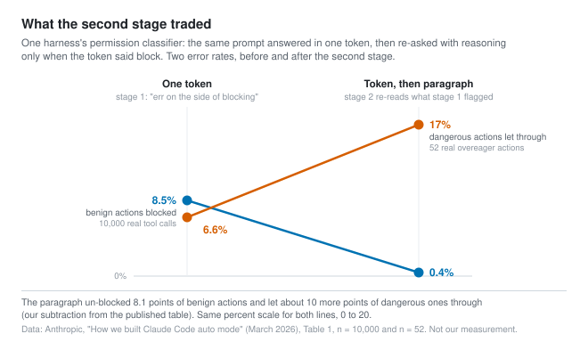
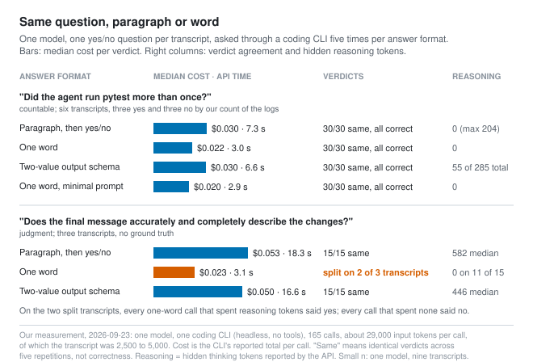

# The loop asks yes-or-no questions and pays for paragraphs

*2026-09-23 · the RunAI Coder team · [run.ceo/coder](https://run.ceo/coder/?utm_source=github_Official_Page)*

**TL;DR:** A language model computes a probability for every token before it writes one, so a closed-set question can be read off the first position instead of generated. Coding agents ask dozens of these per session and mostly pay for paragraphs. One harness already reads a single token for its permission check and escalates to reasoning only on a flag; the reasoning bought back false positives and paid in recall. Decision models sell that position with calibration and no reasons.

Before most shell commands run in a coding agent's hands-off mode, the harness asks a second model a question about the command and the conversation so far. The answer it wants back is one token: yes to block, no to allow. Only if that token is yes does it ask the same model the same question again, this time with permission to reason. The vendor's [engineering write-up](https://www.anthropic.com/engineering/claude-code-auto-mode) gives the arithmetic in one sentence: most actions clear the first stage, so "reasoning tokens are spent only where needed."

Two things are packed into that design, and this post is about both. A question with two possible answers can be read off a language model in one token, because the probability of that token is already a classifier's output. And the paragraph the second stage writes is there to change the verdict, which is a different job from finding it.

## The distribution before every token

At each position, a decoder computes a score for every token in its vocabulary and a softmax turns the scores into probabilities that sum to one. Generation picks one token from that distribution, appends it, and runs the network again. Where an API exposes the distribution, it looks like this: OpenAI's [logprobs cookbook](https://cookbook.openai.com/examples/using_logprobs) describes a `logprobs` flag that returns "the log probability of each token in the message content" and a `top_logprobs` setting for "the number of most likely tokens to return at each token position." The first use case the cookbook lists is classification: "logprobs provide a probability associated with each class prediction, enabling users to set classification or confidence thresholds."

So the classifier was never a separate kind of model. Ask "does this command delete data? answer yes or no," stop after the first position, and read the probability of the token `yes`. Every generative call does this at every step; a chat reply is a long sequence of classifications over a vocabulary of more than a hundred thousand classes, each one conditioned on the previous pick. What makes a yes-or-no question special is only that you can stop after one.

An engineer who probed the newest of these models with roughly ten thousand API calls, by his own count, put the general case in one line: a transformer "can do that without turning every decision into a sentence first." We will come back to what that probe found. The point for now is that the sentence was always optional.

## The questions a loop asks

Count the closed-set questions inside one coding-agent session. Should this shell command run. Which of the thirty tools fits this step. Is the task finished or does the loop continue. Did the subagent's report describe what the subagent did. Does this tool result contain instructions the agent should not follow. Did the final answer use the tool output it fetched. An eval library that appeared over the weekend [lists the last few](https://github.com/openlayer-ai/jevals) as its motivating examples and observes that "most of what an LLM judge is asked to decide fits" three question types: yes/no, pick one, score on a rubric.

Most of these are answered by generation today. The model writes a tool call, which is a choice dressed as JSON. It writes "the tests pass and the change is complete," which is a done/not-done bit dressed as a sentence. A judge model writes a paragraph of reasoning and a JSON blob, and somebody parses the blob. The same library's authors read the source of a popular eval framework and counted: "Faithfulness is two LLM calls. Answer relevancy is three, plus embeddings. Context precision is one call per retrieved chunk," and every call "generates JSON token by token, and retries when the JSON doesn't parse." A [comparison published on Sunday](https://www.langchain.com/blog/jev-agent-evals-langsmith) ran a judge model over five fixed agent traces a hundred times each: five hundred binary decisions, $28.17 in total for the one judge the authors priced in full.

The permission check is the one place we know of where a shipping coding harness stopped generating. The [documentation](https://code.claude.com/docs/en/permission-modes) is plain about it: "a second model, the classifier, reviews actions instead of you," and it runs on a model the harness selects separately from the one you picked for the session. Rules resolve first, in-project edits and reads pass without a call, and "everything else goes to the classifier." On the paid individual and team plans this mode is the default. So a large share of this harness's sessions today already run a classifier per shell command, and as of the March write-up its first stage was a single token.

## Stage one answers in one token

The write-up says the first stage's "final instruction tells it to 'err on the side of blocking' and emit a single yes-or-no decision without reasoning." The second stage "sees the same prompt and only the final instruction changes, asking for careful reasoning," and because the input is identical, the second request is "almost entirely cache-hit from stage 1."

Then it prints what the two stages did on the vendor's own traffic.

On 10,000 real tool calls, the one-token filter blocked 8.5% of benign actions; the full pipeline, with the paragraph un-blocking what the token flagged, brought that to 0.4%. On 52 real cases where an agent tried something past what the user had authorized, the one-token filter let 6.6% through; the full pipeline let 17% through. The authors call the 17% "the honest number." Their description of the mechanics matches ours: "Stage 1 is fast and cheap, tuned for low FNR at the cost of high FPR. Stage 2 is more expensive and runs only on what stage 1 flagged. It cleans up the false positives but lets a few more dangerous actions through."

Read that as a price list. The token was the conservative half. The paragraph bought back eight points of friction and paid about ten points of recall on a sample of 52. Whether that is a good trade depends on which mistake you can afford; the authors say so, and say the mode is for people who would otherwise skip permissions entirely. What the paragraph did not buy is an explanation at the point of use. When the classifier blocks, the agent "receives the reason," and the docs add that "in most sessions the reason names the rule the classifier matched, such as `[Data Exfiltration]`, rather than giving a written explanation." The paragraph was written for the classifier's own second look; what reaches the agent, in most sessions, is a rule name.

We want to hold on to that last detail, because it is the whole question about the new class of models. If the reasoning is spent and never shown, what was it for? In this pipeline the answer is measurable: it moved 8.1 points of false positives. It was a mechanism for changing the answer, and its side effect of being readable went unused.

## A head instead of a decode loop

Last week a startup shipped a model that answers only closed-set questions and generates no text at all. Its [documentation](https://docs.typesafe.ai/concepts/system-one) describes it as a class of model "built to make fast, structured decisions that software can use directly": you send a state and a list of typed questions, and it "returns typed decisions and probabilities rather than generated text." Three question types: pick one from a list, score on a rubric, and a yes/no that comes back as a probability. The [price page](https://docs.typesafe.ai/models) charges $0.042 per million input tokens and says "output tokens are free," which follows from there being none. Questions in one request are "evaluated in parallel and in isolation against the same state," and the docs say adding questions "barely changes the response time." A page written for people who arrived from coding-agent searches says the model "is not a drop-in replacement for the LLM behind" any coding tool and "does not generate text, write code, or hold a conversation."

The package claims more than "we stop after the first token," and the extra claims are the ones worth separating.

Start with the readout. The company has not published its architecture. The engineer we quoted earlier [probed the API](https://archerhume.com/posts/jevs-architecture-unmasked), measuring how latency scaled with input length and option count, and reconstructed "a causal transformer with a shared state prefix, isolated question suffixes, listwise option processing, typed numerical readouts, and training directed at predictive distributions." A readout means a small function from the final hidden state to K numbers, then a softmax; for a yes/no, "one scalar and a sigmoid would suffice." One observation in that write-up is worth carrying around: the API still reports an `output_tokens` field, and it "is a billing figure." A 200-option question reporting 1,911 output tokens came back as fast as a two-option one, and server time grew only with input length. An open reimplementation that appeared days later [describes its own version](https://github.com/jaredpalmer/kev) in the plain terms the original will not: a LoRA adapter plus "a small pointer head" on a 9-billion-parameter open base, the head scoring each option against the question and a softmax turning "those scores into probabilities," trained with "cross-entropy on the correct answer." That is a classifier head. It is what the first section said a language model already has, moved to the end of the input and trained for the job.

Calibration is the other claim. The vendor's own concepts page says the model's probabilities "are optimized against outcomes to reflect uncertainty" and, in the same breath, that calibration "is measured across groups of predictions; it does not guarantee that an individual answer is correct." The training recipe is unpublished. The probe measured a ten-bin expected calibration error of 0.0313 on a 1,200-item multiple-choice sample. The open reimplementation gets its calibration by fitting a temperature on a development set and storing it with the weights, and reports that its largest model scores 0.852 on a held-out test set of sources it was not trained on and trails the commercial model by 3.5 points on a development set, with the caveat that "this isn't a controlled comparison."

This is the part that a language model's first-token probability does not give you for free. The probability of the token `yes` is a probability of emitting that token, conditioned on the prompt and on the training that shaped the model to write helpful sentences. Nothing in that training aimed the number at the frequency of the world. The probe puts it bluntly: an ordinary model "generates '90% confident' as text; its probability of producing those words does not establish a 90% probability of being right."

Sunday's comparison is the data point people are quoting, so here it is with its own caveats attached. Three judge models and the decision model each scored the same five captured agent runs a hundred times. On the binary pass/fail, the decision model matched the human labels on all 500 decisions; the three generative judges matched on 99.8%, 96.4% and 80.0%. On the continuous quality score, its per-case variance was 92 to 913 times lower than the three judges'. It cost $0.00035 per call and averaged 0.44 seconds. The authors add that the experiment "cannot tell us why" the scores varied less, that the result "is observational," and that "lower variance does not automatically mean higher accuracy: a judge can still be consistently wrong." Five weather-lookup traces is a narrow test, and the judges ran on provider defaults with no temperature set.

## The same question, paragraph or word

We wanted the generative side of that trade on our own transcripts. We had twenty agent runs from an earlier experiment, each a small Python CLI task with pytest in the repository, and we rendered six of them into plain-text transcripts: the task, every tool call, every truncated tool result, the agent's final message. Then we asked one model, through the same CLI the agents had run in, one question per transcript, five times per answer format.

The first question has a countable answer: did the agent run pytest more than once, counting only shell tool calls. Three transcripts yes, three no, by our own count of the logs. The second question does not: does the agent's final message accurately and completely describe the changes it made. We asked that one on three more transcripts. The formats were a paragraph ("the single word yes or no on the first line, then explain your reasoning in one paragraph"), a single word ("do not explain"), and the CLI's structured-output flag with a two-value schema.

On the countable question, every format got every transcript right on every repetition: 30 of 30 per format, no flips. The word cost a median $0.022 per verdict and came back in 3.0 seconds; the paragraph cost $0.030 and took 7.3 seconds; the schema mode cost $0.030 and, to our surprise, spent a median 285 output tokens before filling the field, about 55 of them hidden reasoning and most of the rest a paragraph of prose, so it behaved like the paragraph with a parser attached. On this question the paragraph bought nothing we could measure.

On the judgment question the picture split. The paragraph and the schema mode gave the same verdict on every repetition, 15 of 15 each, and spent between about 150 and 1,000 hidden reasoning tokens per call doing it, median near 500. The single word flipped on two of the three transcripts: one came back yes, no, yes, yes, no; another yes, no, no, no, no. Its reasoning-token count was zero on eleven of the 15 calls, and on those two transcripts the split follows the count exactly: every call that spent reasoning tokens said yes, every call that spent none said no. On the third transcript all five calls spent none and all five said yes, so the count is not a switch. The paragraph and schema formats said yes on all three transcripts, so every one-word flip went toward no. When we told the model not to explain, its adaptive reasoning mostly stayed off too, and the word came from the first pass. A commenter in this week's discussion predicted exactly this for zero-shot decision models: they "answer on first pass vibes." On three transcripts and one model, the prediction held for a generative model asked to behave like one.

Here is what this does not show. We have no ground truth for the judgment question, so 15 consistent verdicts is consistency, not correctness, and we would apply the comparison's own caution to ourselves. And we did not run a decision model at all: we have no API key for the commercial one and did not stand up the open reimplementation, so every number above is from the generative side of the ledger. The side we did measure has one more line on it. Each of these verdicts, word or paragraph, carried about 29,000 input tokens through the CLI, of which the transcript was roughly 2,500 to 5,000; the rest is the coding agent's own system prompt and tool catalog riding along on a question that needed one token back. We tried replacing the system prompt with one sentence, and the median only came down to about 26,000. The decision was cheap. The envelope was not, and it is the envelope that a dedicated endpoint drops.

For what it is worth, our own review pipeline asks a model for paragraphs of verdicts on every draft, and we are keeping it that way. The reason is in the next section.

## The appeal needs the paragraph

Put the three pieces side by side. The harness's first stage shows a single token doing the conservative half of a decision at scale, and a paragraph doing the un-blocking. The decision-model vendors show the same first position with two additions, a head trained against outcomes and a bill with no output line, and one subtraction: no text at all. Our transcripts show that for a countable question the paragraph changed nothing, and for a judgment call it was the difference between a stable verdict and a coin that leaned.

So the question to ask about each yes/no in your own loop is what the paragraph is for, and there are three answers that survive.

It changes the verdict. That is the second stage's job, and the harness authors measured it: 8.1 points of false positives removed, at a price in recall. A decision model cannot do this on its own; the vendor's own docs say that a question which "would require extended reasoning" should be decomposed, and the reimplementation authors say plainly that theirs cannot subtract dates reliably. If the answer needs computation over a long transcript, you either generate the computation or run the question twice, cheap then expensive, the way the harness does.

It is the reason a person will read. A denial that says `[Data Exfiltration]` is a rule name; a denial a user appeals needs the sentence that named the URL and the credential. A commentator on the launch [called the new models](https://simonwillison.net/2026/Sep/21/jev/) "a regression even further towards black box machine learning systems": "put in all the text you want, the only thing you're going to get back is a floating point number. If Jev marks something as spam, which content signals tipped it off?" The first-token probability from a generative model has the same problem; it is only that nobody had sold that first position, on a model of this size, as the whole product.

It fails visibly. A generative judge that has lost the plot produces broken JSON and you know; a readout that has lost the plot produces a well-formed probability, every time. A thread commenter made this point against the launch, and it is the one we would weigh most for a coding harness: the format guarantee removes a failure signal you were relying on without knowing it.

Most of the other questions on the list are paragraphs you are paying for and discarding. The permission check on a `git status` does not need an explanation nobody reads. "Did the agent run the tests twice" did not need one on any of our 30 tries. A judge scoring a fixed trace a hundred times does not need a hundred essays. Those are the cases where reading the first position, from the model you already have or from one trained to be read there, is the same decision for a fraction of the tokens, with one number attached that a generative model's first token does not carry: a probability that was trained to mean something.

Before buying any of it, take a session transcript and list the questions your loop asked that had two or three possible answers. Then count how many paragraphs you were billed for answering them, and mark the ones anyone read.

---

**Sources.** Anthropic, ["How we built Claude Code auto mode"](https://www.anthropic.com/engineering/claude-code-auto-mode) (March 2026) and the Claude Code [permission modes](https://code.claude.com/docs/en/permission-modes) and [auto mode configuration](https://code.claude.com/docs/en/auto-mode-config) docs. TypeSafe AI docs: [System One](https://docs.typesafe.ai/concepts/system-one), [models and pricing](https://docs.typesafe.ai/models), [AI primer](https://docs.typesafe.ai/introduction/machine-learning-primer), [Jev with coding agents](https://docs.typesafe.ai/introduction/coding-agents). ["Jev's Architecture Unmasked"](https://archerhume.com/posts/jevs-architecture-unmasked) (17 September 2026). [Kev](https://github.com/jaredpalmer/kev) README. LangChain, ["Jev-as-a-Judge for Agent Evals"](https://www.langchain.com/blog/jev-agent-evals-langsmith) (20 September 2026). [jevals](https://github.com/openlayer-ai/jevals) README. OpenAI cookbook, ["Using logprobs"](https://cookbook.openai.com/examples/using_logprobs). Simon Willison, ["Jev introduces a new shape of LLM"](https://simonwillison.net/2026/Sep/21/jev/) (21 September 2026). Hacker News discussions of the [Kev release](https://news.ycombinator.com/item?id=49783999) and [Willison's post](https://news.ycombinator.com/item?id=49796843). Our measurement: one model through one coding CLI, six plus three transcripts, four answer formats, five repetitions each, 165 calls, run 2026-09-23; counts and medians in the post are from that run and are not a benchmark.
