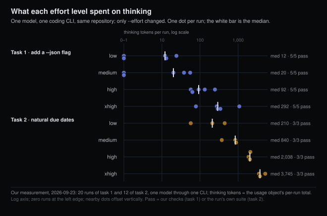

# Effort replaced the thinking budget

*2026-09-23 · the RunAI Coder team · [run.ceo/coder](https://run.ceo/coder/?utm_source=github_Official_Page)*

**TL;DR:** The fixed thinking budget is gone from current models; what remains is an effort level the docs call soft guidance, and the model decides per request whether to think. On a routine coding task the four levels spent medians of 12 to 292 thinking tokens and all passed; on a calendar task the same words spent 210 to 3,745. The default also moved with yesterday's release. Log the level beside the model name before reading any count as drift.

On the day a new model shipped, one tester asked it at maximum effort for an SVG of a pelican riding a bicycle and got no picture. The model hit the 128,000-token output cap while it was still reasoning about the question, and the failed attempt cost $2.56. The same request at low, medium, high and extra-high effort returned four pelicans whose differences, [the tester reported](https://news.ycombinator.com/item?id=49803892), "aren't huge."

Not long ago you would have set that request's thinking budget as a number of tokens. Now you set a word, and the model reads the word and decides. This post is about what changed hands in that handover, what the word buys on two coding tasks we ran 32 times between them, and why a chart of thinking tokens falling by half over a month, posted last week, is measuring something its author did not control.

## A number became a preference

The old control was `budget_tokens`: a ceiling on how many reasoning tokens the model could spend before answering. The current [extended thinking docs](https://platform.claude.com/docs/en/build-with-claude/extended-thinking) describe it as on its way out for anything recent: it "is deprecated on the Claude 4.6 models," and "Claude 4.7 and later models do not support it and reject requests that use it, returning a 400 error." Its replacement is adaptive thinking, which the [steering page](https://platform.claude.com/docs/en/build-with-claude/thinking-steering-and-cost) defines in one sentence: "the model evaluates each request and decides for itself whether to think and how much."

What you set instead is `effort`, one of five words from `low` to `max`. The docs are careful about its grammatical mood. It "acts as soft guidance for how willing Claude should be to think and how deeply." The [effort page](https://platform.claude.com/docs/en/build-with-claude/effort) says it again, and adds that even at the bottom of the scale the decision stays with the model: "Effort is a behavioral signal, not a strict token budget. At lower effort levels, Claude still thinks on sufficiently difficult problems, but thinks less than it would at higher effort levels for the same problem." The [thinking overview](https://platform.claude.com/docs/en/build-with-claude/thinking) names the only hard control left: if "you need a hard ceiling on spend: use `max_tokens`. Effort is soft guidance. `max_tokens` is a strict limit." On the newest models the off switch is gone as well; the thinking overview lists the models that "reject `thinking: {type: "disabled"}`," and the model released yesterday and the two newest model families are on the list.

The word also reaches further than the thinking block. The effort page says the parameter "affects all tokens in the response," and that "lower effort also means fewer and terser tool calls." A [July post](https://claude.com/blog/claude-model-and-effort-level-in-claude-code) on the vendor's blog puts that in coding-agent terms: effort "controls how much work Claude does on your request overall including the number of files read, tools used, and how many steps it takes before it checks back in with you," and at lower effort the model "would rather ask you for more context than spend tokens figuring something out on its own." So the knob that used to cap reasoning now expresses a preference about diligence, and the model reads it as a request.

The steering page adds one more mechanical detail. "In a tool-use loop, the first request after new user input typically carries most of the reasoning, and follow-up requests that only process tool results can skip thinking, including at `xhigh` and `max`." An agent session is dozens of requests. The docs are saying that most of them may think nothing, whatever word you passed; in our runs below, 31 of 258 assistant messages on the first task and 57 of 208 on the second carried a thinking block.

## What the word bought on two tasks

We wanted to see what the word does on a task of the kind our agents run all day, and on one built to need reasoning. Same model, same coding CLI, same permission mode, same small Python repository with four tests; the only flag that changed was `--effort`.

The first task was the one we have run in two earlier experiments: add a `--json` flag to the `list` command, add a test, document it, run the suite. Five runs at each of `low`, `medium`, `high` and `xhigh`, twenty in all. Every run passed all four of our checks: the suite green, the flag producing the JSON we asked for on a fresh store, the README updated, a test mentioning the flag.

The thinking counts barely moved for the first two words and then did. Medians per run: 12 tokens at `low`, 20 at `medium`, 92 at `high`, 292 at `xhigh`. Four of the ten runs at the bottom two levels thought for zero tokens across the whole session. The highest single run, at `xhigh`, spent 1,075. Against those numbers the rest of the response grew steadily: median output tokens went 2,465, 3,018, 3,460, 4,513 across the four levels, median tool calls 15, 16, 16, 20, and median cost $0.36, $0.46, $0.46, $0.57. On a task the model judged easy, the word bought more files read and more tokens written before it bought much thinking, which is the docs' description of what the parameter does. And the outcome did not move at all: twenty green runs, four different words.

The second task was written to need reasoning. Add a `--due` option that parses "tomorrow," "next friday," "in 3 weeks," "end of month," "end of next month" and plain dates, relative to an injectable clock, with tests pinned to a January 31st and to the day before a leap day, at least eight cases. Three runs per level, twelve in all. Every run passed the suite it wrote, every one of the twelve suites contained the leap day, and the two diffs we read handled "next friday" as strictly after today and neither produced a February 31st from a January 31st. We did not verify the twelve implementations independently beyond that; the tests are the agent's own.

Here the word bit. Medians per run: 210 thinking tokens at `low`, 840 at `medium`, 2,038 at `high`, 3,745 at `xhigh`, with the extremes at 57 and 5,150. Output tokens went 5,226 to 13,092, tool calls 15 to 25, cost $0.56 to $1.00, and API time 71 to 160 seconds. The lowest word did not turn thinking off on a task that called for it, which is what the docs say, and the top word raised the bill by about 80% for a suite that was already green at the bottom. Whether the extra reasoning bought anything the tests could not see, we cannot say from twelve runs.

One count cut across both tasks. Of the 32 sessions, in none of them did the first assistant message carry a thinking block. Thinking showed up between the second and the ninth message, most often the second to the fifth, after the model had read the repository, and in the longer sessions again around the tenth to eighteenth. The docs say the first request after user input "typically carries most of the reasoning." In a coding CLI whose first move is to look at the files, it carried none of it in our runs, and the word you passed had no bearing on that.

## The default moved with the model

Here is the detail that turns this from a mechanics note into something to check in your own logs this week. Every model that supports effort defaults to `high`, the CLI's model configuration docs say, with two model-specific exceptions: one older model defaults to `xhigh`, and the model released yesterday defaults to `medium`. The effort page spells out the consequence for anyone who never set the parameter: on the new model "`medium` is the default (Claude Opus 5 and earlier Opus models default to `high`, so a request that omits `effort` runs one level lower than it did on Claude Opus 5)." The CLI's [model configuration docs](https://code.claude.com/docs/en/model-config) list how a session's level is resolved, an explicit flag or environment variable first, then a saved setting, then "the model's default effort," and add that a saved top-level setting from before levels were stored per model "doesn't count" for the new one.

The same page adds two sentences that complete the picture. "The effort scale is calibrated per model, so the same level name does not represent the same underlying value across models." And when you ask for a level a model lacks, the CLI "falls back to the highest supported level at or below the one you set." So `high` on one model and `high` on another are not the same request, a session that never touched the setting may have changed level by switching models, and a session that asked for `xhigh` may be running at `high`.

The launch page for the new model leans into the low end. Its benchmark charts plot every level from `low` to `max` on a cost axis, and its tester quotes are about the bottom of the scale: one says the model "at its lowest effort setting" caught 72% of known bugs in code review against 56% for the prior model at high, and that on another workload "low thinking effort matched its higher thinking settings on half the output"; another that low effort beat the prior model's high with "about 60% fewer output tokens." Those are the vendor's testers on the vendor's page, and we have not run the new model. The point for anyone reading a log is narrower: the level a session runs at is now a function of the model, the CLI version, and whichever setting was saved last, and none of those three appears in the thinking count.

## Counting a decision you did not make

Last week a chart whose title ended "Median thinking declined in August" was posted. Its [author](https://twitter.com/Lon/status/2101793422487204027) had noticed the model "felt dumber" after a plan change and went looking for a number, and found one in the thinking-token counts of the author's own sessions: 6,921 turns and 36,374 API invocations at `xhigh` and `max` effort, July against August. The median fell by 21.9% weighting by turn, 23.1% by day, 35.1% by session, 46.2% by project, and 50.6% at the level of individual invocations. Five weightings, all down, the spread between them more than a factor of two.

Read against the docs above, the chart is a measurement of a decision the model made on every one of those 36,374 requests, under the two top levels the author ran at, `xhigh` and `max`. That is a real observation, and it is not the one the title suggests. The author printed the population counts under the chart: 19 projects in July against 17 in August, 99 sessions against 81, 4,009 turns against 2,912. Different projects, different tasks, a month apart, on a model whose docs say thinking per request "tends to decrease as a conversation grows." The comment thread did the sorting for us. One commenter asked how anyone measures thinking tokens when the text is never returned; the answer is the usage field, which returns the count and never the text. Another asked how you build a repeatable test on a non-deterministic system. A third, who follows a public tracker that runs fifty fixed tasks a day through the same CLI, pointed out that fewer thinking tokens "isn't necessarily bad if you can get the same results"; a reply noted that the tracker's own status has read "collecting baseline data. Degradation detection paused." for months.

None of those commenters, and not the author, could separate the four things that can move a thinking count in the same direction: the model's per-request decision, the effort level in force, the mix of tasks, and a change on the serving side. The count cannot tell them apart. It is the only number you get, and it is a number about what the model chose, measured after the fact, on tasks that were not held fixed. Our own data has the same shape from the other end: twenty runs across five pairs of small coding tasks on one model in one day ranged from 18 to 2,117 thinking tokens per run with no change to any setting. Before that spread is subtracted out, a monthly median is a weather report.

## The level belongs in the log

The table behind this post carries three columns per run where our earlier ones carried one, and that is the shape every later table gets: the model identifier, the effort flag we passed, and the thinking-token total from the usage object. The model identifier we always logged. The effort flag is the one whose meaning moved without us touching it, and the docs say it will keep moving, per model and per CLI version; the CLI's stream output does not report the level it resolved, so the flag is the best a log can hold. The thinking total is the number everyone is reading; it was already a decision the model made, and now the request it was made under can change between two sessions that look identical from the prompt.

A thinking count with no effort level beside it is a measurement with the setting it was taken at torn off.

---

**Sources.** Anthropic docs: [Extended thinking](https://platform.claude.com/docs/en/build-with-claude/extended-thinking), [Steering thinking and cost](https://platform.claude.com/docs/en/build-with-claude/thinking-steering-and-cost), [Effort](https://platform.claude.com/docs/en/build-with-claude/effort), [Thinking overview](https://platform.claude.com/docs/en/build-with-claude/thinking); Claude Code docs, [Model configuration](https://code.claude.com/docs/en/model-config); Claude blog, ["Choosing a Claude model and effort level in Claude Code"](https://claude.com/blog/claude-model-and-effort-level-in-claude-code) (July 2026); Anthropic, [Claude Opus 5.5](https://www.anthropic.com/claude-opus-5-5) launch page (22 September 2026) and the Hacker News [discussion](https://news.ycombinator.com/item?id=49803892); Lon Lundgren, ["Fable 5 — Median thinking declined in August"](https://twitter.com/Lon/status/2101793422487204027) and the Hacker News [discussion](https://news.ycombinator.com/item?id=49789224); Marginlab, [Claude Code performance tracker](https://marginlab.ai/trackers/claude-code/). Our measurement: one model through one coding CLI, two tasks, four effort levels, 32 runs, 2026-09-23; counts and medians in the post are from that run and are not a benchmark.
